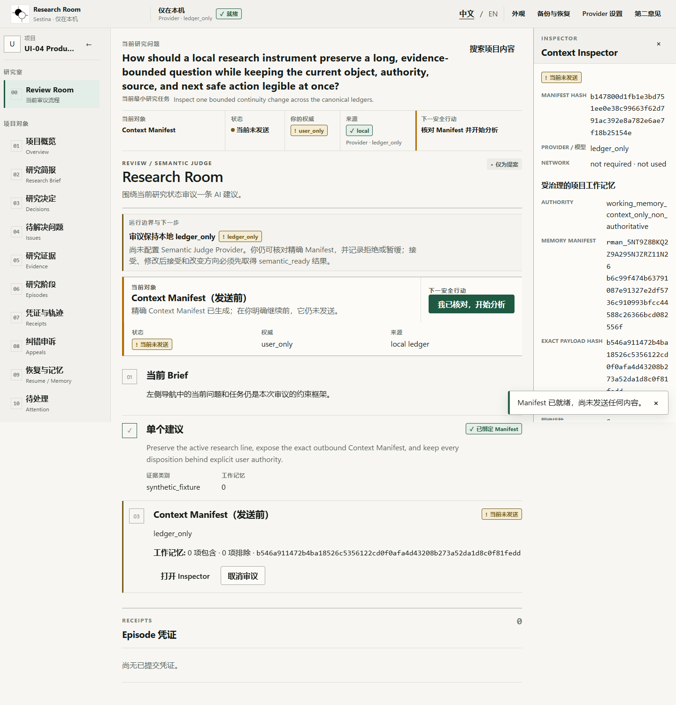
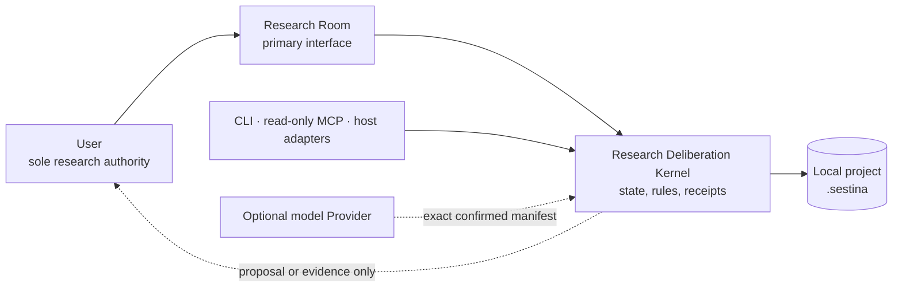

<div align="center">
  
  <h1>Sestina</h1>
  <p><strong>A local research room that keeps AI-assisted work aligned, inspectable, and under your authority.</strong></p>
  <p>让长期 AI 辅助研究保持聚焦、可核查，并始终由你裁决。</p>

[](https://github.com/Roblis0n/Sestina/releases/latest)
[](https://github.com/Roblis0n/Sestina/actions/workflows/ci.yml)
[](LICENSE)
[](.node-version)
[](PRIVACY.md)

**English** · [简体中文](docs/i18n/README.zh-CN.md) · [日本語](docs/i18n/README.ja.md) · [Español](docs/i18n/README.es.md) · [Français](docs/i18n/README.fr.md) · [Deutsch](docs/i18n/README.de.md)
</div>

---

Sestina is a local, interactive research application for work that lasts longer
than one chat. Its Research Room keeps the active question, evidence, decisions,
open issues, corrections, provenance, and next safe action in one continuous
workspace. Models can propose; only the user can accept, reject, resolve, waive,
or change research direction.



## Why Sestina

Long-running AI research often fails quietly: the question drifts, an old audit
is repeated, a suggestion becomes an apparent decision, evidence boundaries
disappear, or a polished answer hides an argumentative jump. Sestina turns
those failure modes into visible research objects and explicit actions.

| Research need                     | What Sestina provides                                                 |
| --------------------------------- | --------------------------------------------------------------------- |
| Keep the real question in view    | A persistent active research line and versioned Research Brief        |
| Separate proposals from decisions | A user-only Authority Gate and append-only receipts                   |
| Know what leaves the machine      | Exact, reviewable Context Manifests before Provider calls             |
| Challenge an AI assessment        | Correction appeals and an independently configured second opinion     |
| Compare genuine disagreement      | A bounded, mutually blind two-participant deliberation room           |
| Resume without inventing context  | Project-scoped governed memory, backups, restore, and schema recovery |

## The product boundary



- **Local-first:** project state lives in the selected project's `.sestina`
  directory. There is no Sestina cloud account, background sync, telemetry,
  crash upload, or automatic research-content logging.
- **Explicit outbound context:** optional Provider requests remain disabled until
  the user configures a connection, inspects the exact Context Manifest, and
  confirms that bound request.
- **Fail-closed authority:** Provider output, agreement, signatures, hashes, and
  tool success never mutate research authority.
- **Thin integrations:** CLI, Skills, MCP, and host adapters expose the Kernel;
  they do not duplicate its rules. The public MCP surface is read-only.

Read the [privacy contract](PRIVACY.md), [security policy](SECURITY.md), and
[data-flow inventory](docs/security/DATA-FLOW.md) before using real research
material.

## Accepted product target after 0.2.0

The complete post-0.2 restructure is now an accepted product target. It
converges Review, user Authority, canonical state changes, exact outbound
Manifests, persistence, recovery, task-first navigation, and the desktop
lifecycle into one Kernel-owned path. The target distribution is an Electron
desktop application; the current `v0.2.0` archive remains a local loopback
research server preview.

This is design authority, not a shipped-feature claim. Read the
[acceptance and authority record](docs/product/restructure/README.md) and its
exact 18-file plan set before post-0.2 implementation work. The existing
installation and limitation statements below remain the current release truth.

## Install the 0.2.0 public preview

The supported distribution is an archive, not a native installer. It requires
**Node.js 24.x** and a local browser.

1. Open the [`v0.2.0` release](https://github.com/Roblis0n/Sestina/releases/tag/v0.2.0).
2. Download `SHA256SUMS` and the one archive matching your system:
   - `sestina-research-room-0.2.0-windows-x64.zip`
   - `sestina-research-room-0.2.0-macos-arm64.tar.gz`
   - `sestina-research-room-0.2.0-ubuntu-x64.tar.gz`
3. Verify the archive SHA-256, then extract it into a new empty directory.
4. In the extracted Sestina directory, run:

```text
node start.mjs --version --json
node start.mjs
```

Open only the printed `http://127.0.0.1:...` address. Platform-specific details
are in the [Windows](docs/release/INSTALL-WINDOWS.md),
[macOS](docs/release/INSTALL-MACOS.md), and
[Ubuntu](docs/release/INSTALL-LINUX.md) guides.

> **Preview limits:** 0.2.0 has no installer, updater, code signing,
> notarization, background service, npm publication, or public write-capable
> MCP. Release verification proves software behavior and artifact integrity; it
> does not prove Provider semantic quality, research correctness, adoption, or
> market value.

## Build from source

Prerequisites: Git, Node.js 24.x, and Corepack.

```text
git clone https://github.com/Roblis0n/Sestina.git
cd Sestina
corepack enable
pnpm install --frozen-lockfile
pnpm verify:public
pnpm --filter @sestina/research-room build
node apps/research-room/dist/main.js
```

The server binds to loopback only. The default deterministic path works without
a semantic Provider and reports that limitation as `ledger_only`.

## Repository map

| Path                  | Purpose                                                       |
| --------------------- | ------------------------------------------------------------- |
| `apps/research-room`  | Production loopback server and React Research Room            |
| `packages/research`   | Research objects and user-authority domain model              |
| `packages/core`       | Application orchestration and Authority Gate                  |
| `packages/review`     | Deterministic and optional semantic review contracts          |
| `packages/storage`    | SQLite persistence, migrations, backup, and restore           |
| `integrations/mcp`    | Bounded read-only Model Context Protocol adapter              |
| `integrations/skills` | Generated host skill integration                              |
| `researchbench`       | Synthetic, reproducible development evaluation assets         |
| `docs`                | Product, architecture, security, release, and recovery guides |

The accepted post-0.2 product and implementation design is indexed under
[`docs/product/restructure`](docs/product/restructure/README.md).

Start with the [public documentation index](docs/README.md), the
[product definition](docs/product/CURRENT-PRODUCT-DEFINITION.md), or the
[architecture overview](docs/ARCHITECTURE.md).

## Contributing

Issues and pull requests are welcome. Use synthetic data only—never attach real
research content, project databases, Provider responses, credentials, private
paths, or raw logs. See [CONTRIBUTING.md](CONTRIBUTING.md),
[SUPPORT.md](SUPPORT.md), and the [Code of Conduct](CODE_OF_CONDUCT.md).

## License and marks

Source code and project documentation are available under the
[Apache License 2.0](LICENSE). Required attribution is in [NOTICE](NOTICE), and
bundled dependency terms are recorded in
[third-party notices](docs/release/THIRD-PARTY-NOTICES.md). The copyright
license does not grant trademark rights in the Sestina name or official logo;
see [TRADEMARKS.md](TRADEMARKS.md).
