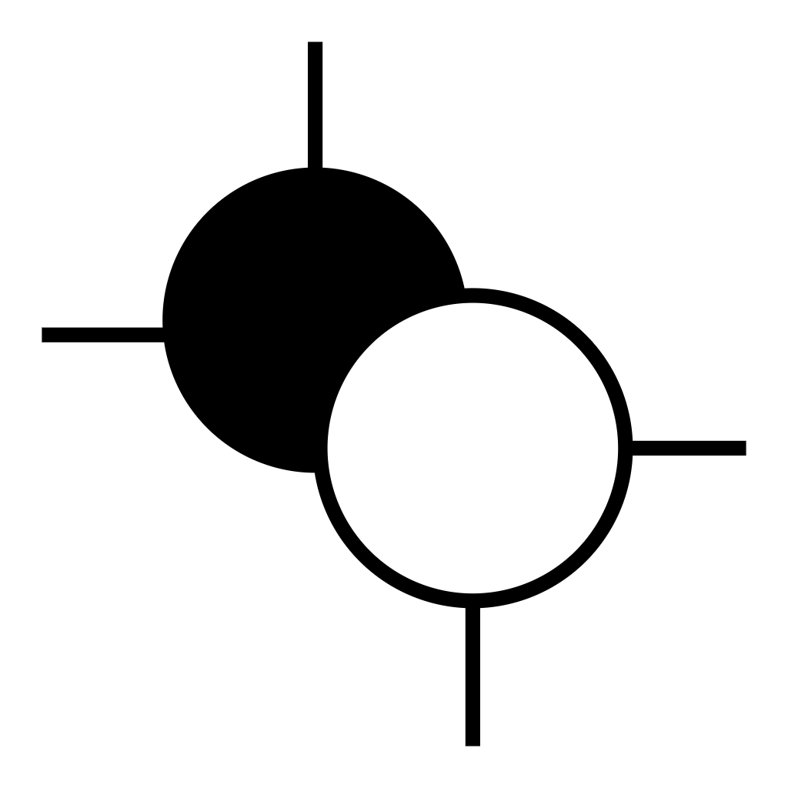

<div align="center">
  
  <h1>Sestina</h1>
  <p><strong>Un espace de recherche local pour garder le travail assisté par IA ciblé, vérifiable et sous votre autorité.</strong></p>

[English](../../README.md) · [简体中文](README.zh-CN.md) · [日本語](README.ja.md) · [Español](README.es.md) · **Français** · [Deutsch](README.de.md)
</div>

---

Sestina est une application de recherche locale et interactive destinée aux
travaux qui dépassent une seule conversation. Research Room réunit la question
active, les preuves, les décisions, les problèmes ouverts, les corrections, la
provenance et la prochaine action sûre. Les modèles peuvent proposer ; seule la
personne utilisatrice peut accepter, rejeter, résoudre, accorder une dérogation
ou modifier l'orientation de la recherche.

## Ce que Sestina apporte

- Une ligne de recherche persistante et un Research Brief versionné empêchent
  le remplacement silencieux de la question.
- Authority Gate sépare les propositions des décisions formelles, exige une
  action directe de l'utilisateur et produit des reçus ajoutés sans réécriture.
- Avant tout appel optionnel à un Provider, le Context Manifest exact affiche
  les données incluses et exclues, le but, les limites et les liaisons par hash.
- Une évaluation peut faire l'objet d'un Correction Appeal et d'un second avis
  configuré indépendamment.
- Une salle de délibération bornée compare deux participants mutuellement
  aveugles, sans vote, vainqueur ni synthèse automatique faisant autorité.
- La mémoire gouvernée par projet, les sauvegardes, la restauration et les
  migrations permettent de reprendre le travail sans inventer de contexte.

## Autorité et confidentialité

Research Deliberation Kernel possède les règles et Research Room est
l'interface principale. CLI, Skills, MCP et adaptateurs d'hôte restent des
couches d'accès minces ; le MCP public est en lecture seule.

L'utilisateur est l'unique autorité de recherche. Une sortie de Provider, un
accord entre modèles, une signature, un hash ou la réussite d'un outil ne peut
pas modifier un Brief, une Decision, une Issue, une Review, un Appeal ou une
Deliberation. En l'absence de preuve, l'état reste unknown ou unproven.

Les données restent par défaut dans le dossier `.sestina` du projet choisi. Il
n'existe ni compte cloud obligatoire, ni synchronisation en arrière-plan, ni
télémétrie, ni envoi automatique des incidents ou du contenu. Un contexte ne
peut être transmis à un Provider externe qu'après configuration, inspection du
Manifest exact et confirmation explicite de cette requête.

## Lancer la préversion publique 0.2.0

Node.js 24.x et un navigateur local sont nécessaires.

1. Téléchargez `SHA256SUMS` et l'archive correspondant à votre système depuis la
   [Release `v0.2.0`](https://github.com/Roblis0n/Sestina/releases/tag/v0.2.0).
2. Vérifiez le SHA-256, puis extrayez l'archive dans un dossier neuf et vide.
3. Dans le dossier extrait, exécutez :

```text
node start.mjs --version --json
node start.mjs
```

Ouvrez uniquement l'adresse `http://127.0.0.1:...` affichée. Les plateformes
prises en charge sont Windows x64, macOS arm64 et Ubuntu x64. Consultez le
[guide de publication](../release/README.md) pour les détails.

La version 0.2.0 est une archive de préversion : elle n'inclut ni installateur,
ni mise à jour automatique, ni signature, ni notarisation, ni service en
arrière-plan, ni publication npm, ni synchronisation cloud. Les tests valident
le logiciel et les artefacts, pas la qualité sémantique d'un Provider ni la
justesse d'une conclusion scientifique.

Le projet est publié sous [Apache License 2.0](../../LICENSE). Consultez
[CONTRIBUTING.md](../../CONTRIBUTING.md) et utilisez uniquement des données
synthétiques dans les rapports et contributions.
