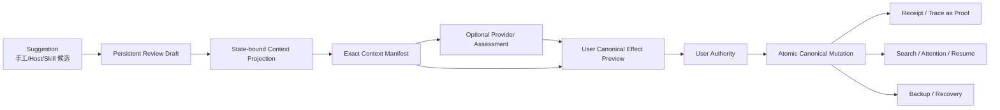
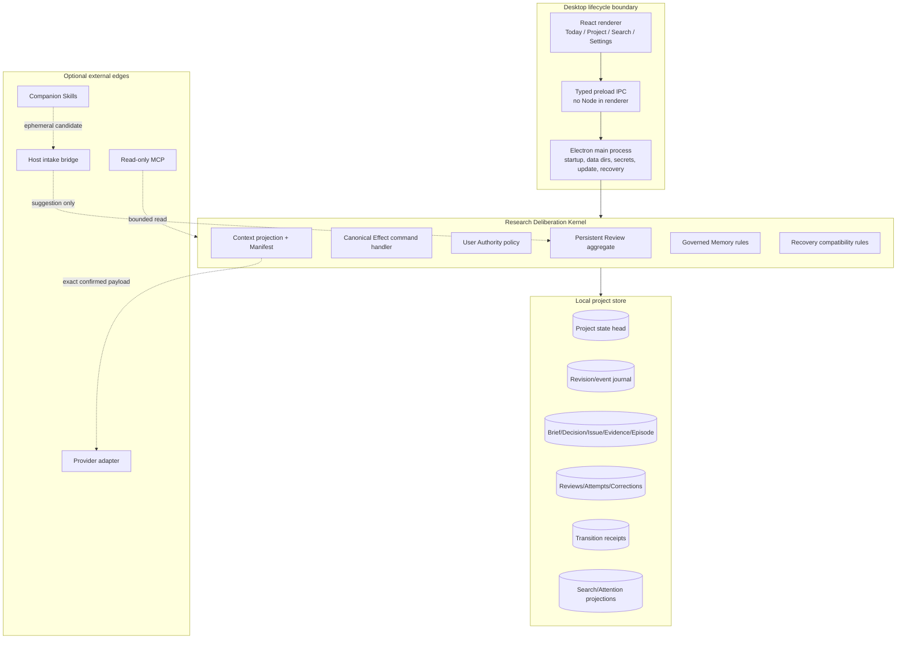
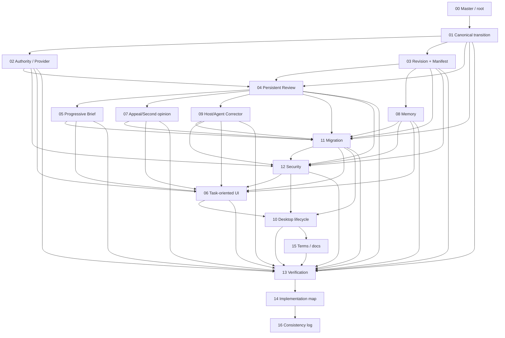

# Sestina v0.2.0 完整产品重构总计划

> **总裁决：问题定义成立，但必须把产品从“多个治理对象各自完成一段协议”重构为“一个建议如何在用户裁决下成为可恢复的规范研究状态变更”。** 本计划是完整建议，不代表仓库已经实施。

## 1. 目标产品一句话定义

**Sestina 是一款本地桌面科研决策 App：它把人或 AI 的建议绑定到当前本地研究状态，在任何外发前展示并重新验证 Exact Context Manifest，由用户选择类型化的 `canonical effect`，再由唯一 Kernel 原子写入研究对象、生成 Receipt，并让检索、待处理、继续工作、备份和恢复共享同一事实。**

这个定义刻意不把 Sestina 描述成通用 Agent、模型评测器、个人知识库、多 Agent 会商平台或插件集合。Provider、Host、Skill、MCP 只是候选或带来源 assessment 的入口；真正不可替代的增量是**状态绑定、显式外发、用户 Authority、原子变更、可验证恢复**。

## 2. 不可约简用户任务

用户带着以下任一输入进入产品：

- 一条来自 ChatGPT、Codex、同事、文献笔记或自己的新建议；
- 一个需要继续或纠正的旧 Review；
- 一个重启、迁移或恢复后的项目状态；
- 一个宿主产生但尚未成为研究决定的候选。

用户最终必须完成的不是“把建议评审一遍”，而是：

> **理解建议与当前问题、决定、证据边界和未知项的关系；知道将要外发什么；在 Provider 可用或不可用时都能决定是否以及如何改变研究；得到一个明确的 resulting object/revision；并能在下次打开、搜索或恢复时回到同一结果。**

普通 Prompt + Markdown + Git 可以记录说明、保存文本和人工维护决定日志，但不能稳定提供以下组合保证：

1. 同一 transaction snapshot 上生成的 exact outbound payload；
2. send 前对 project revision、projection hash、Provider generation 和 exact request bytes 的重新绑定；
3. 外部 Agent 无法绕过的 user-only Authority；
4. target/version 约束下的原子 canonical mutation；
5. Receipt 与 resulting object、revision、rollback/compensation 的一一对应；
6. future schema、损坏 DB、项目身份和 Brief binding 的 fail-closed 恢复。

Sestina 只有把这些保证放进默认主旅程，才值得继续作为独立 App。

## 3. 唯一核心闭环



禁止出现的旁路：

```text
Provider Assessment ─X→ Authority
Appeal Resolution ─X→ 第二套 canonical truth
Room Resolution ─X→ 第二套 canonical truth
Pilot Session ─X→ 第二套 continuity truth
Agent Corrector ─X→ 直接写 Research State
Memory ─X→ Evidence
Receipt ─X→ 替代 resulting object
Renderer state ─X→ 自行复制 Kernel state machine
```

## 4. 最终保留、重构、合并、隐藏和退出的产品表面

| 当前表面 | 最终裁决 | 目标位置 | 理由 |
|---|---|---|---|
| Research Deliberation Kernel | 保留并收紧 | 唯一业务、状态、Authority、Manifest、Memory、恢复规则来源 | 是产品不可替代增量的承载者 |
| Research Room | 保留并重组 | `Today / Review` 主交互面 | 从对象工作台变为任务闭环 |
| Research Brief | 结构性重构 | `Project` 中的渐进约束面 | 既避免首启表单过重，也避免稀薄 context |
| Exact Context Manifest | 保留并升级 | Review send gate；普通摘要 + technical proof | 当前最强、经受攻击的保护 |
| Provider Semantic Judge | 降级为 assessment | Review 中的可选参考层 | 格式/跨度有效不等于事实或语义正确 |
| generic `accepted` / `modified_accepted` | 新 API 删除 | 类型化 `canonical effect` + legacy 只读映射 | 无 target、无 resulting object 的“接受”没有产品结果 |
| Receipt / Trace | 保留并收窄 | `History` 与完成摘要 | 证明 transaction，不替代 canonical result |
| Appeal | 合并 | 原 Review history 内的 correction record | 保留纠错能力，不形成第二条真相 |
| 第二意见 | 保留为可选 | Appeal 上下文内 `runtime-distinct second opinion` | 明示 identity 与 `cognitive independence unproven` |
| Deliberation Room | 默认入口和新建能力移除 | 历史只读、导出、恢复 | 协议隔离有价值，但默认产品增量不足 |
| Project Working Memory | 保留安全内核，简化 UI | Brief/Review contextual drawer + Project history | 保留 `Store ≠ Recall ≠ Share ≠ Promote`，删除知识库式负担 |
| Closed External App Pilot | 活跃生命周期退出 | 历史只读；候选统一进入 Review queue | 消除第二套 session/continuity truth |
| MCP | 保留只读默认 | Settings > Integrations；诊断/读取 | 维持最小权限 |
| Host intake | 新增窄能力 | 显式启用，仅创建 non-authoritative Review draft | 手工、Codex、Skill、Host 共用一个 lifecycle |
| `agent-corrector` | 作为 companion Skill 保留并合入主树 | 外部入口；ephemeral correction candidate | 不进入 Authority，不冒充独立 watchdog |
| 对象级工作区 | 隐藏到 `Project`/`History` | 二级详情 | 对象仍可审计，不占一级导航 |
| Inspector | 保留，默认关闭 | 按需 technical proof | 复杂度渐进呈现 |
| archive + Node + browser | 作为历史发行形态保留说明 | 文档准确称 `local loopback research server preview` | 不能继续冒充最终 Desktop lifecycle |
| Electron Desktop shell | 目标发行形态 | 三平台本地 App | 复用 Node/React/SQLite，关闭生产 UI 的公开 loopback 面 |

## 5. 当前结构 → 目标结构

| 维度 | `v0.2.0` 当前结构 | 目标结构 |
|---|---|---|
| Review completion | generic disposition；除改向外通常只写 Receipt | `record_only` 或明确 target 的 typed effect；resulting object 是结果 |
| Authority | user-only，但 positive disposition 被 `semantic_ready` gate | user-only 且 Provider-independent；Provider 只改变参考信息 |
| Truth language | `semantic_ready`、validated、固定 confidence 容易实体化 | request/protocol/span integrity 与 Provider claim 分层 |
| State binding | Brief/Decision/Issue/Episode hash；Context 另含 Receipt/Memory | 单调 `projectStateRevision` + `contextProjectionHash` + exact request hash |
| Review persistence | `#pending/#inFlight/#analyzed` 内存 Map | 持久化 Review aggregate + attempt journal；重启不自动重发 |
| Brief | 首次过薄；高级编辑过于 schema/ID 化 | question/task 起步，Review 前按需补约束；typed form + diff/history |
| IA | Review + 10 个对象入口 + Pilot | `Today / Review`、`Project`、`Search`、`Settings` |
| Appeal/Room | 独立状态机与 Resolution | correction 归入 Review；Room 历史只读 |
| Memory | 六态独立工作区 | 四个用户态 + 原因；contextual recall，逐项 Manifest |
| Host | Closed Pilot 的专用 session/continuity | 统一 Review draft intake；Host provenance 不写 Authority |
| Release | archive、Node 24、system browser | Electron shell、typed IPC、三平台 lifecycle、可验证 provenance |
| Recovery | 强 DB/identity/schema/Brief 验证 | 保留并增加 project revision/event journal/Review binding 验证 |

## 6. 目标分层架构



### 6.1 代码责任

- `packages/research`: 纯领域对象、effect 类型、Review state machine、Authority policy、revision invariants。
- `packages/core`: 用例编排、同事务 snapshot/commit、Provider/Host port、recovery orchestration。
- `packages/research-store` + `packages/storage`: repositories、UoW、schema 21–25（均为 `proposed_new`）、migration journal、投影重建。
- `apps/desktop`（`proposed_new`）: Electron main/preload/renderer 入口，不复制 Kernel 规则。
- `apps/research-room`: 保留为开发/兼容 loopback harness，不再定义最终产品身份。
- `integrations/*`: 只读或 draft-only adapter；不能自行实现 Authority、Manifest、effect 或 recovery。

## 7. 目标 canonical truth

### 7.1 Canonical

- 活跃 Research Brief 及其 version；
- Research Decision；
- Research Issue；
- Evidence 及 provenance/support relation；
- 当前 Episode；
- Project Working Memory 的本地状态（永远 non-authoritative）；
- `project_state_head` 与 append-only revision event；
- 已终结 Review 的用户 outcome/effect；
- canonical transition Receipt（证明而非研究结论）。

### 7.2 Persistent but non-authoritative

- Review draft、Context Manifest、Provider attempt、Provider assessment；
- correction record、second opinion；
- ResumeCheckpoint；
- Host suggestion provenance；
- legacy Appeal、Room、Pilot history。

### 7.3 Derived

- Search index；
- Attention queue；
- Today summary；
- relationship projection；
- Context projection；
- `assessment coverage`；
- stale reason summary。

Derived projection 必须携带其来源 `projectStateRevision`。索引或 UI cache 不得成为写入依据。

## 8. Authority、事实真伪与 Provider 的最终关系

| 内容 | 谁可产生 | 是否 canonical | 是否事实证明 | 是否可直接改变研究 |
|---|---|---:|---:|---:|
| Suggestion | 用户、Host、Skill、Agent | 否 | 否 | 否 |
| Deterministic proof | Kernel | 否；是协议事实 | 仅证明 hash/version/write 等 | 否 |
| Provider assessment | Provider | 否 | 否；是带来源的模型判断 | 否 |
| Evidence record | 用户授权的 effect | 是 | 仍受 provenance/support status 限制 | 是，但不自动变成“已证明” |
| Direction decision | 用户 | 是 | 不等于事实为真 | 是 |
| Canonical effect preview | Kernel | 否 | 证明将执行的命令结构 | 否，直到用户确认 |
| Canonical mutation | Kernel 执行用户命令 | 是 | 只证明状态写入成功 | 是 |
| Receipt | Kernel | 是审计证明 | 证明 transaction，不证明研究命题 | 否 |

## 9. Manifest、Receipt、Memory、Host 与 Recovery 的最终关系

- **Manifest**：绑定 Review、project revision、projection policy、selected Memory、Provider generation 和 exact request bytes；send 前重新验证。
- **Receipt**：在同一 transaction 中引用 effect preview hash、before/after revision、resulting object IDs 与 Manifest identity；不自动进入后续 Provider payload。
- **Review history projection**：只有与当前 task 相关的 canonical outcome 摘要才可进入 Context，且必须由确定性规则选择；原始 Receipt/Trace、旧 Provider raw output 默认不外发。
- **Memory**：默认未外发；只有 `In use`、来源仍有效、非 `never_send`、本 Review 中逐项选择的内容进入 Manifest。
- **Host**：只能创建 Review draft；Host session 不是 project continuity truth。
- **Recovery**：验证 DB、project identity、schema、Brief binding、project revision head/event chain 与 persistent Review binding；无法验证时 fail closed。

## 10. 目标主信息架构

| 一级入口 | 用户主任务 | 二级内容 |
|---|---|---|
| `Today / Review` | 处理当前建议、阻塞项和下一步 | Review Thread、effect preview、resulting change、recent changes |
| `Project` | 理解并维护当前研究状态 | Brief、Decisions、Evidence、Issues、History、contextual Memory |
| `Search` | 找到对象及其 Authority/provenance | filter、relationship、revision-aware results |
| `Settings` | 管理 Provider、隐私、外观、恢复、集成 | Provider test、Recovery、Appearance、Host bridge、Advanced proof |

Start Center 在项目外；Recovery 可由启动阻塞态和 Settings 进入。Appeal、Memory、Receipt、Room、Pilot 不再是一级入口。

## 11. 全局数据流

```text
User/Host input
→ persist Review draft (non-authoritative, no project revision)
→ read one local transaction snapshot at projectStateRevision N
→ derive context projection + contextProjectionHash
→ persist exact Manifest + exactRequestHash + Provider generation
→ explicit user confirmation
→ optional network Provider attempt
→ persist validity flags + Provider assessment
→ user edits/chooses canonical effect preview
→ compare N, target versions, preview hash and authority command id
→ atomically mutate canonical objects + advance N→N+1 + persist event/Review terminal/Receipt
→ rebuild or invalidate Search/Attention/Resume projections at N+1
→ Recovery validates the same head/event/Brief binding
```

网络只允许发生在显式确认的 Provider send、用户主动的 update check 或用户显式启用的 Host bridge。没有网络时核心闭环仍完整。

## 12. 全局依赖图



实施顺序是一条依赖链，不代表任何中间节点可作为半成品独立发布。详见 `14-IMPLEMENTATION-DEPENDENCY-AND-CHANGE-MAP.md`。

## 13. 全局术语表

| 用户可见中文 | English | 内部技术名 | 说明 |
|---|---|---|---|
| 今天 / 审议 | Today / Review | `TodayWorkspace` / `ResearchReview` | 主任务入口 |
| 建议 | Suggestion | `ReviewDraft.suggestion` | 非 authoritative 输入 |
| Provider 评估 | Provider assessment | `ProviderAssessment` | 带来源的模型意见 |
| 请求绑定有效 | Request binding valid | `request_binding_valid` | 只证明 response 对应请求 |
| 响应格式有效 | Response schema valid | `response_schema_valid` | 不证明内容正确 |
| 引文位置完整 | Quoted-span integrity valid | `quoted_span_integrity_valid` | 不证明引文支持结论 |
| 规范状态变更 | Canonical effect | `CanonicalEffect` | 用户将批准的具体变更 |
| 仅记录 | Record only | `record_only` | 不改 Brief/Decision/Issue/Evidence，但写入 Review outcome/Receipt |
| 项目状态修订号 | Project state revision | `projectStateRevision` | 每个 canonical transaction 单调递增 |
| 上下文投影哈希 | Context projection hash | `contextProjectionHash` | exact outbound projection 的确定性 hash |
| 凭证（变更证明） | Receipt (proof of transition) | `TransitionReceipt` | 不是研究结果本身 |
| 运行时不同的第二意见 | Runtime-distinct second opinion | `SecondOpinionAttempt` | `cognitive independence unproven` |
| 建议 / 使用中 / 未使用 / 已忘记 | Suggested / In use / Not in use / Forgotten | Memory UI projection | 内部状态仍可更细 |

完整迁移见 `15-TERMINOLOGY-DOCS-AND-CLAIM-MIGRATION.md`。

## 14. 全局不变量

1. Kernel 是唯一业务与状态真相；Renderer、Provider、Host、Skill、MCP 不能复制其 transition。
2. 用户是唯一研究 Authority；用户决定不把错误事实变真。
3. `projectStateRevision` 永不减少；rollback 也是新的 compensating revision。
4. 每个 Review 终结要么 `record_only`，要么指向明确 target/result 的 typed effect。
5. Manifest 显示真实 exact payload；send 前重新验证 revision、projection、Provider generation、exact bytes。
6. Provider assessment 永远 non-authoritative；不存在 `semantic_ready` 作为 action capability。
7. 无 Provider、Provider 失败或用户跳过 assessment 时核心闭环可完成。
8. Memory 默认不外发，且 `Memory ≠ Evidence`。
9. 不保存隐藏思维链，只保存公开结构化理由。
10. Search、Attention、Resume、Today 都是带 revision 的 derived projection。
11. 恢复验证 DB、identity、schema、Brief binding 和 revision/event chain；不完整时 fail closed。
12. 外部 adapter 只能读或创建 draft；不能写 canonical object。
13. 项目默认本机保存，无 Sestina 云账号、遥测或后台上传。
14. 唯一官方 Logo 原文件保持字节不变；不重绘、不反色、不裁切、不生成主题变体。
15. legacy Appeal/Room/Pilot 可读、可导出、可恢复，但不能继续形成活跃第二状态机。

## 15. 全局 Stop Doing

- 停止把 `schema-valid`、hash-valid、span-present 统称为 semantic validation。
- 停止让 Provider availability 决定用户是否能接受、修改或改向。
- 停止创建没有 target、before/after 或明确 `record_only` 的 disposition。
- 停止把 Receipt 数量、测试数量、fixture、截图或 hash 当作产品结果。
- 停止让 Appeal、Room、Memory、Receipt、Pilot 争夺一级导航。
- 停止要求普通用户手写 JSON、canonical IDs 或 migration/schema 术语。
- 停止扩张参与者、轮次、自动 synthesis、winner、vote、agreement score。
- 停止扩张 Closed Pilot 的 session/continuity workflow。
- 停止在当前 archive 发行物上使用不加限定的“Desktop App”。
- 停止让 Renderer、MCP 或 Host adapter 自行判断 Authority 或 stale。
- 停止把“本地”写成“没有任何网络”；所有可选外发必须具体说明。
- 停止让旧实现成本成为保留独立入口和状态机的理由。

## 16. 整套重构完成的定义

整套工程只有在以下条件同时成立时才完成：

1. 新建、无 Provider、零网络项目可完成 Suggestion → Review → Manifest → effect → Receipt → restart；
2. 每个 effect 提交前显示 target、before/after、不会改变的对象；提交后显示 resulting object 与 revision；
3. 任一 outbound-relevant 或 canonical transaction 都能让旧 Manifest fail closed，并给出精确原因；
4. Provider timeout、invalid JSON、进程崩溃、result write uncertain 不会自动重发或产生混合 truth；
5. Review 在每个持久状态重启后都能恢复；
6. Search、Attention、Today、Receipt、Resume 与 Recovery 指向相同 project revision；
7. `accepted`、`modified_accepted`、`semantic_ready`、用户可见 `ledger_only` 在新路径不可达；
8. Appeal correction、second opinion、Host suggestion 都回到同一 Review/effect transition；
9. 新建 Room、Closed Pilot 主入口和独立 Resolution truth 不可达；历史数据仍可读/导出/恢复；
10. Memory 的四态 UI、显式 Manifest selection、forget 副本边界经破坏性测试；
11. `v0.2.0` 项目经 dry-run、备份、copy-on-write migration 后打开，无法无损映射的 generic acceptance 不制造新 Decision/Evidence；
12. Electron 三平台 lifecycle、typed IPC、签名/公证边界、upgrade failure recovery 与 uninstall data separation 通过；
13. 真实 production build 在所有指定主题、语言、宽度、200% 文本、键盘、screen reader、long content 和大项目矩阵中通过；
14. Release provenance 从 public tag exact commit 到 unsigned reproducible core bundle、signed envelope 和 asset hashes 可追踪；
15. `16-CROSS-PLAN-CONSISTENCY-AND-DECISION-LOG.md` 的所有冲突均已回写解决，且没有必要内容被推迟为另一个版本。

## 17. 为什么仍值得是独立 App

独立 App 的价值不是“再提供一个 AI 回答”，而是把 Prompt/Markdown/Git 难以同时保证的五件事做成默认机制：

- **确切上下文**：用户看到真实 outbound bytes，而非摘要；
- **状态绑定**：Manifest 和 action 都绑定同一 revision/target version；
- **权限分离**：Provider/Agent 提议，用户决定，Kernel 执行；
- **原子可恢复改变**：canonical object、revision、event、Review terminal 和 Receipt 同事务；
- **本地生命周期**：项目、秘密、备份、迁移、恢复和 Host bridge 都受一致安全边界约束。

如果不能完成这条闭环，最合理的产品应收缩为 Prompt + Markdown 工作流；完成后，Sestina 才提供独立、可证伪且直接的产品增量。

## 18. 单一产品选择

本计划不保留互相矛盾的双路线：

- **Kernel**：typed canonical effect + append-only revision journal；不是全量 event-sourcing 重写。
- **Provider**：optional assessment；不是 Authority gate。
- **Review persistence**：新建专用 interactive Review aggregate；不复用用途不同的 `review_runs`。
- **IA**：task-first 四入口；对象详情进入 Project/History。
- **Appeal/Room**：Appeal 内嵌；Room 历史只读。
- **Memory**：内部精细、UI 四态；不删除能力也不发展成知识库。
- **Host**：draft-only intake；MCP 默认只读。
- **Agent Corrector**：companion Skill 合入主树但不进入 Kernel Authority。
- **Release**：Electron Desktop App；当前 archive 只作为历史/开发 loopback preview 表述。

这些选择已在各领域计划中展开并记录拒绝条件；不需要编码 Agent 再猜产品方向。
