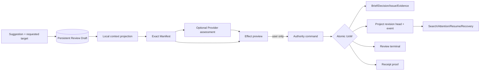

# Review 到 canonical research state 的统一 transition 计划

> 本文件给出该领域的完整目标状态和实施合同。它不是 `v0.2.0` 当前事实，也不是完成证明；标注 `existing_verified` 的内容仅表示基线代码中已直接核对。

## 1. 计划结果

完成后，用户不能再提交没有产品结果的 generic `accepted`。每次终结 Review 都必须选择一个类型化 `canonical effect`：`record_only`、`create_decision`、`add_evidence`、`create_or_resolve_issue`、`patch_brief` 或 `formal_direction_change`。Kernel 在提交前生成 target-aware before/after preview，在同一事务中校验 project revision、target version、effect hash 和 user actor，写入 resulting object、revision event、Review terminal state 与 Receipt；失败时不留下部分写入，rollback 通过新的 compensating revision 表达。

## 2. 来源发现与证据边界

### 对应发现

- `P0-01`：`ResearchRoomService.commit()` 允许 `accepted`、`modified_accepted`、`rejected`、`deferred`、`direction_changed`，但基线只有 `direction_changed` 会通过 `createBriefChangeProposal()` / `confirmBriefChangeProposal()` 改变 Brief；其余路径主要创建 `ResearchRoomReceipt`。
- `P1-01` / `P1-03`：`ledger_only` 会阻止除 reject/defer 外的处置，导致用户 Authority 依赖 Provider。
- `P2-01`：Appeal/Room Resolution 缺少回到真实对象的统一 transition。

### `existing_verified` 保护

- `ResearchRoomService.commit()` 验证 `actor.kind === "user"`。
- `ResearchStore.unitOfWork.commit()` 已提供原子编排边界。
- Brief、Decision、Issue 已有领域函数与 compare-and-swap repository；Receipt 创建和 rollback 有 hash/version 检查。
- 当前 rollback 遇到新状态会停下并产生冲突信号，而不是部分写入。

### 直接核对的生产路径

- `packages/core/src/research-room.ts`：`CommitResearchRoomDispositionInput`、`ResearchRoomService.commit()`、`rollback()`。
- `packages/research/src/room/research-room.ts`：`RESEARCH_ROOM_DISPOSITIONS`、`ResearchRoomReceipt`、`createResearchRoomReceipt()`、`rollBackResearchRoomReceipt()`。
- `packages/research/src/brief/research-brief.ts`：Brief change proposal/confirmation。
- `packages/research/src/decision/research-decision.ts`、`packages/research/src/issue/research-issue.ts`：现有 canonical object transitions。
- `packages/research/src/ports/repositories.ts`：repositories 与 `ResearchUnitOfWork`。

### 边界

Evidence 的最终创建命令应复用当前 argument/evidence 与 object-workspace command 中已存在的 provenance 规则；**具体写命令入口是 `requires_code_verification`**：实施前核对 `packages/core/src/research-object-workspaces.ts`、`packages/evidence/src/evidence-service.ts` 与 `packages/research/src/argument/evidence.ts`，回答“UI 当前创建的是哪一种 Evidence 聚合、哪一个 repository 是 canonical 写入口”。若答案是两个不同聚合，必须先在本计划的 `add_evidence` handler 中选择唯一 canonical 写入口，不能双写。

## 3. 当前状态与根因链

```text
当前对象：AnalyzedResearchRoomReview + generic disposition
→ transition：commit(disposition)
→ UI：用户看到 Accept / Modify & accept / Reject / Defer / Change direction
→ 缺陷位置：除 direction_changed 外，没有明确 target command；before/after 常相同
→ 后果：UI 和 Receipt 表示“完成”，但 Brief/Decision/Issue/Evidence 未改变
→ 连带问题：Appeal、Room、rollback、Search、Attention 无法回答“究竟改了什么”
→ 为什么文案修补无效：只把按钮改名仍没有 target、expected version、原子 mutation 与 resulting object
```

根因不是 Receipt 少一个字段，而是 Review outcome 与 canonical object command 没有建模为同一个事务。

## 4. 方案空间

| 方案 | P0/P1 闭合 | Kernel 单一真相 | 迁移 | UI 负担 | 第二状态机风险 | 可逆性/维护 |
|---|---|---|---|---|---|---|
| A. 保留 disposition，只增加 `targetKind/targetId` metadata | 部分；`accepted` 仍不能表达 create/patch/resolve 的不同校验 | 弱，commit 仍需大量分支猜测 | 低 | 表面低、错误高 | 高 | 初期快，长期条件分支膨胀 |
| B. 完整 event-sourced command：所有对象都只由事件重放 | 能闭合 | 强 | 极高；重写 Brief/Decision/Issue/Evidence repositories | 中 | 低 | 可审计，但与当前规模不相称 |
| C. 删除 generic disposition，采用 typed effect command + append-only project revision event | 完整 | 强；现有对象仍是 canonical，event 记录 transaction | 中高，可增量迁移 | effect preview 增加一步但降低歧义 | 低 | 高，可通过补偿命令逆转 |
| D. 仅保留 `record_only`，用户手工去各对象页面修改 | 避开伪接受，但核心闭环断裂 | 对象真相单一 | 低 | 高；重复操作 | 中 | 维护低但产品价值下降 |
| E. 让 Provider 选择并执行 effect | 表面闭合，违反 user-only Authority | 破坏 | 高 | 低表面/高风险 | 极高 | 不可接受 |

### 完全删除 Review 的反事实

删除 Review 后，用户可直接在 Decision/Issue/Evidence/Brief 页面编辑；这会保留对象真相，却失去 suggestion、Manifest、Provider assessment、effect preview 与 Receipt 的因果链。Sestina 将退化为结构化项目数据库，因此不采用。

## 5. 最终推荐裁决

选择 **C：typed canonical effect + append-only project revision event**，但不把全部对象重写成 event-sourcing。

- **保留**：现有 Brief/Decision/Issue/Evidence 领域聚合、repositories、CAS、UoW、user-only actor、Receipt hash。
- **删除**：新 API 的 `accepted`、`modified_accepted` 和无 target 的“成功”语义。
- **牺牲**：commit DTO 变得更严格；UI 必须在提交前形成 effect preview。
- **收益**：每个 action 对应一个可测试 command；Receipt 引用 resulting object；Appeal/Host/Room 不再需要各自发明 Resolution truth。
- **不形成第二套真相**：canonical object 仍是研究内容真相；project event 是 transaction journal；Receipt 是 proof；Review 是工作流聚合。
- **复杂度相称**：新增复杂度直接服务用户最核心问题“做完会改变什么”，并删除多条旁路状态机。

## 6. 目标领域模型

### 6.1 `CanonicalEffect`（`proposed_new`）

```ts
interface CanonicalEffectBase {
  schemaVersion: "2.0.0";
  effectId: string;                 // system-generated, stable across preview/commit
  reviewId: string;
  projectId: string;
  baseProjectStateRevision: number;
  effectKind: CanonicalEffectKind;
  target: EffectTarget;
  publicReason: string;             // public structured reason, not hidden CoT
  expectedObjectVersions: readonly ObjectVersionRef[];
  previewHash: string;
}

type CanonicalEffectKind =
  | "record_only"
  | "create_decision"
  | "add_evidence"
  | "create_or_resolve_issue"
  | "patch_brief"
  | "formal_direction_change";
```

### 6.2 Effect payloads

| effect | target | 必要字段 | resulting object | Authority class |
|---|---|---|---|---|
| `record_only` | Review 本身 | outcome=`rejected|deferred|reference_only|assessment_disputed`、reason | terminal Review + Receipt；不改研究对象 | user_recorded workflow outcome |
| `create_decision` | 预分配 `rdec_*` 或现有 Decision | statement、rationale、scope；更新时 expected version | ResearchDecision | user_recorded decision；不等于事实为真 |
| `add_evidence` | 预分配 Evidence ID | evidence kind、summary、source/provenance、support status、related claim/issue | canonical Evidence + links | user_recorded evidence record；support 另判 |
| `create_or_resolve_issue` | 新 `riss_*` 或现有 Issue | mode、kind/summary 或 resolution、expected version | ResearchIssue + transition | user_recorded issue action |
| `patch_brief` | active Brief/version | typed field patch、reason | new Brief version superseding active | user_recorded constraint change |
| `formal_direction_change` | active Brief/question | new question、supersession reason、impact summary | new Brief version + prior question superseded marker | user direction decision |

### 6.3 Preview 与 command

`CanonicalEffectPreview`（`proposed_new`）必须包含：

- `targetId`（create action 在 preview 时预分配）；
- `beforeProjectStateRevision`；
- `before` / `after` field diff；
- `willCreate` / `willUpdate`；
- `relatedObjectIds`；
- `objectsNotChanged`；
- `rollbackMode: exact_inverse | compensating_only | no_content_change`；
- `validationWarnings`；
- `previewHash`。

`AuthorityCommand`（`proposed_new`）包含 `authorityCommandId`（幂等键）、`reviewId`、`effectId`、`previewHash`、`expectedProjectStateRevision`、user actor 与短公开理由。

### 6.4 Canonical 与 derived

- canonical：resulting Brief/Decision/Issue/Evidence、Review terminal outcome、project revision event。
- authoritative：只有用户方向/决定和经用户授权写入的状态；Evidence 的 factual support 仍由 provenance/support relation约束。
- non-authoritative：Suggestion、Provider assessment、effect preview。
- derived：Search/Attention/Today/Resume 与 before/after rendering。
- Receipt：canonical audit record，但不是研究结论或 resulting object。

## 7. 状态机与 transition

### 7.1 Review-to-effect 状态

| from | action / actor | precondition | mutation | to | failure / retry |
|---|---|---|---|---|---|
| `assessment_recorded` 或无 assessment 的 `manifest_confirmed` | `prepare_effect` / user | Review 非 stale；target 可解析 | 只写/更新 effect draft，预分配 ID，计算 preview | 同状态 + `effect_preview_ready` 子状态 | invalid input 保留 draft；无写 Authority |
| effect preview ready | `edit_effect` / user | 未提交 | 重算 diff/hash | effect preview ready | 旧 preview hash 作废 |
| effect preview ready | `commit_authority_command` / user | user actor、revision/target versions/preview hash 一致 | 单事务执行 effect、revision N→N+1、event、Review terminal、Receipt、projection invalidation | `committed` 或 `disposed` | 任一错误全回滚；409 stale 可 rebase，不自动提交 |
| effect preview ready | `cancel` / user | 无 in-flight commit | terminal workflow record | `cancelled` | 幂等重复 cancel 返回同结果 |
| `committed` | `request_rollback` / user | Receipt 可逆且当前 head 与 after revision 可安全匹配 | exact inverse 作为新的 command；revision N→N+1 | 新 compensating Review/Receipt | 不匹配则只允许 compensation preview |
| `committed` | `compensate` / user | exact inverse 不安全 | 创建反向或 superseding canonical effect | 新 revision | 不删除旧对象/Receipt |

### 7.2 Effect-specific合法性

- `record_only`：不得携带 target mutation；Receipt before/after content hash可相同，但 project revision 仍推进一次，因为 Review outcome/history 是 canonical transaction summary。
- `create_decision`：同一 `authorityCommandId` 重试返回已创建 Decision；不同 command 使用相同预分配 ID时报 idempotency conflict。
- `add_evidence`：Provider suggestion 不能直接把 support status 设为 proven；缺 provenance 时不能提交。
- `create_or_resolve_issue`：resolve 必须匹配 Issue expected version；已解决重复提交为幂等成功或明确 no-op，不创建第二 Resolution。
- `patch_brief`：基于 active Brief version；candidate stale 时必须重做 diff。
- `formal_direction_change`：必须展示哪些 pending Review/Manifest 会 stale；旧 question 不删除。

### 7.3 并发（concurrent Review）与 stale

两个 Review 可同时形成 preview，但第一个 commit 推进全局 revision 后，第二个必须进入 `stale`。Kernel 可在同一读取事务中重算 target diff：若 projection 未变化，用户仍需重新确认 fresh preview；不得自动沿用旧 Authority nonce。

### 7.4 crash/restart

commit 前崩溃：Review/preview 保留，无 canonical write。事务提交完成但 renderer 未收到响应：重启用 `authorityCommandId` 查询 Receipt/resulting object，返回 `committed`，不重放。数据库返回不确定时记录 recovery-required，不猜测成功。

## 8. 数据流与 Authority 流



- 网络：只在 `M → PA`，且 Manifest 已确认。
- 写 Authority：只在 `AC → UOW`。
- stale 点：Manifest、effect preview、target expected version、Provider generation。
- fail closed：hash/revision/actor/idempotency 任一不符。
- 禁止 Provider payload：Authority nonce、secret、absolute path、hidden reasoning、未选择 Memory、其他项目、raw Trace、full Receipt body。

## 9. API、Schema、Repository 与代码边界

| 当前文件／模块 | 当前职责 | 目标职责 | 修改类型 | 直接验证 |
|---|---|---|---|---|
| `packages/core/src/research-room.ts` / `ResearchRoomService.commit()` | generic disposition；仅改向写 Brief | 调用统一 `CanonicalEffectService.commit()`；不自行猜 target | 重构 | `existing_verified` |
| `packages/research/src/room/research-room.ts` | disposition/Receipt schema | 新 Review compatibility types；generic disposition 仅 legacy decoder | 重构/弃用 | `existing_verified` |
| `packages/research/src/effect/canonical-effect.ts` | 不存在 | effect union、preview、invariants、authority command | `proposed_new` | 计划对象 |
| `packages/core/src/canonical-effect.ts` | 不存在 | UoW command handler、idempotency、compensation | `proposed_new` | 计划对象 |
| `packages/research/src/brief/research-brief.ts` | Brief proposal/confirm/version | 作为 `patch_brief`/`formal_direction_change` 唯一领域实现 | 保留/适配 | `existing_verified` |
| `packages/research/src/decision/research-decision.ts` | Decision create/transition/supersede | `create_decision` handler 复用 | 保留/适配 | `existing_verified` |
| `packages/research/src/issue/research-issue.ts` | Issue create/resolve等 | issue effect 复用 | 保留/适配 | `existing_verified` |
| `packages/core/src/research-object-workspaces.ts` + Evidence services | 对象命令/投影 | 选定唯一 Evidence 写入口 | 收敛 | `requires_code_verification`：核对 `ResearchObjectWorkspaceService`、对应server command与Evidence repository的实际链；若存在多个写入口，保留一个canonical handler、其余改为adapter；若当前没有完整Evidence写命令，则由`add_evidence`新增唯一handler，禁止双写 |
| `packages/research/src/ports/repositories.ts` | repositories/UoW | 增加 Review、Manifest、revision event、transition Receipt repos | 扩展 | `existing_verified` 基线接口 |
| `packages/storage/src/migrations/021-project-state-revisions.ts` | 不存在 | revision head/event | `proposed_new` | 计划对象 |
| `packages/storage/src/migrations/022-persistent-research-reviews.ts` | 不存在 | Review/effect/attempt | `proposed_new` | 计划对象 |
| `apps/research-room/src/server.ts` `/api/reviews/commit` | 接收 disposition | 接收 `AuthorityCommandDto`；legacy endpoint 只读兼容警告 | 重构 | `existing_verified` route |
| `apps/research-room/client/src/api/dto.ts` / decoders | generic DTO | discriminated effect DTO + strict decoder | 重构 | `existing_verified` |
| `apps/research-room/client/src/components/product/ReviewWorkspace.tsx` | disposition buttons | effect composer + target picker + diff + commit result | 重构 | `existing_verified` |
| `apps/research-room/client/src/components/product/CanonicalEffectPreview.tsx` | 不存在 | before/after、objects not changed、rollback mode | `proposed_new` | 计划对象 |

新 API：

```text
POST /api/project/reviews/:reviewId/effects/preview
POST /api/project/reviews/:reviewId/commit
POST /api/project/receipts/:receiptId/compensations/preview
POST /api/project/receipts/:receiptId/compensations/commit
GET  /api/project/authority-commands/:authorityCommandId
```

所有写 API 要求 active local session/capability、user actor、expected revision 和 idempotency key；Renderer 不生成 resulting IDs。

## 10. UI 与交互

### 入口与主任务

Review Thread 在 Manifest/assessment 后显示“**决定这条建议如何影响项目**”。默认不预选 effect。用户先选：

- 仅记录，不改变研究；
- 形成研究决定；
- 记录为证据；
- 创建/解决问题；
- 修改 Brief；
- 正式改变方向。

### Effect preview

卡片必须显示：

1. 动作名称与 target；
2. before/after diff；
3. resulting ID；
4. “不会改变”的相邻对象；
5. 该决定是否属于方向决定、证据记录或只记录；
6. rollback/compensation 方式；
7. 当前 project revision；
8. commit 后 Search/Attention/Resume 的变化摘要。

### 状态

| UI 状态 | 表达 |
|---|---|
| empty | 尚未选择 effect；显示六种动作的任务语言，不显示内部 enum |
| loading | “正在根据 revision N 计算变更预览”；按钮禁用但输入保留 |
| disabled | 指明缺字段/target 不可用；不使用 Provider 缺失作为禁用理由 |
| stale | 显示引发 stale 的对象/event；提供“重新计算预览”，不自动提交 |
| success | 顶部显示 resulting object、revision N+1、Open result、View proof |
| partial | 不允许；atomic transaction 要么成功要么失败。索引重建可显示 derived projection pending，但 canonical result明确已成功 |
| error | 保留 effect draft；显示可行动错误，不泄露内容/路径 |
| offline/no Provider | effect 功能完全可用；assessment 区显示未取得 |
| recovery | 若 commit 结果不确定，锁定重复提交，提供按 authorityCommandId 恢复 |
| destructive | `formal_direction_change`、forget/compensation 显示具体 supersede/保留内容，不使用泛化“确定吗” |

technical proof（target versions、preview hash、transaction ID）在默认关闭的 Inspector 中；普通摘要始终先显示用户可理解的结果。提交后焦点移到成功摘要，返回时恢复触发按钮。

## 11. 中文／English 与术语

| 弃用 | 新用户文案 | English | 内部兼容 |
|---|---|---|---|
| Accept | 形成…… / 仅记录 | Apply canonical change / Record only | legacy receipt 保留 `accepted` 原值 |
| Modify & accept | 编辑变更内容 | Edit effect | 不再是 disposition |
| Change direction | 正式改变方向 | Formal direction change | effect kind |
| Disposition | 处置结果（仅历史） | Legacy disposition | 新 API 使用 effect/outcome |
| Result | 已写入的对象 | Resulting object | Receipt 不称 Result |
| Rollback | 撤销或补偿 | Exact inverse / Compensating change | UI 根据能力区分 |

不得再用“已接受，因此正确”“Receipt 即研究结果”等表达。

## 12. 隐私、安全与权限

- 只有 `ResearchActor.kind === "user"` 和 active desktop session capability 可提交 Authority command。
- Provider、Host、Skill、MCP 不获得 effect commit capability；即使它们提供 target hint，也必须由用户在 preview 中确认。
- 不可信 suggestion/Provider 文本作为数据渲染，不能注入 effect kind、ID、path 或 API call。
- `authorityCommandId`、preview hash、expected revision 共同防止重复/重放；nonce 不能写日志。
- target ID 必须由 Kernel 生成并验证 prefix/project ownership；不得接收任意 SQL/path。
- error/log 仅记录 code、object kind、hash 前缀和 revision；不记录 suggestion/evidence正文、secret 或 exact payload。
- compensation 不删除历史；权限与原提交相同。
- local HTTP legacy surface 继续要求 Host/session token；Desktop IPC 方案由 `12-PRIVACY-SECURITY-AND-THREAT-MODEL.md` 限制。

## 13. 数据迁移与向后兼容

统一迁移权威在 `11-DATA-MIGRATION-COMPATIBILITY-AND-ROLLBACK.md`。本领域映射为：

| legacy disposition | 新 Review terminal | 新 effect | 映射质量 |
|---|---|---|---|
| `direction_changed` | `committed` | `formal_direction_change`，从 Receipt prior/redirect question 恢复 | 可验证时 lossless |
| `rejected` | `disposed` | `record_only(outcome=rejected)` | lossless |
| `deferred` | `disposed` | `record_only(outcome=deferred)` | lossless |
| `accepted` | `disposed` | `record_only(outcome=legacy_acceptance, canonical_effect_unresolved=true)` | lossy；禁止制造 Decision/Evidence |
| `modified_accepted` | `disposed` | 同上，保留 modifiedProposal 为 historical suggestion text | lossy；禁止猜 target |

- 旧 Receipt 原始 JSON/hash 以历史附件保存；新 canonical Receipt 投影标注 migration provenance。
- migration baseline 将项目设为 revision 1，不虚构历史 revision。
- migration 前 copy-on-write backup；失败不替换原 DB。
- 旧 release 对新 schema 必须 `too_new` fail closed；downgrade 只能恢复 pre-migration backup。
- Appeal/Room/Pilot 不能通过 legacy Resolution 反向创造 effect；只能显式转换成新的 Review draft。

## 14. 测试与验证

### 先写 RED tests

1. generic `accepted` 不带 effect 在新 API 被拒绝。
2. `record_only` 写 Review/Receipt/revision，但不创建 Decision/Evidence/Issue/Brief version。
3. `create_decision` 的 object、revision event、Review terminal、Receipt 在同事务；注入任一 repository failure 全部回滚。
4. Provider 未配置仍可提交每一种 effect。
5. 两个 Review 基于同一 revision，先提交者成功，后者 stale。
6. HTTP/IPC response 丢失后，用 `authorityCommandId` 查询得到已提交结果，不能重复创建。
7. rollback 不减少 revision；新状态存在时只能 compensation。
8. migration 不把 legacy accepted 猜成 Decision。

### 测试层

- unit：effect parser、target ownership、preview diff、inverse/compensation policy。
- property：随机 effect 序列保持 revision 单调、ID 唯一、Receipt/result 一一对应、无 Provider 不影响 capability。
- repository/UoW：故障注入、CAS、idempotency unique constraint、SQLite crash recovery。
- API：strict DTO、legacy endpoint deprecation、session capability、409 stale/422 validation。
- integration：Brief/Decision/Issue/Evidence 四类实际 domain functions。
- E2E：键盘完成六种 effect；resulting object 可从 Project/Search 打开。
- crash/restart：commit 前、事务中、commit 后 response 前。
- concurrency：两个窗口/Host draft，不允许 mixed target versions。
- privacy：错误与 Receipt export 不泄露 nonce/secret。
- performance：1000 对象下 preview 与 commit 的可观察延迟预算由 `13` 设定，不以 mock 代替真实 SQLite。
- production visual：长 diff、长中文 reason、200% 文本、High Contrast、screen reader。

这些测试证明 transition 合同，不证明 Evidence 命题真实或 Provider 判断准确。

## 15. 完整验收标准

- 用户可从任意 Review 明确选择六种 effect，且提交前能看到 target、before/after、resulting ID 和不受影响对象。
- 新路径不存在 generic `accepted`/`modified_accepted`。
- `record_only` 明确显示“未改变 Brief/Decision/Issue/Evidence”。
- 每个 canonical effect 成功后，Project、Search、Attention、Today、Receipt 显示同一 resulting object 和 revision。
- 任一 repository failure 留下原 Review/preview，不留下半个 object、event 或 Receipt。
- 重启后 authority command 幂等恢复；不重复创建。
- stale 指出具体 object/event；用户重做 preview 后才能提交。
- rollback/compensation 均创建新 revision，并保留原历史。
- migrated legacy acceptance 只读可见但不能冒充 canonical object change。
- Provider/Host/Appeal/Room 不存在绕过该 service 的写路径。
- user-only actor、future-schema、recovery、exact Manifest 保护不回归。

## 16. 明确非目标

- 不让 Provider 自动决定 effect。
- 不建立通用工作流编排器或任意插件 command bus。
- 不把所有 suggestion 强制转成 Decision。
- 不用 event sourcing 重写全部既有聚合。
- 不把用户方向决定表达成事实证明。
- 不支持团队共同 Authority、云同步或后台自动写入。
- 不把 physical delete 作为 rollback。
- 不在本计划判断第三方模型准确率。

## 17. 被拒绝方案与重新考虑条件

- **A metadata patch**：只有在未来证据证明所有 effect 都能由同一个 update 语义无损表达时才重开；当前 Brief/Decision/Issue/Evidence 的约束不同，证据不支持。
- **B full event sourcing**：只有当现有对象版本/CAS 无法可靠恢复或跨设备合并成为硬需求时重开；当前产品不做云/协作，成本过高。
- **D 手工对象编辑**：只有产品决定收缩为纯状态数据库、放弃 Review 主闭环时重开。
- **E Provider 自动执行**：与 user-only Authority 不变量冲突，不因模型能力提高而重开。
- **保留 generic disposition**：只有迁移兼容 decoder 使用；不得回到新 UI/API。

## 18. 实施风险与失败收缩

- **一半实现风险**：如果 schema 已新增但 UI 仍发送 generic disposition，server 必须拒绝新写，不能同时写两套 Receipt。兼容层只读 legacy。
- **Evidence 双聚合风险**：在唯一写入口核对完成前，`add_evidence` 不得启用；其他 effect 可在开发分支测试，但整套不出货。
- **projection 延迟**：canonical commit 可成功而 Search 索引重建失败；Receipt/result 明确 canonical success，Attention 显示 derived projection repair，不回滚研究状态。
- **Provider contract 冲突**：assessment 与 effect 完全分离，因此 Provider adapter 可暂不可用，不阻塞 canonical transition。
- **migration 失败**：继续使用原 DB；新 runtime 进入 Recovery，不部分切换。
- **UI 尚未切换**：旧 UI 只能以 read-only compatibility mode 打开 migrated schema，防止无 preview 写入。
- **rollback 不可逆**：转为 compensation，不修改旧 Receipt/hash。

## 19. 对其他计划的依赖

- `03-PROJECT-STATE-REVISION-AND-MANIFEST.md` 定义 `projectStateRevision`、Manifest stale 与 transaction event。
- `04-PERSISTENT-REVIEW-AND-SEMANTIC-CLAIMS.md` 持久化 effect draft、attempt 与 terminal lifecycle。
- `02-AUTHORITY-PROVIDER-DECOUPLING.md` 保证所有 effect 在无 Provider 时可用。
- `05-PROGRESSIVE-RESEARCH-BRIEF.md` 定义 `patch_brief`/`formal_direction_change` 字段与 diff。
- `07-APPEAL-SECOND-OPINION-AND-DELIBERATION.md` 规定 correction 只能产出 effect draft。
- `08-GOVERNED-MEMORY-SIMPLIFICATION.md` 规定 Memory 不能作为 Evidence effect 的自动来源。
- `09-HOST-PILOT-AND-AGENT-CORRECTOR-INTEGRATION.md` 规定 Host 只创建 draft。
- `11-DATA-MIGRATION-COMPATIBILITY-AND-ROLLBACK.md` 是 legacy disposition/Receipt 的迁移权威。
- `06-TASK-ORIENTED-IA-AND-PRODUCTION-UI.md` 实现 effect composer/result UI。
- `13-TEST-EVAL-AND-PRODUCTION-VERIFICATION.md` 将本计划 RED tests 纳入总矩阵。
