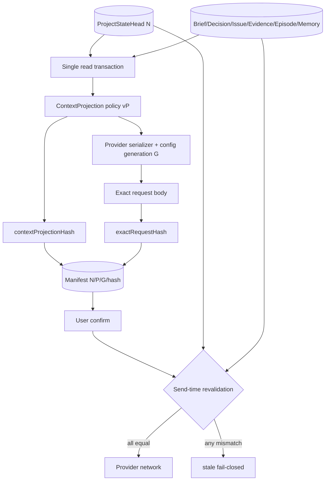

# Project state revision 与 Exact Context Manifest 单一绑定计划

> 本文件给出该领域的完整目标状态和实施合同。它不是 `v0.2.0` 当前事实，也不是完成证明；标注 `existing_verified` 的内容仅表示基线代码中已直接核对。

## 1. 计划结果

完成后，每个 canonical transaction 都推进一个单调 `projectStateRevision`；每个 Review 的 Context Manifest 持久化 `projectStateRevision`、`contextProjectionHash`、`exactRequestHash`、Provider generation、projection policy/schema identity，并从同一 SQLite read transaction snapshot生成。send 前重新读取 head、重算 projection/body并逐项比较；任何变化都 fail closed，UI给出精确 stale原因。rollback/compensation从不降低 revision，Search/Attention/Resume/Recovery均携带同一 revision。

## 2. 来源发现与证据边界

### 对应发现

`P0-01` 的直接原因之一是当前 state binding 与 outbound context范围不一致：`readState()` 的 `stateHash`包括 Brief、active/frozen Decisions、unresolved Issues和当前 Episode，但 `prepare()` 的 context另含 `receiptSummary`、更广的 Issue history与可选 Memory。Receipt/Memory改变可改变请求字节，却不一定改变 `ResearchRoomStateBinding`，因此旧 Manifest可能继续通过 stale gate。

### 必须保留的保护

- Manifest已保存 `contextHash`、`suggestionHash`、`stateBindingHash`、request body/hash/bytes、Provider generation与excluded fields。
- Provider send重新 prepare并比较请求，redirect=error、retry=0。
- Brief/Decision/Issue/Episode各自有 entity version/CAS。
- Recovery验证schema、DB integrity、project identity与Brief binding。

### 生产证据

- `packages/core/src/research-room.ts`：`prepare()` context与`readState()` semantic hash范围。
- `packages/research/src/room/research-room.ts`：`ResearchRoomStateBinding`、`ResearchRoomContextManifest`。
- `apps/research-room/src/openai-compatible-provider.ts`：`samePreparedInput()`和send。
- `packages/core/src/project-memory.ts`：Memory manifest/version/hash/policy验证。

本计划不声称当前发生过实际错误外发；它修复代码路径中可确定构造的stale漏检。

## 3. 当前状态与根因链

```text
canonical objects + receipts + memory
→ readState() 构造窄 stateBinding
→ prepare() 构造更宽 context/request body
→ Manifest只用窄 binding做 stale比较
→ 宽 context某项变化但窄 binding不变
→ old Manifest仍可能被发送
→ Exact Manifest“这是当前真实payload”的核心承诺失效
```

给 `stateHash` 临时追加一个字段无法稳定解决：未来任何新 outbound input 都可能再次遗漏。需要统一 transaction revision、显式projection policy与hash，而不是手工同步两个对象列表。

## 4. 方案空间

| 方案 | 正确性 | 精确 stale | 性能 | 迁移 | 维护/扩展 |
|---|---|---|---|---|---|
| A. 单一全局 revision，只比较 revision | 强、保守 | 只能说“项目变了” | O(1) | 中 | 新字段不易漏，但无payload差异信息 |
| B. 多对象 revision vector | 精确 | 强 | vector可大；1000对象复杂 | 高 | 每加对象要更新vector/比较逻辑 |
| C. 纯 `contextProjectionHash` | 对当前payload精确 | 强 | 每次需重算 | 中 | 无transaction顺序/恢复head，hash相同难解释历史 |
| D. 混合：全局revision + projection hash + exact request hash + Provider generation | 最强；顺序、payload与外部配置分层 | 最精确 | 可缓存，send前重算 | 中高 | 明确policy版本，最不易形成漏项 |
| E. 保持当前stateBinding并手工加Receipt/Memory | 暂时闭合 | 中 | 低 | 低 | 高回归风险 |

### 完全删除 Manifest 的反事实

可减少复杂度，但会删除Sestina最难被Prompt/Markdown替代的保护，并放大Provider隐私风险，因此不采用。

## 5. 最终推荐裁决

选择 **D：`projectStateRevision` + `contextProjectionHash` + `exactRequestHash` + Provider generation**。

- global revision提供canonical transaction总顺序、恢复head和并发边界；
- projection hash证明本Review选定policy下的outbound context；
- exact request hash证明Provider serialization后的真实body；
- Provider generation防配置切换；
- object versions留在event/preview中用于精确diff，不把全部vector塞进Manifest。

任何revision变化都先让旧Manifest进入`requires_revalidation`。Kernel在fresh snapshot上重算：若projection/request hash相同，UI可提供“一键重新确认，payload未变”；仍不得直接发送。该选择稍偏保守，但不会产生两个“当前状态”。

## 6. 目标领域模型

### 6.1 Project state head (`proposed_new`)

```ts
interface ProjectStateHead {
  projectId: string;
  projectStateRevision: number;     // starts at 1 after migration baseline
  canonicalStateHash: string;
  lastTransactionId: string;
  schemaVersion: number;
  updatedAt: string;
}
```

存储建议：`research_project_state_heads`（一项目一行）+ `research_project_state_events`（append-only）。不要复用 `research_projects.version`，因为子对象写入不会自然推进它。

### 6.2 Revision event (`proposed_new`)

字段：`projectId`、`revision`、`transactionId`、`effectKind`、`reviewId?`、`changedObjectRefs`、`previousCanonicalHash`、`nextCanonicalHash`、`compensatesReceiptId?`、`publicSummary`、`createdAt`、`data`。唯一键 `(project_id, revision)` 和 `transaction_id`。

### 6.3 Persistent Manifest (`proposed_new`)

```ts
interface ExactContextManifestRecord {
  manifestId: string;
  reviewId: string;
  projectId: string;
  projectStateRevision: number;
  contextPolicyVersion: string;
  contextProjectionHash: string;
  projectionObjectRefs: readonly ObjectVersionRef[];
  selectedMemoryRefs: readonly MemoryVersionRef[];
  providerIdentity: ProviderIdentitySnapshot | null;
  providerGeneration: number | null;
  exactRequestHash: string | null;
  exactRequestBody: string | null; // local, protected; absent for no-provider path
  exactRequestBytes: number;
  status: "prepared" | "confirmed" | "sent" | "stale" | "cancelled";
  staleReason?: ManifestStaleReason;
  version: number;
}
```

### 6.4 Revision推进矩阵

| 变化 | 推进 `projectStateRevision` | 原因 |
|---|---:|---|
| Brief activate/patch/direction change | 是 | canonical state/outbound context |
| Decision create/transition/supersede | 是 | canonical state |
| Issue create/status/resolution | 是 | canonical state |
| Evidence create/state/provenance/link | 是 | canonical state；是否入projection由policy决定 |
| Episode current state | 是 | canonical state |
| `record_only` Review outcome + Receipt | 是，一次 | canonical review history发生transaction |
| effect + Receipt | 是，一次，不重复 | 同一transaction |
| Memory confirm/edit/stale/expire/retire/forget | 是 | project context治理状态变化 |
| Review draft/Manifest/Provider attempt/assessment | 否 | workflow/non-authoritative；由Review version管理 |
| Appeal correction/second opinion | 否，直到effect commit | non-authoritative |
| Host suggestion draft | 否 | non-authoritative |
| Provider settings/generation | 否 | app setting；单独使Manifest stale |
| language/theme/nav/Inspector/search query | 否 | UI preference/derived |
| Search/Attention index rebuild | 否 | derived |
| backup/export | 否 | 副本操作 |
| migration baseline | 设为1并记录baseline event | 不虚构历史序列 |
| rollback/compensation | 是，N→N+1 | revision永不倒退 |

### 6.5 Default outbound projection

默认只包含：active Brief相关字段、selected canonical Decisions、与task相关的open/recent Issues、用户明确选定的Evidence引用/摘要、current Episode摘要、当前Suggestion、selected Memory、deterministic Context limitations、相关prior Review outcome summary。**不包含**原始Receipt/Trace、全量历史、旧Provider raw output、absolute paths、secrets或其他项目。

Receipt只通过确定性 `RelevantReviewOutcomeSummary` 进入context；该summary是canonical projection的一部分，因此其transaction已推进revision。

## 7. 状态机与 transition

### 7.1 Manifest lifecycle

| from | action | actor | precondition | mutation | to | failure |
|---|---|---|---|---|---|---|
| none | prepare | user/Kernel | Review draft、single read snapshot N | persist projection refs/hash/body/hash | `prepared` | snapshot/read/hash失败，无Manifest |
| prepared | confirm | user | exact summary/body visible、version匹配 | confirmation record | `confirmed` | stale/nonce不符 |
| confirmed | prepare Provider attempt | user | Provider snapshot/generation相同 | bind attempt | confirmed/attempt prepared | config changed→stale |
| confirmed | send | Kernel | 在同一fresh snapshot重算revision/projection/body全部匹配 | network invoke；mark sent | `sent` | 任一不符→`stale`，不网络 |
| prepared/confirmed | project canonical transaction | Kernel derived check | head N→N+1 | record precise reason | `stale` | 无自动reconfirm |
| prepared/confirmed | Provider config generation change | Settings | generation不同 | stale reason | `stale` | 无send |
| stale | rebuild | user | Review仍可用 | 新Manifest ID/version，旧保留 | new prepared | 原Manifest不可复活 |
| any unsent | cancel | user | 无active send | terminal | `cancelled` | 幂等 |

### 7.2 precise stale reason

至少包含：`project_revision_changed`、`brief_binding_changed`、`target_version_changed`、`projection_policy_changed`、`memory_selection_changed`、`memory_item_changed`、`provider_generation_changed`、`request_body_changed`、`schema_changed`、`migration_rebind_required`。reason携带before/after revision及changed object refs；不得只显示 `stale_state`。

### 7.3 concurrent write

Projection在SQLite read transaction中构建；send revalidation再次打开read transaction。写事务不能在projection对象读取中途混入。若head在body构造后、network前变化，最后一次head compare必须发生在网络调用前且与prepared body一致。

### 7.4 mixed-version prevention

不得从缓存读取Brief N、repository读取Decision N+1并拼接。所有repository读接受同一transaction handle或snapshot abstraction；无法提供snapshot的adapter fail closed。

### 7.5 rollback

compensation产生新event、新hash、新revision；旧Manifest全部requires revalidation。即便canonical hash偶然回到旧值，revision仍不同，旧Manifest不能自动复活。

## 8. 数据流与 Authority 流



写Authority只发生在后续effect transaction。Manifest是derived/persistent gate，不写研究结论。

## 9. API、Schema、Repository 与代码边界

| 当前路径/符号 | 当前职责 | 目标职责 | 修改 | 验证 |
|---|---|---|---|---|
| `packages/core/src/research-room.ts` `readState()/prepare()/analyze()` | 分别构建binding/context | 调用统一 `ProjectSnapshotReader`/`ContextProjectionService` | 重构 | `existing_verified` |
| `packages/research/src/room/research-room.ts` `ResearchRoomStateBinding/ContextManifest` | v1 schema | legacy兼容；新Manifest v2 | 重构 | `existing_verified` |
| `packages/research/src/project/project-state-revision.ts` | 不存在 | head/event/types/invariants | `proposed_new` | 计划对象 |
| `packages/core/src/context-projection.ts` | 不存在 | policy、snapshot、projection/hash/diff | `proposed_new` | 计划对象 |
| `packages/storage/src/migrations/021-project-state-revisions.ts` | 不存在 | heads/events | `proposed_new` | 计划对象 |
| `packages/storage/src/migrations/023-context-manifests-and-transition-receipts.ts` | 不存在 | persistent Manifests/new Receipts | `proposed_new` | 计划对象 |
| `packages/research-store/src/transactions/research-unit-of-work.ts` | UoW | 同时管理head/event/object writes | 扩展 | `existing_verified` |
| `apps/research-room/src/openai-compatible-provider.ts` | prepare/send exact body | 接收Manifest-bound prepared input；send前fresh validate | 保留/重构 | `existing_verified` |
| `packages/core/src/project-memory.ts` |独立Memory manifest | selection作为ContextProjection输入；不复制revision规则 | 重构 | `existing_verified` |
| Recovery services | DB/schema/Brief验证 | 增加head/event链与Manifest/Review binding | 扩展 | `existing_verified` |

`requires_code_verification`：实施前核对当前`ResearchStore`所有repository是否共享同一`StorageDatabase` transaction实例。若全部共享，revision head/event与对象写入可直接纳入现有UoW；若某repository绕过UoW连接，必须先改为snapshot-aware并收敛到同一connection。不同答案只影响UoW适配范围，不改变“同一transaction snapshot、不能先读后比较”的目标合同。

## 10. UI 与交互

### 普通摘要

Manifest区先显示：

- Project revision；
- 将外发的对象类别与数量；
- selected Memory；
- Context limitations；
- Provider endpoint origin/model；
- 是否会联网；
- 发生变化时的diff。

### Technical proof（默认关闭）

显示policy/schema版本、projection refs、`contextProjectionHash`、exact body/bytes/hash、Provider generation、excluded fields。hash可复制；exact body可查看但不默认全展开。

### stale

- `revision changed, payload changed`：展示变动对象与字段，必须重建/重新确认。
- `revision changed, payload unchanged`：展示“不相关项目变化，实际payload相同”，仍要求fresh confirmation。
- `Provider changed`：显示旧/新model/origin/generation，不沿用确认。
- `Memory changed`：指出item及状态，forgotten内容不回显。
- `schema/policy changed`：要求migration/rebuild，不能发送。

### 大内容

exact body采用虚拟化/折叠与查找；200%文本下操作按钮保持可达；screen reader先读摘要再可进入technical region。hash不能成为唯一状态表达。

## 11. 中文／English 与术语

- `stateBinding`：legacy技术名；新用户表面使用“项目状态修订号”和“上下文投影”。
- `projectStateRevision`：camelCase仅API/TypeScript；DB列`project_state_revision`。
- `contextProjectionHash`：仅证明projection字节，不证明结论。
- `exactRequestHash`：序列化后body hash；不得称“语义hash”。
- `Manifest confirmed`：用户确认了此payload，不表示同意Provider输出。
- `stale`：中文“上下文已变化，需要重新核对”，并附原因。
- `Provider generation`：中文“Provider配置代次”，普通摘要只在变化时出现。

## 12. 隐私、安全与权限

- exact body是敏感本地数据；UI、logs、crash report默认不复制。Clipboard需显式action。
- Manifest与Provider secret分离；secret永不进入body/Receipt/export。
- send-time validation必须发生在网络前；验证失败不得建立连接。
- Provider redirect、DNS/private address、response size与timeout由`12`控制。
- Manifest ID/confirmation不能跨project或跨desktop session重放。
- forgotten Memory不得进入fresh projection；历史已发送Manifest的副本处理见`08`/`12`。
- projection policy是代码签名/版本化资源，不接受research text修改。
- Host suggestion不能指定未授权absolute path或强制selected Memory。
- Error仅显示hash前缀/对象ID/原因，technical view按需显示完整hash。

## 13. 数据迁移与向后兼容

- 每个`v0.2.0`项目建立`ProjectStateHead(revision=1)`；从当前canonical对象计算baseline canonical hash。
- 写一条`migration_baseline` event，`changedObjectRefs`列出现有活跃对象，但不假装它们在revision 1新创建。
- 旧Receipt/Memory/Brief等保留原entity versions；revision 1是新的全局坐标。
- 旧Manifest只存在于Receipt内，全部标记`legacy_manifest_unresendable`；不能在新runtime发送。
- active pending Review基线不存在持久数据，因此无可迁移；不从临时UI state猜测。
- migration使用复制DB、运行schema、回填head/event、重建projection、验证、原子替换；原DB备份保留。
- event chain或canonical hash验证失败则migration不切换。
- restore旧backup后新runtime重新执行baseline；不会沿用已迁移DB的revision。
- future schema/too-old策略见`11`。

## 14. 测试与验证

### RED/property tests

- 变更Receipt outcome、Memory、Brief、Decision、Issue、Evidence、Episode逐项验证revision推进与旧Manifest失效。
- UI theme/language/Inspector/search变化不推进revision。
- 同transaction effect+Receipt只推进一次。
- compensation推进revision，即使canonical hash恢复旧值。
- 任意对象写入若未更新head/event，transaction invariant失败并回滚。
- projection字段随机增删时policy schema hash变化；旧Manifest不能发送。
- concurrent writer在projection构建/发送各时间点注入，不能产生mixed-version body。
- revision变而projection相同：必须重新确认，网络调用次数仍0直到确认。
- provider generation变更、exact body变更、redirect配置变更均stale。
- migration baseline稳定、幂等、失败可重试。

### 层级

unit（hash/policy/reason）、repository（head/event unique/CAS）、transaction（故障注入）、API（Manifest DTO）、provider contract（exact bytes）、crash/restart、large project性能、backup/restore、production UI长body。hash测试只证明字节一致。

## 15. 完整验收标准

- 所有canonical transaction有连续无缺口revision和对应event；不存在静默子对象写。
- Manifest持久化revision/projection hash/exact request hash/provider generation/policy/schema。
- send前读取fresh snapshot并验证四层identity；失败时0网络。
- stale UI指出具体对象/配置变化；无泛化“状态过期”死路。
- revision变但payload未变时仍需重新确认，且明确说明body相同。
- Search/Attention/Today/Resume/Recovery均报告其projection revision；过旧时显示rebuilding而不冒充current。
- rollback/compensation从不复用旧revision或复活旧Manifest。
- UI preferences/搜索不制造研究revision噪音。
- migration后的旧Manifest不可重发，旧Receipt仍可审计。
- 1000对象下构建/重算在定义性能阈值内，且不截断而不提示。
- Exact Manifest原有body可见、redirect/retry、Memory选择、安全保护不回归。

## 16. 明确非目标

- 不把每个UI交互写入project revision。
- 不用hash证明语义正确。
- 不把object revision vector直接暴露给普通用户。
- 不支持离线多设备合并或CRDT。
- 不允许旧Manifest“只要hash相同”自动发送。
- 不在Provider payload中默认放全量Receipt/Trace/history。
- 不以性能为由绕过single snapshot。
- 不减少Recovery fail-closed。

## 17. 被拒绝方案与重新考虑条件

- **纯global revision**：只有产品不再需要解释payload差异时才重开；当前Exact Manifest需要projection proof。
- **纯vector**：只有并行协作/局部rebase成为核心需求时重开；当前认知和存储成本不相称。
- **纯projection hash**：只有不需要transaction顺序、恢复head和canonical audit时重开。
- **手工补stateBinding**：不会重开；它不能防未来字段遗漏。
- **revision变但hash同就自动发送**：违反显式确认与fail-closed，不重开。

## 18. 实施风险与失败收缩

- 若某些旧command绕过新UoW，head会漂移；切换前必须建立“每个canonical repository write需要transaction context”的架构测试。
- 若projection缓存按错误key复用，可能body stale；cache key必须含project/revision/policy/selection/provider generation，send仍重算。
- event日志增长：head O(1)，历史分页/归档；不得删除影响恢复的event。大项目性能由`13`验证。
- migration baseline计算中崩溃：只操作副本，原DB不变。
- UI先消费revision但旧API不提供：read-only compatibility，不允许发送。
- Provider send已经发出但状态写 uncertain：Review转`provider_attempt_uncertain`，不以revision回滚掩盖外发事实。

## 19. 对其他计划的依赖

- `01-REVIEW-CANONICAL-TRANSITION.md` 规定revision在effect transaction中推进一次。
- `04-PERSISTENT-REVIEW-AND-SEMANTIC-CLAIMS.md` 绑定Review/attempt/Manifest。
- `08-GOVERNED-MEMORY-SIMPLIFICATION.md` 定义Memory哪些变化推进revision、如何进入selection。
- `05-PROGRESSIVE-RESEARCH-BRIEF.md` 定义Brief/context limitations projection。
- `11-DATA-MIGRATION-COMPATIBILITY-AND-ROLLBACK.md` 负责baseline、copy-on-write和downgrade。
- `12-PRIVACY-SECURITY-AND-THREAT-MODEL.md` 约束exact body、network、secret。
- `06-TASK-ORIENTED-IA-AND-PRODUCTION-UI.md` 实现Manifest summary/diff/stale状态。
- `13-TEST-EVAL-AND-PRODUCTION-VERIFICATION.md` 设置concurrency/performance/release证明。
