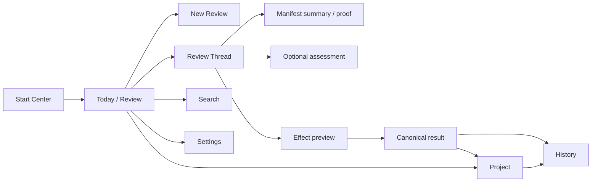

# Task-first 信息架构与完整生产 UI/UX 计划

> 本文件给出该领域的完整目标状态和实施合同。它不是 `v0.2.0` 当前事实，也不是完成证明；标注 `existing_verified` 的内容仅表示基线代码中已直接核对。

## 1. 计划结果

完成后，Sestina 的一级导航只有 `Today / Review`、`Project`、`Search`、`Settings`。Research Room 仍是主要产品交互面，但不再把 Brief、Decision、Issue、Evidence、Episode、Receipt、Appeal、Memory、Attention、Room、Pilot 并列为对象入口。用户在一条 Review Thread 中看到 Suggestion、Context limitations、Exact Manifest、可选 Provider assessment、deterministic proof、canonical effect preview、user Authority、resulting object 与 Receipt。Inspector 默认关闭，technical proof按需展开。全产品覆盖空白、加载、stale、partial、failed、offline、recovery、主题、语言、桌面宽度、200%文本、键盘、screen reader、长内容与大项目。

## 2. 来源发现与证据边界

### 对应发现

- `P1-06`：`ProjectShell.tsx` 当前主导航含 Overview、Brief、Decisions、Issues、Evidence、Episodes、Receipts、Appeals、Resume/Memory、Attention，再单列 Open Pilot；页面围绕对象/protocol组织。
- `P1-04`：Brief在首启与完整编辑之间两极化。
- `P1-05`：React本地`prepared/analyzed`状态与Map生命周期共同造成重启丢失。
- `P0-01/P1-01/P1-02`：UI无法稳定回答“做完改什么”，且Provider status过度控制/实体化。
- `P2-01`：Appeal/Room作为独立工具抢占主产品。
- `P2-02`：system browser loopback与Desktop identity不一致。

### `existing_verified` 基线保护/素材

- Start Center、语言、Light/Dark/High Contrast、Thread + Inspector、Search、Attention、Recovery、Provider settings、keyboard/focus处理已有真实代码与截图/Playwright覆盖。
- `ContextInspector`能展示Manifest/technical details；`ProjectShell`已有search overlay与focus return。
- 唯一官方Logo文件存在并在当前UI使用；本计划禁止修改其字节与使用规则。

视觉判断中，源码/DOM/测试不能替代production rendering。目标验收必须用真实打包App渲染。

## 3. 当前状态与根因链

```text
一级导航按对象列出10+入口
→ 用户先学习内部名词和对象关系
→ Review Thread只覆盖一段流程，Receipt/Appeal/Memory/Pilot在别处
→ Inspector持续承载大量protocol状态
→ action完成后resulting research object不突出
→ UI像研究状态数据库/治理协议可视化，而非任务完成面
```

只调整颜色、卡片、圆角或把导航折叠，仍保留相同认知模型；需要先改路由、页面主任务、状态因果与内容层级，再调整视觉tokens。

## 4. 方案空间

| 方案 | 核心闭环 | 对象可审计 | 认知负担 | 迁移 | 长期维护 |
|---|---|---|---|---|---|
| A. 保留object-first导航，仅重排/折叠 | 部分 | 强 | 仍高 | 低 | 每增对象就增入口 |
| B. 单一聊天Thread，所有对象完全隐藏 | 直观 | 弱；难审计/恢复 | 低初始、高后期 | 高 | 易退化成聊天App |
| C. Task-first四入口；Review Thread主闭环，Project/History承载对象 | 完整 | 强 | 最低可接受 | 中高 | 页面职责稳定 |
| D. Dashboard-first KPI/卡片首页 | 间接 | 中 | 中 | 中 | 容易装饰化、无主动作 |
| E. 把Room/Pilot做成独立产品标签页 | 分裂 | 强局部 | 极高 | 高 | 第二产品线持续扩张 |

### 完全删除Inspector的反事实

会让普通界面更简单，但Exact Manifest、hash、request body、Receipt proof和recovery diagnostics无处可核对，破坏核心保护。正确做法是默认关闭、渐进展开，而非删除。

## 5. 最终推荐裁决

选择 **C：四入口task-first IA + Review Thread + Project/History + contextual Inspector**。

- Today/Review回答“现在最需要我做什么”。
- Project回答“当前研究状态是什么、如何维护”。
- Search回答“某对象/决定/证据在哪里、来源和状态是什么”。
- Settings回答“Provider、隐私、恢复、外观、集成如何配置”。
- History作为Project二级页面保存Receipt、old Appeal、Room、Pilot等审计对象。
- Inspector默认关闭，只有Manifest、proof、raw technical detail需要时打开。
- 删除默认Room/Pilot入口和new routes；不删除历史可读性。
- 视觉继续`Quiet Instrument`方向，但以状态因果和可操作性为先。

此方案保留结构化状态的独特价值，避免退化为空白聊天，同时删除对象并列造成的主导航复杂度。

## 6. 目标领域模型

### 6.1 一级路由 (`proposed_new`)

| Route | Label | Canonical/derived | 主任务 |
|---|---|---|---|
| `/project/today` | Today / Review | derived queue + persistent Review | 处理当前Review/Attention/恢复 |
| `/project/reviews/new` | New Review | persistent draft | 输入/导入Suggestion |
| `/project/reviews/:reviewId` | Review Thread | persistent Review | 完成Manifest/assessment/effect/commit |
| `/project/state` | Project | canonical projections | 查看Brief/Decision/Evidence/Issue关系 |
| `/project/state/brief` | Brief detail | canonical projection | 查看当前Brief、coverage与关联 |
| `/project/state/brief/edit` | Edit Brief | candidate→canonical | typed progressive edit |
| `/project/state/brief/history/:versionId` | Brief history | canonical history | 查看字段diff、来源与冲突 |
| `/project/history` | History | audit/legacy | Receipt、correction、Room、Pilot历史 |
| `/project/history/:kind/:id` | History detail | read-only/Receipt proof | 审计/导出/恢复 |
| `/project/search` | Search | derived at revision | 搜索/筛选/跳转 |
| `/project/settings` | Settings | app/project settings | Provider/privacy/appearance/recovery/integrations |
| `/project/settings/:section` | Settings section | settings | 直接链接 |

旧路由alias：`/project/review`→`/project/today`；对象collection routes→`/project/state`对应tab/filter；appeal/room/pilot→history detail/read-only。alias不保留旧写能力。

### 6.2 页面级view model

- `TodayViewModel`: project revision、current question/task、actionable Reviews、blocking Issues、recovery/projection状态、recent canonical changes。
- `ReviewThreadViewModel`: persistent Review aggregate、Context limitations、Manifest摘要、attempt、assessment、proof、effect preview、result。
- `ProjectStateViewModel`: Brief summary、typed relation lists/graph、history cursor、contextual Memory。
- `SearchViewModel`: query、filters、revision、results、authority/provenance、index status。
- `SettingsViewModel`: Provider config/generation/test facts、privacy/network、appearance、recovery、host bridge、release identity。

View model全部derived，不能写Authority；actions调用Kernel command API。

### 6.3 页面组件职责 (`proposed_new`)

| Component | 责任 | 不得承担 |
|---|---|---|
| `TodayWorkspace` | queue、current task、recent result | 自行计算stale/Authority |
| `ReviewThread` | 顺序呈现Review stages | 存业务状态 |
| `ContextManifestSummary` | 普通payload/网络摘要 | 取代exact body |
| `ProviderAssessmentPanel` | assessment+identity+unknown | 表示事实已验证 |
| `DeterministicProofPanel` | flags/hash/write facts | semantic verdict |
| `CanonicalEffectComposer` | effect选择/typed target payload | 直接写对象 |
| `CanonicalEffectPreview` | before/after/result/rollback | 允许绕过preview |
| `AuthorityOutcomePanel` | Authority outcome／用户裁决结果、actor、confirmed revision | 把Provider assessment当成裁决 |
| `CanonicalResultCard` | resulting object/revision/open/history | 把Receipt当结果 |
| `ProjectStateWorkspace` | Brief/Decision/Evidence/Issue关系 | object-first主导航 |
| `HistoryWorkspace` | Receipt/correction/legacy read-only | 新建Room/Pilot |
| `TechnicalProofDrawer` | exact bytes/hash/raw errors | 默认常开 |

### 6.4 Authority/visual state

每个显示对象带`source class`、`authority class`、`revision/version`；颜色只是冗余，文本/图标/position同时表达。

## 7. 状态机与 transition

UI不定义新的domain state machine，只映射`04`和`01`。页面级状态如下：

| 页面状态 | 进入 | 用户可做 | 退出/结果 | 失败收缩 |
|---|---|---|---|---|
| Today empty | 无active Review/attention | 新建Review、查看Project | draft | 不显示空白聊天 |
| Review draft | persisted | 编辑source/target、prepare context | manifest prepared | 输入保留 |
| Manifest prepared | persistent | 查看summary/body、确认/取消 | confirmed | stale则重建 |
| Attempt running | persistent | 离开页面、cancel、查看Manifest | assessment/failed/uncertain | 不阻塞整个App |
| Assessment recorded | persistent | 比较assessment/proof、选择effect | effect preview | Provider非gate |
| Effect preview | persistent | 编辑/commit/cancel | committed/disposed | stale重新计算 |
| Canonical success | Receipt/result | Open result、View proof、compensate | Project/History | derived index可pending |
| Recovery required | startup/kernel | preview backup/restore/diagnostics | reopen same revision | 所有项目写禁用 |
| Search index rebuilding | projection lag | 浏览canonical Project/History | fresh index | 搜索显示revision lag |

焦点：每个action完成后移到新的stage heading；关闭drawer/overlay回到触发控件；route切换focus到`#workspace-heading`。Overlay打开时执行 **overlay inert**：背景必须设为`inert`，不仅`aria-hidden`；关闭后focus return到原触发控件。

## 8. 数据流与 Authority 流



网络状态在Review/Settings的正确时机出现；Provider setup不抢占Start Center。Research data不因页面导航外发。

## 9. API、Schema、Repository 与代码边界

| 当前路径/组件 | 当前职责 | 目标职责 | 修改 | 验证 |
|---|---|---|---|---|
| `apps/research-room/client/src/routing/project-route.ts` | object workspace routing | 新route map + legacy aliases | 重写 | `existing_verified` |
| `apps/research-room/client/src/screens/ProjectShell.tsx` | 10+对象/Host导航、search overlay | 四入口App shell、Today queue、secondary History | 重构 | `existing_verified` |
| `apps/research-room/client/src/components/product/ReviewWorkspace.tsx` | prepare/analyze/disposition | 拆为persistent ReviewThread/stage components | 重构 | `existing_verified` |
| `apps/research-room/client/src/components/product/ResearchObjectWorkspace.tsx` | collection/detail workspaces | Project/History内部复用，不作主入口 | 重构/隐藏 | `existing_verified` |
| `apps/research-room/client/src/components/product/ContextInspector.tsx` | selection inspector | `TechnicalProofDrawer`，默认closed、contextual | 重构 | `existing_verified` |
| `apps/research-room/client/src/components/product/ReceiptList.tsx` | Review页列表 | History/CanonicalResult次级proof | 移动/重构 | `existing_verified` |
| `apps/research-room/client/src/components/product/CorrectionAppealWorkspace.tsx` | 独立Appeal | Review correction section/legacy history | 重构 | `existing_verified` |
| `apps/research-room/client/src/components/product/DeliberationRoomWorkspace.tsx` | active Room | legacy read-only renderer | 收缩 | `existing_verified` |
| `apps/research-room/client/src/components/product/ExternalAppPilotWorkspace.tsx` | active Pilot | legacy read-only renderer/diagnostics | 收缩 | `existing_verified` |
| `apps/research-room/client/src/components/product/ProjectMemoryWorkspace.tsx` | 独立Memory | contextual drawer + Project history | 重构 | `existing_verified` |
| `apps/research-room/client/src/screens/StartCenter.tsx` | project selection/init | 说明不可约简任务、recent projects、recovery | 保留/重构 | `existing_verified` |
| `apps/research-room/client/src/styles/tokens.css` | design tokens | 保留palette foundation，新增semantic layout/focus/space tokens | 调整 | `existing_verified` |
| `apps/research-room/client/src/styles/app.css` / `apps/research-room/client/src/styles/deliberation.css` | current screens | 删除orphan styles；responsive/a11y states | 重构 | `existing_verified` |
| `apps/desktop/*` | 不存在 | Electron shell/preload/renderer host | `proposed_new` | `10`定义 |

### route cutover

新router先接受旧deep links并转到新projection；一旦migration完成，旧mutation components从bundle移除。不得只在CSS隐藏仍可路由的new Room/Pilot按钮。

## 10. UI 与交互

### 10.1 Start Center

主文案回答：Sestina帮助用户把建议变成可核对、可恢复的研究状态变更。主要动作：Open project / Create project；次动作：Restore backup、Language、Appearance。不得在首屏堆Manifest/Authority术语。

状态：首次空白、recent projects、missing directory、read-only、schema too new、recovery required、migration preview。初始化确认列出将创建的本地目录/文件，不把Logo用作背景装饰。

### 10.2 Today / Review

布局：

```text
[Project title] [revision]                         [Search] [Settings]
Current question
Current task

Needs your decision
 ├─ Review: manifest changed — Rebuild
 ├─ Review: Provider result uncertain — Continue without assessment
 └─ Issue: evidence threshold unresolved — Open Project

Active Review Thread / Start a Review
Recent canonical changes
```

队列只放可行动项；大量Attention分页/分组，不用数百徽章。优先级由Kernel projection给出。

### 10.3 Review Thread

```text
1 Suggestion              source + requested target
2 Current context         question/task/limitations
3 Exact Context Manifest  summary → expandable exact payload
4 Optional assessment     Provider claim | deterministic proof
5 What will change        typed effect + before/after
6 Your decision           user-only confirm
7 Result                  object/revision | Receipt proof
```

每stage有明确完成/未完成/失效状态。原始Finding、ArgumentDelta、Provider error长内容可折叠，但unknowns和limitations不可隐藏。

### 10.4 Project

默认显示Brief摘要与四组关系：Decisions、Evidence、Issues、Current episode。可切换List/Relations/History；不在一级导航复制对象。每项显示authority/provenance/status/version。Memory在“Context in use”drawer；Appeal以 **contextual Appeal** 形式嵌入原Review correction history；History含Receipt、correction、legacy Room/Pilot。

### 10.5 Search

专用route，不再只做overlay。支持全文、kind、status、authority/source、date/revision过滤；结果显示为何匹配、是否stale、canonical/derived。1000对象时虚拟化、cursor pagination；索引落后显示projection revision并提供rebuild diagnostics。

### 10.6 Settings

Sections：Provider、Privacy & Network、Appearance & Accessibility、Recovery & Data、Integrations、About & Release Proof、Advanced Diagnostics。Provider test明确`metadata_only_no_research_context`；Host bridge默认off；update check用户主动。

### 10.7 全状态矩阵

| 状态 | Today | Review | Project/Search | Settings/Recovery |
|---|---|---|---|---|
| loading | skeleton + current task保留 | stage-level | 保留上次结果+busy | 禁用重复动作 |
| empty | next action | empty draft | “无对象”+创建位置 | 无配置说明 |
| disabled | 原因+可修复动作 | 缺target/revision；非Provider gate | 权限/readonly | capability原因 |
| success | queue移除+recent change | resulting result card | revision刷新 | 保存确认 |
| stale | actionable queue | reason+diff/rebuild | stale source标签 | config generation提示 |
| partial | projection pending | Provider partial/invalid独立 | index lag | backup preview incomplete fail closed |
| error | stable summary+retry | input保留；error code/action | 不清空结果 | 不泄露path/secret |
| offline/no Provider | 核心正常 | assessment unavailable | 正常 | network状态诚实 |
| recovery | 启动阻塞 | write禁用 | verified preview only | primary recovery path |

### 10.8 响应式与内容压力

- 1100px：单主栏，导航icon+label可收缩，Inspector overlay drawer；不做三栏挤压。
- 1280px：导航+主栏；Inspector按需overlay/窄side panel。
- 1440/1920px：主内容最大可读宽度，空余用于关系/Inspector，不无限拉长行。
- 200%文本：无需水平滚动完成核心任务；sticky actions不遮挡；dialog可滚动。
- 长Brief/Finding/error：结构化折叠、首层摘要、保留全文访问；不truncate后无入口。
- 1000对象/数百Attention：cursor pagination/virtualization/grouping；初始render不加载全量。

### 10.9 可访问性

- 全键盘：skip link、逻辑tab order、Escape关闭、focus trap、focus return。
- overlay背景`inert`；nested overlay禁止。
- screen reader：landmarks/headings、stage status live regions节流、表格caption、diff语义。
- 状态不靠颜色：文字、icon、shape、position。
- High Contrast使用系统/明确border，不依赖低饱和背景。
- reduced motion关闭非必要transition；不以动画传递状态。
- touch不是主目标，但target至少可点击。

### 10.10 主题、语言与Logo

Light/Dark/High Contrast共享结构与semantic tokens；中文/English布局允许长度差异，不用固定宽度。唯一官方Logo原文件字节保持不变：不重绘、不反色、不裁切、不生成dark variant；通过周围容器/留白适配主题。

### 10.11 生产视觉验收矩阵

必须在**真实production Desktop build**逐项渲染：

- Languages：zh-CN、en。
- Themes：Light、Dark、High Contrast。
- Widths：1100、1280、1440、1920；至少一个非整数DPI。
- Text：100%、200%。
- Motion：normal、reduced。
- Input：mouse、keyboard-only、screen reader。
- Data：empty、long Chinese、long English、1000 objects、hundreds Attention、long Provider error。
- States：Manifest prepared/stale、no Provider、attempt running/uncertain、effect preview、success、recovery、legacy history。

源码审查、Playwright DOM、测试成功、storybook或截图生成不能替代真实build的人眼结构检查与实际交互。

### 10.12 必须捕获的无私人数据截图

1. Start Center：首次/最近项目/recovery required。
2. Today：empty、有3类action、hundreds Attention分组。
3. Review：no Provider、Manifest exact-body展开、assessment+proof、stale diff、uncertain、effect preview、success。
4. Project：长Brief、关系列表、contextual Memory、History。
5. Search：1000对象、index lag、无结果。
6. Settings：Provider、Privacy、Recovery、Integrations、About/release proof。
7. Correction/second opinion；legacy Room/Pilot read-only。
8. 每主题/语言/200%/1100px关键组合。

截图只证明该时刻视觉；必须配合键盘、focus、scroll、commit/restart/recovery交互证据。

## 11. 中文／English 与术语

一级名称固定：`Today / Review`（今天 / 审议）、`Project`（项目）、`Search`（搜索）、`Settings`（设置）。

- `Project Objects`、`Host Access`从一级导航删除。
- `Attention`改为Today中的“Needs your decision”，其完整列表可在Today二级展开。
- `Inspector`用户文案“Technical proof / 技术证明”，默认关闭。
- `Receipt`文案“变更凭证”，不称“结果”。
- `Provider assessment`和`Deterministic proof`分栏。
- `Appeal`用户文案“纠正此评估”，不是独立产品名。
- `Room`只在历史对象标题中保留。
- `Open Pilot`从主UI删除。
- current archive文案“Local loopback research server preview”；target build“Desktop App”。

不得使用大段抽象slogan、AI味泛化卡片或badge堆积替代关系说明。

## 12. 隐私、安全与权限

- Renderer不直接访问Node/filesystem/secrets；Desktop使用context-isolated preload IPC（`10/12`）。
- untrusted research/Provider/Host文本不以raw HTML渲染；外链默认不打开，显式确认且使用系统浏览器。
- technical exact body默认关闭，复制/download显式；截屏测试使用synthetic data。
- error boundary不得把secret、absolute path、payload写入UI/console。
- session/capability过期时写动作disabled并说明，不自动重新认证。
- Recovery状态下全局写入口关闭；readonly preview明确。
- route参数project/object ownership由server验证，客户端router不是安全边界。
- Provider/network状态必须在send前显示；Settings test不携研究context。
- Host bridge开启状态在App chrome持续可见但不抢主任务；默认off。
- Logo asset不得被data URL重写或主题滤镜反色。

## 13. 数据迁移与向后兼容

### 路由/数据兼容

- `/project/review` alias到`/project/today`；若有active legacy Review ID，定位historical thread。
- `/project/overview|brief|decisions|issues|evidence|episodes`转到`/project/state`并设置tab/filter。
- `/project/receipts|appeals|deliberation-rooms|external-app-pilot`转History；`new` routes返回410/说明已合并，不创建对象。
- Memory route转Project contextual memory；不丢对象。
- 旧deep link ID保持可导航；history renderer读取legacy projection。
- UI preferences（language/theme）迁移，不推进project revision。
- 新production shell首次打开migrated项目时显示migration summary；不重新onboard已知用户。
- 旧UI bundle不得写新schema；compatibility mode只读。

完整表级迁移见`11`。

## 14. 测试与验证

### RED/E2E

- 新用户无需读README完成Start→Brief→Review→Manifest→no-Provider effect→result→restart。
- 主导航DOM/keyboard只有四入口；旧Room/Pilot new action不可达。
- Provider失败不禁用effect。
- effect完成显示resulting object，Receipt次级。
- route aliases导航到正确tab/history且不写legacy table。
- Inspector默认closed；打开/关闭focus正确、背景inert。

### Accessibility

axe/ARIA只作基础；加keyboard scripts、screen reader手动脚本、200% reflow、High Contrast、reduced motion、long text。每个dialog/overlay检查focus trap/return、Escape、scroll。

### Visual/production

真实Electron packaged build在矩阵中截图并人工比较页面构图、主次、溢出、状态可辨。DOM snapshot/CSS unit不能替代。修复后同场景重拍并记录artifact hash。

### Performance

1000对象、数百Attention、长Brief/Findings：启动、Today、Search、Project、drawer、route切换测真实SQLite+production renderer；验证pagination/virtualization和memory use。不得用空fixture宣称通过。

### Other

API contract、no-network、crash/restart、migration、recovery、themes/language、release artifact。详见`13`。

## 15. 完整验收标准

- 一级导航仅四项，Start Center/Recovery除外；对象仍可从Project/Search/History找到。
- 每条Review可在一页回答“发生什么、为什么、能做什么、做完改什么、结果在哪里”。
- no Provider/offline/failed/uncertain/stale均有完整action，不出现死路。
- canonical result与Receipt层级清楚；result first、proof second。
- Inspector默认关闭，technical proof完整可达。
- legacy Appeal/Room/Pilot可读/导出/恢复但不能新建或写Resolution。
- Search/Attention/Project显示revision/provenance/authority一致。
- 1100/1280/1440/1920、200%、长中英、1000对象、hundreds Attention可操作。
- Light/Dark/High Contrast、keyboard、screen reader、reduced motion通过生产矩阵。
- 不靠颜色表达；focus/overlay/inert/return正确。
- 官方Logo文件hash与v0.2.0基线相同，无变体。
- 真实production rendering证据存在；source/DOM/test不冒充视觉通过。
- 移除orphan routes/styles/components后没有第二UI state machine。

## 16. 明确非目标

- 不做移动端/网页SaaS。
- 不做空白chat-first通用Agent。
- 不用Dashboard指标替代任务。
- 不通过删除Manifest/Recovery/Authority降低复杂度。
- 不扩展Room、多Agent、Pilot。
- 不重绘Logo或做主题Logo。
- 不以审美偏好代替功能验收。
- 不以截图证明交互闭环。
- 不加入社交、团队协作、云同步。

## 17. 被拒绝方案与重新考虑条件

- **A折叠object nav**：只有用户任务确实按对象启动而非Review/next action时重开；当前产品核心不支持。
- **B纯Thread**：只有审计对象/恢复不再是核心时重开；会丢独特增量。
- **D Dashboard-first**：只有存在稳定、决策相关KPI时重开；当前没有。
- **E Room/Pilot独立产品线**：只有产品不变量改变为通用Agent/多Agent平台时重开。
- **删除Inspector**：只有Manifest/technical proof不再需要时重开，当前不可。
- **CSS-only重设计**：不能重开为主方案；仅在IA完成后调整tokens。

## 18. 实施风险与失败收缩

- UI先于Kernel完成会用mock假装result；新UI只能在真实DTO/transition可用后合并主入口。
- 新旧routes并存可能仍可创建Room/Pilot；server必须先冻结legacy writes，UI隐藏不是保护。
- object detail被移入Project后可能降低可发现性；Search/deep links/History必须同时到位。
- Electron与loopback两种host若并存，production feature flag必须唯一；About明确当前mode。
- performance优化不得缓存过期Authority state；view model带revision。
- visual矩阵耗时不允许删减；未完成则整套refactor未出货，但canonical DB保持可用于开发测试。
- Logo适配只能改容器背景/spacing；禁止滤镜。
- partial implementation以read-only compatibility收缩，不开放混合写路径。

## 19. 对其他计划的依赖

- `01`/`02`/`03`/`04`定义Review Thread真实状态和actions，UI不得复制。
- `05-PROGRESSIVE-RESEARCH-BRIEF.md`定义Brief页面/limitations。
- `07-APPEAL-SECOND-OPINION-AND-DELIBERATION.md`定义correction/legacy Room位置。
- `08-GOVERNED-MEMORY-SIMPLIFICATION.md`定义contextual Memory drawer。
- `09-HOST-PILOT-AND-AGENT-CORRECTOR-INTEGRATION.md`定义Host queue和legacy Pilot。
- `10-RELEASE-IDENTITY-AND-LOCAL-LIFECYCLE.md`定义production Electron shell与viewport。
- `11`定义route/data migration，`12`定义renderer/IPC安全。
- `13`是production visual/accessibility/performance证据权威。
- `15`统一文案；`16`核对routes/domain一致。
