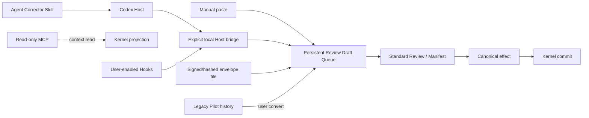

# Host、Closed Pilot 与 Agent Corrector 统一接入计划

> 本文件给出该领域的完整目标状态和实施合同。它不是 `v0.2.0` 当前事实，也不是完成证明；标注 `existing_verified` 的内容仅表示基线代码中已直接核对。

## 1. 计划结果

完成后，手工粘贴、Codex、Skill、MCP相关宿主和`agent-corrector`产生的内容都只进入同一个 `Persistent Review Draft` 队列。Host adapter只能提交带source host identity、optional file references、requested target hint和公开理由的non-authoritative Suggestion，不能写Brief/Decision/Issue/Evidence、不能确认Manifest、不能commit Authority。Closed External App Pilot不再拥有默认`Open Pilot`入口、candidate/continuity/disposition的独立产品生命周期；历史Pilot可读、导出、诊断和恢复。`codex/agent-corrector`作为独立companion Skill合入主树，但保持ephemeral、显式调用边界和无持久Authority。

## 2. 来源发现与证据边界

### 对应发现

- `P1-06`：当前`ProjectShell.tsx`有独立HOST ACCESS / Open Pilot入口；Pilot拥有17+状态、attempts、continuity、feedback、Review/Receipt binding，形成第二条产品旅程。
- `P2-01`：Host continuity与Room/Appeal类似，协议保护存在，但直接canonical增量不足。
- `P2-02`：Host运行依赖archive/loopback/系统Codex环境，与最终Desktop生命周期需要重新边界化。

### `existing_verified` Pilot保护

- `ClosedExternalAppPilot`明确`canMutateAuthority=false`，有exact Manifest、explicit confirmation、attempt budget、no auto retry、host observation provenance、interrupted_unknown。
- candidate需确认并进入Review；continuity只为host observation。
- MCP/Skill现有接入整体受限，MCP主要read-only。

### 发布后分支（不属于`v0.2.0`）

`codex/agent-corrector` commit `74c62c5f4ab22cc8267a4edc74cfaa34b078a3a8` 新增：

- `integrations/skills/canonical/agent-corrector/SKILL.md`及Codex bundle（`branch_verified`，不属于`v0.2.0`）；
- bounded bilingual evals与明确limits；
- Skill自称同一Agent的短纠偏loop，不是watchdog、permission system、durable memory或independent enforcement；
- eval文档明确显式`$agent-corrector`不证明implicit discovery。

这些只用于本计划宿主集成设计，不能倒算为`v0.2.0`能力。

## 3. 当前状态与根因链

```text
Codex host task
→ Open Pilot create/preflight/context confirmation/launch
→ candidate confirmation/import
→ separate Review binding/disposition
→ continuity check/session close
→ Pilot拥有自己的session、attempt、continuity和完成态

同时Agent Corrector Skill
→ 同一Agent内ephemeral correction
→ 无DB/Authority

若两者继续独立扩张
→ Host、Pilot、Skill、Review各自表达“纠偏已完成”
→ Kernel不再是唯一truth，主UI被宿主协议占据
```

只把`Open Pilot`移到Settings不足：active Pilot状态机仍可能成为第二套continuity truth。需要把唯一持久增量收缩为Review draft+provenance。

## 4. 方案空间

| 方案 | 低摩擦 | 单一Review lifecycle | Authority安全 | Host能力 | 迁移/维护 |
|---|---|---|---|---|---|
| A. 保留Closed Pilot全生命周期，仅隐藏入口 | 低 | 否 | 现有保护强 | 高 | 高；第二产品线继续 |
| B. 只允许手工粘贴，删除所有Host/Skill/MCP | 中低 | 是 | 强 | 低 | 低；失去跨宿主入口 |
| C. Thin Host Intake：手工/Host/Skill统一创建Review draft；MCP默认只读；Pilot历史只读 | 高 | 是 | 强 | 足够 | 中 |
| D. 通用Agent平台：开放工具、自动continuity、直接object写入 | 高表面 | 否 | 破坏 | 极高 | 极高，违反范围 |
| E. Agent Corrector作为独立产品，不接Sestina | 高Skill独立性 | 分离 | 可 | 无persistent handoff | 中 |

### 完全删除Host integration的反事实

Sestina核心仍成立，但用户必须复制粘贴每条建议；跨工具provenance和低摩擦入口下降。只要adapter保持draft-only，Host有直接增量，没必要完全删除。

## 5. 最终推荐裁决

选择 **C：Thin Host Intake + 统一Review draft queue；Closed Pilot active lifecycle退出；Agent Corrector作为companion Skill合入主树**。

- manual paste是永远可用的基线。
- MCP保持read-only默认；不在通用MCP工具中偷偷加入Authority写。
- 可选`reviewDraft.submit`本地Host bridge默认关闭、用户显式启用，只写non-authoritative draft。
- Codex/Skill可生成本地`ReviewDraftEnvelope`文件或调用enabled bridge；两者语义相同。
- Pilot历史保留，candidate可由用户显式转Review；continuity不再决定project continuity。
- Agent Corrector branch在重构后rebase并合入`integrations/skills`，但不进`packages/core`；其显式/隐式发现声明保持谨慎。
- 牺牲Pilot的session/continuity仪式，换取同一Kernel、低权限和更清晰主产品。

## 6. 目标领域模型

### 6.1 Review draft source (`proposed_new`)

```ts
type ReviewSource =
  | { kind: "manual"; actorId: string }
  | { kind: "clipboard_import"; actorId: string }
  | { kind: "host"; host: HostIdentity; invocationId?: string }
  | { kind: "skill"; host: HostIdentity; skillId: string; skillVersion: string }
  | { kind: "hook"; host: HostIdentity; hookId: string; invocationId: string }
  | { kind: "legacy_pilot"; pilotId: string; candidateId?: string }
  | { kind: "legacy_room"; roomId: string };

interface ReviewDraftEnvelope {
  schemaVersion: "1.0.0";
  suggestion: string;
  publicReason?: string;
  source: ReviewSource;
  requestedTarget?: { kind: string; id?: string }; // hint only
  fileReferences?: readonly HostFileReference[];
  createdAt: string;
  envelopeHash: string;
}
```

`requestedTarget`只作为hint，Kernel在effect preview重新解析/确认。file reference只含display name、host-provided path token/hash、可选line range；Sestina不自动读取正文。

### 6.2 Host identity

字段：adapter ID/version、host product/version、local connection ID、project binding、session capability ID、invocation ID、timestamp。不得把“Codex”字符串当可信identity；bridge创建时由本地runtime记录。

### 6.3 Capability budget

| Adapter | 默认 | 可选显式能力 | 永远禁止 |
|---|---|---|---|
| Manual paste | UI输入 | file picker读取用户选文件 | Authority旁路 |
| MCP | read-only project context/diagnostics | 无 | write/Provider/send/secret |
| Host bridge | off | `reviewDraft.submit`, `reviewDraft.status` | object write、Manifest confirm、effect commit |
| Hooks | off | 用户显式启用后，只能提交bounded `ReviewDraftEnvelope`和查询自身draft status | 读取任意项目/文件、Provider调用、Authority、后台continuity |
| Skill | 无进程权限 | 输出envelope/调用已启用bridge | DB、network、Authority、hidden context |
| Agent Corrector | same-agent visible context | ephemeral correction candidate | watchdog、pre-tool guarantee、durable memory |

### 6.4 Historical Pilot

`LegacyHostSessionRecord`只读映射Pilot：host/preflight/manifests/attempts/candidate/review/receipt/continuity/events/failure/evidence class。`continuity`标`host_observation_non_authoritative`，不作为Resume truth。

## 7. 状态机与 transition

### Unified intake

| from | action/actor | precondition | mutation | to | failure/retry |
|---|---|---|---|---|---|
| external suggestion | submit envelope / user-enabled adapter | valid session capability、project binding、size、schema | persist Review draft/source | `draft` | invalid拒绝；Host保留原工作 |
| envelope with file refs | inspect / user | explicit selection | resolve/read selected file within containment | draft enriched | path changed→unavailable；不自动猜 |
| draft | open in Today / user | none | no mutation | Review Thread | restart恢复 |
| draft | cancel intake / user | draft尚未进入canonical effect commit | 持久化`cancelled` terminal outcome；保留source provenance | cancelled history | 不通知Host写Authority；需要时从原suggestion新建Review |
| draft | prepare Manifest/effect | user | 走统一Review | standard states | Host不参与 |
| legacy Pilot | convert / user | candidate可读 | create new draft with provenance | draft | 幂等by source candidate hash |
| legacy Pilot | close/history | read-only | none | history | active commands blocked |

### Agent Corrector

Skill在Host内产生correction candidate；只有用户显式“Send to Sestina Review”或执行bridge command才创建draft。implicit discovery即使发生，也不能自动persist。没有Sestina运行时，Skill继续独立ephemeral工作。

### Host failure

bridge断开只影响submit；已持久draft不依赖Host session。Sestina不尝试重启Host、不自动continuity check。diagnostics显示adapter/port/token状态，不影响project canonical state。

## 8. 数据流与 Authority 流



网络：Host bridge只loopback；Skill本身无Provider/network依赖。Authority只在standard Review commit。

## 9. API、Schema、Repository 与代码边界

| 当前模块/路径 | 当前 | 目标 | 修改 | 证据 |
|---|---|---|---|---|
| `packages/research/src/pilot/closed-external-app-pilot.ts` |完整Pilot aggregate | legacy parser/export only | 收缩 | `existing_verified` |
| `packages/core/src/closed-external-app-pilot.ts` | preflight/attempt/candidate/continuity | history reader + explicit convert | 收缩 | `existing_verified` |
| migration020 tables | active Pilot/attempt/events | frozen historical source | 只读 | `existing_verified` |
| `apps/research-room/client/src/components/product/ExternalAppPilotWorkspace.tsx` | active Pilot UI | LegacyHostSessionView | 重构 | `existing_verified` |
| `apps/research-room/client/src/screens/ProjectShell.tsx` Open Pilot | default Host入口 | 删除；Settings Integrations展示bridge | 删除 | `existing_verified` |
| `integrations/mcp/src` | read-only/limited MCP | 保持read-only；统一context DTO版本 | 保留/适配 | `existing_verified` |
| `packages/research/src/review/review-source.ts` | 不存在 | envelope/source/host identity | `proposed_new` | 计划对象 |
| `apps/desktop/src/host-bridge/*` | 不存在 | disabled-by-default loopback draft intake | `proposed_new` | `10/12` |
| `integrations/skills/canonical/agent-corrector/*` | branch only | rebase后合入main companion bundle | 合并（不进v0.2.0历史） | commit `74c62...` |
| `integrations/skills/evals/agent-corrector/*` | branch only | 保留bounded evidence与claim limits | 合并/文档迁移 | commit `74c62...` |
| `integrations/skills/canonical/sestina-research-integrity` | active connected Skill | 薄读/context + draft handoff，不复制effect | 适配 | `requires_code_verification`：核对当前bundle实际工具调用 |

`requires_code_verification`精确范围：核对`integrations/skills/canonical/sestina-research-integrity/**`、对应generated Codex bundle及其引用的MCP tool names。要回答：当前Skill是否能调用任何write/commit/authority工具，是否自行保存continuity或只读取project context。若存在write/direct persistence，目标改为删除该调用并只允许`submit_review_draft`显式handoff；若严格read-only，则只升级context DTO/provenance并保留现有能力边界。两种答案都不改变“业务transition只在Kernel、Skill不能写Authority”。

目标Host bridge API（production Desktop显式开启）：

```text
POST /host/v1/review-drafts
GET  /host/v1/review-drafts/:externalId/status
GET  /host/v1/capabilities
```

使用独立短期capability token，不复用Provider secret/desktop renderer IPC。

## 10. UI 与交互

### Today

“Imported suggestions”显示pending Host/Skill drafts，包含source、created time、requested target hint、file refs count。主动作Open Review；次动作Discard。不得显示Host session为project state。

### Settings > Integrations

- MCP：read-only、endpoint/command、可读范围、copy config；无写权限开关。
- Host bridge：默认Off；开启前显示loopback origin、token lifetime、唯一能力“创建待审建议”；可随时rotate/disable。
- Codex/Agent Corrector：安装/版本/explicit invocation说明；不写implicit discovery guaranteed。
- Diagnostics：host unavailable、token expired、last accepted envelope metadata（不含正文）、path/reference errors。

### Legacy Pilot History

read-only banner、original host/preflight/manifests/attempts/candidate/continuity/failure；可导出。若candidate存在，显示“Create a new Review from this candidate”，预览复制字段和source。无Open/Run/Retry/Continuity/Disposition controls。

### Failure states

- host unavailable：manual paste可用；不阻塞Review。
- malformed envelope：拒绝并显示schema/size，不回显secret。
- duplicate invocation：幂等返回已有draft。
- optional file unavailable：draft仍可打开，ref标unavailable，用户可remove/reselect。
- offline：loopback bridge与manual可用；Agent Corrector独立可用。
- 1000 drafts：Today只显示actionable前若干，完整queue分页/搜索。
- screen reader：source/authority label完整；不靠Host品牌logo。

## 11. 中文／English 与术语

- Closed External App Pilot / Open Pilot：新主UI弃用；历史称“Legacy host session / 历史宿主会话”。
- Host suggestion：`宿主建议`，不是Decision/Authority。
- Review draft queue：`待审建议队列`。
- Continuity verified：历史文案改“Host continuity observation recorded”；不等于project continuity。
- MCP：明确“read-only by default”。
- Agent Corrector：`companion Skill / 辅助纠偏Skill`；不得称独立watchdog或自动拦截器。
- Explicit invocation：可证明；implicit discovery：只有未命名Skill的宿主观测才能证明，当前文档不保证。
- Ephemeral correction candidate：`临时纠偏建议`，只有显式handoff才持久化。

不得把branch成果写成`v0.2.0`已发布能力。

## 12. 隐私、安全与权限

- Host bridge默认关闭，只bind `127.0.0.1`随机端口；Host/Origin/session token/DNS rebinding控制见`12`。
- capability只允许draft create/status，不允许读任意project data；MCP读取仍受单独read capability。
- envelope有size/content limits、strict schema、project binding、idempotency hash；文本当数据。
- file refs不自动dereference；用户显式打开时realpath/containment/symlink/junction检查。
- 所有 Host／Hooks／Skill instruction 都是 **untrusted host instruction**：只能作为字符串数据进入draft，不能改变Brief、选择Memory、确认Manifest、调用Provider、effect commit或Recovery。
- Agent Corrector读取范围仅active Host已授权context；Sestina不自动摄取完整聊天/私人文件。
- logs只存Host identity/invocation/hash/failure，不存suggestion正文/paths/secret。
- disable/rotate token立即拒绝新submit；已有draft本地保留。
- no background Host polling/continuity/upload。

## 13. 数据迁移与向后兼容

- 所有`closed_external_app_pilots`、attempts、events保持历史；schema可复制到legacy表或以read-only repository包装，写接口移除。
- `candidate_received`及之后状态可显示“Convert to Review”；不自动创建，避免重复/未经用户同意。
- 已绑定Review/Receipt保持原链接；continuity字段标non-authoritative history。
- active/interrupted Pilot在新UI不恢复执行，状态投影为`legacy_incomplete`；可导出/convert。
- Search index把Pilot归History，不放Needs your decision，除非用户选择conversion reminder。
- Agent Corrector branch内容合并到refactored main时更新paths/docs/schema，但不迁入project DB。
- old Open Pilot route redirect History；old create/run APIs server-side frozen。
- downgrade/pre-migration backup规则见`11`。

## 14. 测试与验证

- RED：Host/MCP/Skill actor直接commit effect必须失败。
- RED：bridge关闭/token无效/Origin错误不能创建draft；manual path仍工作。
- unit：envelope parser、identity、idempotency、target hint non-authority、file refs。
- integration：manual/Codex/Skill/bridge创建相同Review aggregate/state。
- MCP contract：read-only工具列表无mutating Authority；capability budget snapshot。
- Host security：CSRF/DNS rebinding/other local process/token replay/body size/path traversal/symlink。
- Pilot migration：所有status/attempt/continuity/read-only/convert幂等。
- Agent Corrector：canonical/generated bundle drift、explicit invocation、negative cases、claims limits；不把bounded eval冒充implicit discovery或产品价值。
- crash/restart：draft持久、bridge不自动restart Host或resubmit。
- no-network：Skill/manual/MCP read在配置范围；Host bridgeloopback only。
- E2E：Codex envelope→Today→Review→effect；legacy Pilot→Review。
- production visual：Integrations settings、long suggestion/error、1000 drafts、200%。

## 15. 完整验收标准

- 所有输入渠道产出相同persistent Review draft schema和Thread。
- Host/Skill/MCP不能写canonical state、confirm Manifest、invoke Provider或commit effect。
- MCP默认read-only；draft bridge默认off、capability可见可rotate。
- 主导航无Open Pilot；server无active Pilot mutation。
- legacy Pilot完整可读/导出/恢复，candidate显式转换且幂等。
- Host failure不阻塞manual/Review/Project；restart不自动continuity或resubmit。
- Agent Corrector合入主树但不计入v0.2.0，文档明确same-agent/ephemeral/explicit evidence limits。
- implicit discovery未被explicit eval冒充。
- source host identity/file refs/requested target在Review可见，target仅hint。
- Search/Receipt/Review provenance一致，不出现第二continuity truth。
- local/privacy/Authority/Manifest protections不回归。

## 16. 明确非目标

- 不把Sestina变通用Agent平台。
- 不自动控制Codex或后台监控Host。
- 不保留Closed Pilot active生命周期。
- 不让MCP/Skill写Authority。
- 不自动读取完整聊天、项目外文件、邮箱或云盘。
- 不声称Agent Corrector隐式触发已证明。
- 不把Host observation当外部事实或用户价值证据。
- 不增加Host种类无限插件市场。

## 17. 被拒绝方案与重新考虑条件

- **保留Pilot隐藏入口**：只有其独立continuity产生不可由Review/provenance替代的直接增量时重开；当前无此产品证据。
- **仅手工粘贴**：只有Host bridge安全/维护成本无法控制时重开；作为fallback始终保留。
- **通用Agent平台**：违反产品不变量，不重开。
- **Agent Corrector独立产品**：只有团队决定另立产品/仓库时重开；在Sestina内保持companion。
- **MCP默认write**：不重开；最小权限要求明确。
- **隐式自动persist Skill结果**：不重开；缺用户显式handoff。

## 18. 实施风险与失败收缩

- 合并branch时可能把其“completed”文档状态误当产品完成；只迁代码/skill/eval，更新claims并保持v0.2.0历史分离。
- Pilot写API未冻结但UI已移除会留下旁路；server/repository先冻结。
- Host bridge若复用renderer session token扩大本机进程权限；必须独立capability。
- optional file ref可能泄露path；普通UI只显示basename，technical按需。
- MCP与bridge共用tool registry时容易误开放write；分别定义capability manifests。
- partial implementation只允许manual draft和read-only history，不开放半个bridge/continuity。
- Electron packaging未完成时，current archive文档仍称loopback preview；不提前宣称Desktop Host integration。

## 19. 对其他计划的依赖

- `04-PERSISTENT-REVIEW-AND-SEMANTIC-CLAIMS.md`是所有draft/attempt生命周期权威。
- `01`/`02`禁止Host Authority并定义effect。
- `03`定义Manifest/target stale；`08`禁止Host选择Memory。
- `06`定义Today queue/Settings/legacy historyUI。
- `10`定义Desktop/bridge lifecycle，`12`定义loopback/path威胁。
- `11`定义Pilot表迁移/冻结，`15`迁移Agent Corrector claims。
- `13`区分Skill bounded eval、implementation evidence与产品完成。
