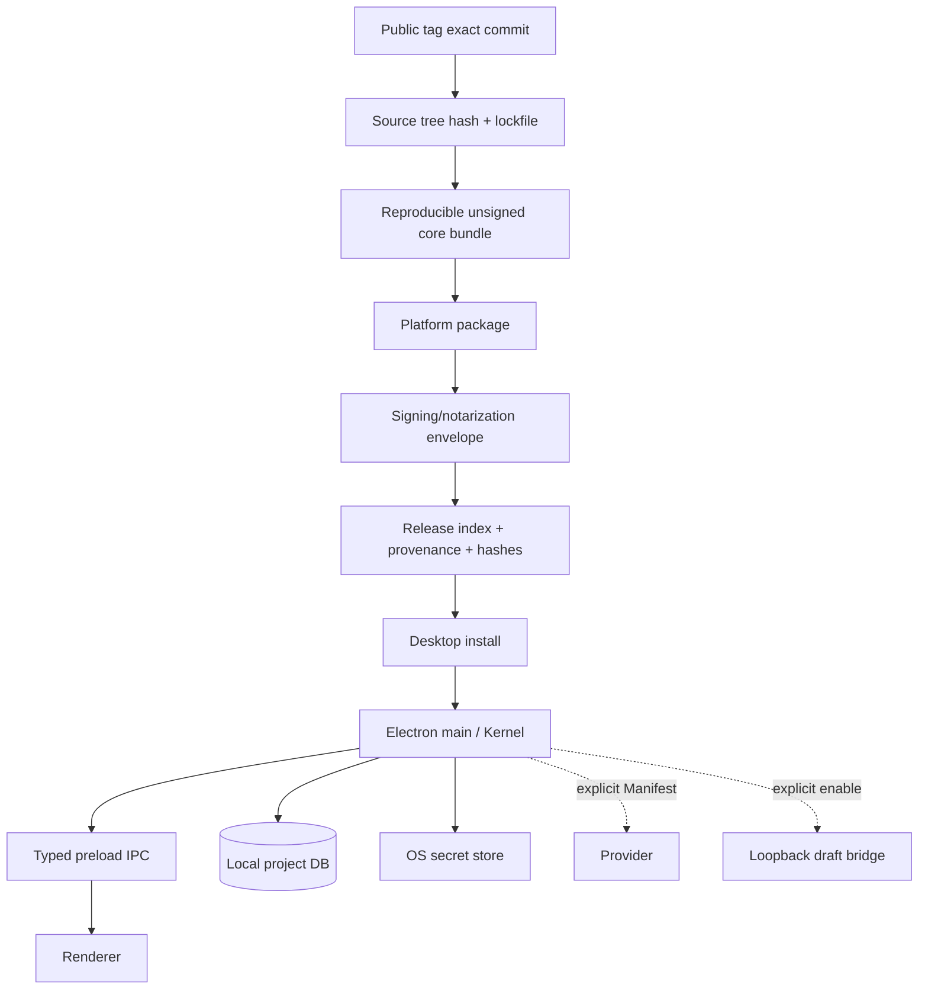

# Release identity 与真实本地 Desktop lifecycle 计划

> 本文件给出该领域的完整目标状态和实施合同。它不是 `v0.2.0` 当前事实，也不是完成证明；标注 `existing_verified` 的内容仅表示基线代码中已直接核对。

## 1. 计划结果

完成后，Sestina 的正式产品形态是三平台Electron Desktop App：React renderer运行在`contextIsolation`/sandbox下，Node/Kernel/SQLite位于main或受控utility process，通过typed preload IPC通信；生产UI不暴露system-browser loopback server。当前archive + Node + browser只作为历史/开发兼容形态，准确称`local loopback research server preview`。每个Release从public tag exact commit、source tree hash、lockfile/toolchain/build command、migration/schema identity、asset hashes到unsigned reproducible core bundle和signed envelope可追踪；启动、停止、重开、升级前备份、升级失败恢复、数据目录、secret、卸载与三平台签名/公证形成完整lifecycle。

## 2. 来源发现与证据边界

### 对应发现

- `P2-02`：`v0.2.0`实际需要下载archive、安装Node 24、运行`node start.mjs`、打开`127.0.0.1`浏览器；Release文档诚实写无installer/updater/signing/notarization，但这与无条件“Desktop App”身份存在张力。
- 公开Release index/manifest中`sourceCommit`与tag target `caf893db...`不一致；仓库/附件存在一份tag对齐的冻结副本，但不是公开baseline，不能倒算修复。

### `existing_verified` 强基础

- deterministic release builder、per-platform archives、manifest、SHA256SUMS、embedded `RELEASE-IDENTITY.json`、version/status commands。
- `SESTINA_RELEASE_CONTRACT`包含product/version/channel/node/schema/migration manifest hash/releaseBuildId。
- server强制`127.0.0.1`、Host validation、session token、CSP/COOP/referrer/nosniff/frame deny。
- recovery/backup/restore、future schema fail-closed。

### 证据路径

`scripts/build-release.mjs`、`assemble-public-release.mjs`、`verify-release-artifact.mjs`、`verify-public-release.mjs`、`verify-release-tag.mjs`、`packages/schema/src/release-contract.mjs`、release docs与实际公开制品。

## 3. 当前状态与根因链

```text
产品主张：local interactive research App / Research Room
→ 实际：archive + external Node 24 + shell command + system browser + loopback
→ 用户必须理解runtime/port/process/terminal
→ 启动、停止、重开、升级、卸载不像App lifecycle
→ Release index sourceCommit不绑定tag exact commit
→ 用户无法从制品独立证明“这个包来自公开tag”
```

只增加launcher脚本或改README不能完成Desktop lifecycle；只加Electron壳但保留renderer规则/公开HTTP和不可追踪build也不够。发行身份、安全边界、数据目录与migration必须一起设计。

## 4. 方案空间

| 方案 | 启动成本 | 三平台维护 | 安全边界 | Provider secret | 签名/更新 | 构建/体积 | 与身份一致 |
|---|---|---|---|---|---|---|---|
| A. 内置Node runtime + native launcher + system browser loopback | 低 | 中 | 仍有Host/Origin/CSRF/DNS面 | OS secret可做 | 可签launcher；更新自建 | 中，体积较小 | 中；仍像local server |
| B1. Tauri shell + Node sidecar | 低 | 高；Rust+Node双runtime | WebView+sidecar/IPC两边 | 可 | 强 | 较小但复杂 | 高 |
| B2. Electron shell复用Node/React/SQLite | 最低用户成本 | 中；统一runtime | renderer/main IPC可收窄；Chromium供应链 | OS keychain |成熟签名/installer工具 | 较大 | 高 |
| C. 保持archive + Node + browser，准确称loopback server preview | 高 | 低 | 当前边界可继续加固 | 当前secret store | 无installer/auto update | 小 | 低，若不称Desktop则诚实 |
| D. 重写为原生Swift/WinUI/GTK | 低 | 极高 | 可强 | 可 | 平台原生 | 多套build | 高但不可维护 |
| E. PWA/浏览器extension | 中 | 中 | 浏览器权限复杂 | 风险 | web更新 | 中 | 违反本地App/文件恢复定位 |

### 完全删除本地发行物的反事实

若完全删除archive/installer/Desktop制品，只发布源码并要求用户自行安装Node、构建和运行，Kernel仍可作为代码存在，但普通用户无法获得可验证的start/stop/reopen/upgrade/uninstall、secret/data directory、single-instance、签名和Recovery闭环；产品身份会退化为开发者项目或协议库。该收缩不违反“本地”本身，却违反“本地交互式科研 App”和Research Room主交互面的不变量，因此不采用。

### 第一性裁决

当前业务代码、provider adapters、SQLite、release scripts均是Node/TypeScript；Electron能最大程度复用，同时移除生产system-browser/公开HTTP。体积增加是直接可见代价，但比Tauri+Node sidecar的双runtime和原生重写更可控。

## 5. 最终推荐裁决

选择 **B2：Electron Desktop App**。

- main process加载Kernel/storage/provider adapters；renderer无Node integration、context isolated、sandboxed。
- typed preload IPC是唯一UI command边界；所有Authority/Manifest/state machine仍在Kernel。
- production不启动Research Room HTTP server。`apps/research-room`保留为dev/legacy preview harness。
- Host intake需要时启用独立、默认off的loopback bridge，能力只有draft submit/status；不复用UI API。
- Windows提供code-signed installer；macOS提供signed+notarized DMG；Linux提供AppImage/包与checksum/provenance（Linux签名能力按制品格式明确）。
- 不做后台自动更新；Settings中用户主动“Check for updates”，验证签名/provenance并在升级前备份。
- unsigned core bundle要求可复现；签名时间戳/公证作为外层不可bit-reproducible envelope单独记录。
- 牺牲制品大小和Electron维护，换取与“本地交互式科研App”一致的真实生命周期。

## 6. 目标领域模型

### 6.1 Runtime modes

| Mode | Identity | Use | Network/UI |
|---|---|---|---|
| `desktop_production` | target official product | installed release | local renderer+IPC；Provider显式外发 |
| `desktop_development` | dev only | coding/test | dev server可用，清晰banner |
| `loopback_preview_legacy` | v0.2.0/history | archive compatibility | system browser + 127.0.0.1 |
| `host_bridge_enabled` | optional sub-capability | draft intake | independent loopback endpoint, default off |

About/diagnostics必须显示当前mode。

### 6.2 Desktop process model (`proposed_new`)

- Electron main：single-instance lock、project lease、window lifecycle、Kernel service、storage、Provider、backup/recovery、secret access、update check。
- preload：allowlisted typed methods；no generic invoke/eval/file path。
- renderer：React task UI；untrusted content inert。
- utility process（可选、建议）：Provider response parsing/large content或backup，可被kill；不持有Authority。
- Host bridge：单独server/token/capability，关闭时无listener。

### 6.3 Data directories

| 数据 | 位置/所有者 | uninstall默认 |
|---|---|---|
| App binaries | OS application directory | 删除 |
| app settings/UI prefs | OS userData | 提示可保留/删除 |
| Provider secrets | OS Keychain/Credential Manager/Secret Service | 单独删除选项 |
| project canonical data | 用户选择项目内`.sestina` | **永不默认删除** |
| managed backups | 项目或用户选定data root内 | 列表展示，默认保留 |
| temp/crash residue | OS temp/userData temp | clean on startup/exit；异常可诊断 |
| logs | local redacted rotating logs | 可清除 |

### 6.4 Release identity (`proposed_new` schema v4)

```json
{
  "product": "Sestina",
  "version": "...",
  "channel": "...",
  "publicTag": "...",
  "sourceCommit": "...",
  "sourceTreeHash": "...",
  "dirtyTree": false,
  "toolchain": {"node":"...","pnpm":"...","electron":"...","rust":null},
  "lockfileSha256": "...",
  "buildCommand": "...",
  "databaseSchemaVersion": 25,
  "migrationManifestSha256": "...",
  "uiAssetManifestSha256": "...",
  "officialLogoSha256": "...",
  "unsignedCoreBundleSha256": "...",
  "signedEnvelope": {"platform":"...","sha256":"...","signingIdentity":"...","notarization":"..."}
}
```

`databaseSchemaVersion:25`只是本计划`proposed_new`迁移集合的目标；实施时manifest与实际migration严格相等。

### 6.5 Canonical、authoritative 与 derived

- canonical release truth：public tag、`sourceCommit`、source tree/lockfile/toolchain hashes、schema/migration identity、unsigned core bundle与platform envelope hashes。
- authoritative product state：仅Kernel持有的project canonical state和用户Authority；Desktop shell、installer、update service均不能重定义。
- non-authoritative input：远端update metadata在签名、tag/version policy与artifact hash全部验证前只是候选。
- derived projection：About页面、diagnostics、available-update badge、安装进度和平台文案；可重建，不能替代release manifest或project state。
- ownership：release builder生成identity，platform signer只包裹verified unsigned core，Desktop main只读取/展示并执行受验证lifecycle。

## 7. 状态机与 transition

### 7.1 App lifecycle

| state | action | precondition | mutation | next | failure/recovery |
|---|---|---|---|---|---|
| not installed | install | signature/provenance verified | binaries/settings dirs | installed | verification fail→不运行 |
| installed | launch | single-instance acquired | main/preload/renderer | Start Center | second launch focuses existing window |
| Start Center | open project | path/identity/schema preflight | project lease+DB open | Today或Recovery | fail closed，no write |
| running | close window | pending writes flushed | window closes；平台设置决定app exit | stopped/background none | 不留background upload/service |
| stopped | reopen | same checks | resume persistent Review/project | running | recovery required if crash |
| update available | user check/download | explicit network, signed manifest | stage installer | ready to update | no research context sent |
| update available/ready update | cancel update / user | 未进入不可中断platform installer commit | 删除受管staging与download record；保留current binary/project | running/current version | cancellation不回滚project revision，也不后台重试下载 |
| ready update | install update | verified pre-upgrade backup | close project, install, migrate copy | new version | failure restores old binary/pre-migration DB |
| installed | uninstall | explicit OS action | app binaries removed | uninstalled | project data/secrets/settings分别处理 |

### 7.2 Upgrade

1. verify release/tag/provenance/signature；
2. inspect project schema/read-only；
3. create/verify pre-upgrade backup；
4. migrate copied DB；
5. verify integrity/project/Brief/revision/events；
6. atomic swap；
7. open new runtime；
8. keep backup/journal。

任何一步失败，不用新runtime写原DB；显示可恢复action。

### 7.3 Host bridge lifecycle

Off→user enable→random loopback port/token→active visible→token rotate/disable→listener closed。App quit必关闭；不注册background daemon。

## 8. 数据流与 Authority 流



正式UI不经HTTP；Host bridge无Authority。Update check不包含研究数据。

## 9. API、Schema、Repository 与代码边界

| 当前路径/制品 | 当前 | 目标 | 修改 | 验证 |
|---|---|---|---|---|
| `apps/research-room` | Node HTTP + browser product | dev/legacy harness | 收缩 | `existing_verified` |
| `apps/desktop/package.json` | 不存在 | Electron app package | `proposed_new` | 计划对象 |
| `apps/desktop/src/main.ts` | 不存在 | lifecycle/Kernel/window/single-instance | `proposed_new` | 计划对象 |
| `apps/desktop/src/preload.ts` | 不存在 | typed allowlisted IPC | `proposed_new` | 计划对象 |
| React client | browser app | renderer bundle，移除fetch/session assumptions | 重构 | `existing_verified` |
| `apps/research-room/src/server.ts` HTTP routes | product API | use-case adapters提取为transport-neutral service；legacy server复用 | 重构 | `existing_verified` |
| `apps/research-room/src/provider-settings.ts` / secrets adapter | file/secret provider | OS keychain adapter + migration | 重构 | `existing_verified` |
| `scripts/build-release.mjs` | archive builder | shared unsigned core + Desktop packager | 重构 | `existing_verified` |
| `scripts/assemble-public-release.mjs` | release index | tag exact commit enforcement + provenance/attestation | 重构 | `existing_verified` |
| `verify-release-*` | version/hash checks | sourceCommit=tag target、tree/lock/toolchain/assets/signature/migrations | 扩展 | `existing_verified` |
| release docs | archive instructions | Desktop install/lifecycle + legacy preview distinction | 重写 | `existing_verified` |

### Build gate

Builder必须从clean detached tag worktree运行；比较`git rev-parse HEAD`与tag peeled commit，dirty tree拒绝。source tree hash用确定性Git tree/object identity或规范tar hash，方法写入manifest。官方Logo hash列入asset manifest，任何变化fail build。

## 10. UI 与交互

### Desktop lifecycle UI

- native window title/menu与project name；不显示localhost URL。
- Start Center可pin recent projects、打开目录、初始化、restore；错误不要求terminal命令。
- About显示version/channel/source commit短值/release proof/当前runtime mode。
- Settings > Updates：最后检查时间、当前/可用版本、explicit network说明、download/verify/install步骤；无后台check。
- Settings > Data：app settings、secrets、project data、backups位置分别列出；Open folder不泄露给Provider。
- Quit时若Provider attempt running，显示cancel/keep app open；不能在后台偷偷继续。
- Upgrade前显示将备份哪个project、backup hash、schema from/to；失败显示恢复路径。
- Uninstall docs/UI明确程序、settings、secret、project data分离；不提供“全部删除”单按钮默认。
- legacy loopback preview启动时显著banner“Browser preview”；不能使用Desktop专属claim。

### 三平台

- Windows：installer/Start Menu/单实例/DPAPI或Credential Manager/路径长与junction测试。
- macOS arm64：signed/notarized/app translocation/bookmark或目录权限/Keychain/quit semantics。
- Linux x64：AppImage/包、Secret Service可用/不可用的fail-closed或user-managed secret path、XDG dirs、Wayland/X11。

UI/视觉矩阵由`06/13`执行。

## 11. 中文／English 与术语

- 当前`v0.2.0`：`local loopback research server preview / 本地回环科研服务器预览`。
- 目标发行：`Sestina Desktop App / Sestina 桌面应用`。
- `local-only`必须限定：项目默认本机；Provider/Host/update只有显式网络动作。
- `automatic update`不使用；写`user-initiated update check and install`。
- `reproducible build`限定为unsigned core；signed envelope受签名timestamp影响。
- `sourceCommit`必须等于public tag target；不能用branch/head近似。
- `releaseBuildId`不替代source provenance。
- `uninstall`不等于删除project data。

不得在实现前文档声称installer、签名、公证、auto-update或Desktop lifecycle已经完成。

## 12. 隐私、安全与权限

- Electron：`nodeIntegration=false`、`contextIsolation=true`、sandbox、remote module禁用、navigation/window open拦截、custom protocol allowlist、CSP。
- IPC：明确channel schema、project/session capability、size limits；无generic filesystem/shell/eval。
- renderer compromise不能读secret/任意文件或commit Authority。
- production无UI loopback HTTP，减少恶意网页/CSRF/DNS rebinding；Host bridge仍按`12`加固。
- update：TLS之外验证signed manifest/artifact hash/source provenance；防downgrade/rollback攻击。
- signing key不在repo/build log；provenance不包含secret。
- project、backup、update staging与installer temp均做canonical path/realpath containment；symlink／junction逐跳解析，逃逸或解析不稳定时fail closed。
- temp installer/migration files权限与cleanup；crash residue可审计。
- OS keychain不可用时不明文降级；允许session-only secret或用户明确不可持久化。
- external links通过shell.openExternal前allowlist/protocol确认。
- no telemetry/background upload，crash report默认本地。

## 13. 数据迁移与向后兼容

- 第一次Desktop打开`v0.2.0`项目，执行`11`copy-on-write migration；原archive仍可通过pre-migration backup读取，但不能打开新schema。
- language/theme/recent projects从legacy local preference迁移到OS userData；不推进project revision。
- Provider config迁移，secret从legacy store移入OS keychain；成功验证后再删除旧secret副本。失败不丢原配置且不明文复制到log。
- legacy recovery/backups catalog纳入Desktop Data页面。
- archive制品不自动删除；docs说明可卸载Node/删archive，但project data独立。
- Release identity migration不改变project DB事实；About显示历史source mismatch时诚实标legacy artifact。
- migration失败留在Recovery，可继续用legacy runtime+pre-migration DB；不混用新binary/旧半迁DB。
- Host bridge旧Pilot不恢复运行，只读history。

## 14. 测试与验证

### Release/provenance RED

- sourceCommit不等tag peeled commit时build fail。
- dirty worktree、lockfile变化、migration manifest mismatch、logo hash变化、asset缺失fail。
- two clean builds unsigned core相同；signed envelope单独验证。
- public index/manifest/installer embedded identity一致。

### Desktop lifecycle

- fresh install/start/close/reopen/uninstall三平台。
- single instance、project lease、crash restart、running Provider attempt、Host bridge shutdown。
- upgrade backup/migration/swap/failure restore/downgrade reject。
- settings/secret/project/backups分离；uninstall不删project。
- no Node prerequisite/system browser/terminal。

### Security

- renderer IPC fuzz、navigation/XSS、custom protocol、other local process、update tamper、secret store failure。
- Host/Origin/DNS tests仅对optional bridge/legacy preview。

### Production

- signed/notarized verification where platform supports；Linux package hash/provenance。
- real packaged E2E/visual/a11y，不用dev server替代。
- reproducibility在pinned toolchain容器/runner验证。

这些证明artifact/lifecycle，不证明市场采用或Provider质量。

## 15. 完整验收标准

- 用户安装后无需Node/terminal/system browser即可启动。
- production UI无公开HTTP listener；Host bridge关闭时系统无相关listener。
- renderer无Node/filesystem/secret/Authority direct access；typed IPC完整。
- 三平台start/stop/reopen/single-instance/project lease可观察一致。
- update只能用户主动，签名/provenance验证，升级前backup，失败可恢复。
- uninstall清楚区分并默认保留project data；secret/settings可单独删。
- public tag、sourceCommit、tree hash、lockfile、toolchain、build command、schema/migration、assets、unsigned/signed hashes可追踪。
- sourceCommit不再出现公开制品/tag不一致。
- logo hash不变。
- current archive文档准确称legacy loopback preview；target才称Desktop App。
- packaged production build完成`06/13`全部视觉/功能矩阵。
- Recovery/future schema/no telemetry/explicit Provider外发保护不回归。

## 16. 明确非目标

- 不做Web SaaS/PWA。
- 不要求后台daemon或后台更新。
- 不把Electron main变第二Kernel。
- 不让renderer直接访问Node。
- 不承诺bit-identical签名envelope；只承诺unsigned core reproducible。
- 不在卸载时默认删项目。
- 不维持两种正式产品身份。
- 不以制品体积作为唯一裁决。
- 不加入云账号/遥测。

## 17. 被拒绝方案与重新考虑条件

- **A bundled runtime+browser**：只有Electron的安全/维护成本不可接受且仍能提供installer/data lifecycle时重开；届时产品名称需明确local server app。
- **Tauri+sidecar**：只有有资源维护Rust+Node双runtime并能减少Electron风险/体积时重开；当前复用成本不占优。
- **C archive preview**：作为legacy/dev保留，不作为最终产品。
- **原生重写**：只有多平台团队和长期维护预算改变时重开。
- **后台auto-update**：只有隐私policy允许且用户可禁用/审计时重开；当前选择显式更新。
- **production loopback UI**：只有IPC无法承载外部可访问性且安全模型重审通过时重开。

## 18. 实施风险与失败收缩

- Electron迁移中transport-neutral service提取不完整会在HTTP/IPC复制业务规则；Kernel/use-case层先抽取，transport只decoder。
- signing/notarization未完成时不能用unsigned package冒充最终Desktop；可供内部验证但不出货。
- secret迁移失败不得明文fallback；Provider显示需重新配置。
- auto update library默认后台check必须禁用并测试网络0调用。
- macOS/Linux权限差异可能影响project bookmarks/secret store；失败进入可行动setup而非静默路径。
- release provenance修复不能只改冻结副本；public pipeline必须从tag重建。
- partial implementation保持legacy preview明确身份，不同时宣称Desktop。

## 19. 对其他计划的依赖

- `11-DATA-MIGRATION-COMPATIBILITY-AND-ROLLBACK.md`定义project migration/backup/downgrade。
- `12-PRIVACY-SECURITY-AND-THREAT-MODEL.md`定义Electron/IPC/bridge/update威胁。
- `06`定义renderer/production视觉，`09`定义Host bridge。
- `03/04`定义restart/revision/attempt；Desktop lifecycle不得重写。
- `13`定义provenance、三平台、packaged E2E证据。
- `15`迁移Desktop/loopback claims和release docs。
- `16`核对最终身份唯一。
