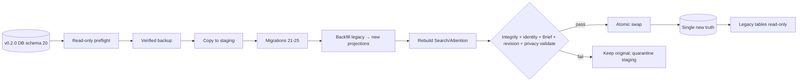

# 统一数据迁移、兼容、恢复与 rollback 权威计划

> 本文件给出该领域的完整目标状态和实施合同。它不是 `v0.2.0` 当前事实，也不是完成证明；标注 `existing_verified` 的内容仅表示基线代码中已直接核对。

## 1. 计划结果

完成后，任何`v0.2.0`项目在写入前先经过read-only dry run、verified pre-migration backup和copy-on-write migration。新schema一次性建立project revision head/events、persistent Review/attempt/correction、persistent Manifest、typed transition Receipt与progressive Brief。旧generic disposition、Appeal、Room、Memory、Closed Pilot逐表映射；无法无损推断的`accepted/modified_accepted`明确迁为legacy record-only，不制造Decision/Evidence。成功验证DB integrity、project identity、schema、Brief binding、revision/event chain和projection后才原子替换；失败保持原项目可恢复。新runtime不双写legacy truth，旧release对新schema fail closed；downgrade只通过pre-migration backup。

## 2. 来源发现与证据边界

### 基线schema

migration manifest 1–20；关键表：

- 013：`research_projects`、artifacts/revisions、`research_briefs`、`research_decisions`/transitions、`research_issues`/transitions、episodes、snapshots；
- 014：`review_runs`、`review_findings`（内部checker）；
- 015：argument claims/evidence/mechanisms/links/deltas；
- 016：`research_room_receipts` generic disposition/provider status；
- 017：`correction_appeals`；
- 018：`deliberation_rooms`；
- 019：`project_working_memory`、`resume_checkpoints`；
- 020：Closed Pilot/attempts/events。

### `existing_verified` recovery保护

- ordered forward-only migrations、future schema fail closed、downgrade unsupported；
- SQLite integrity check、backup hash sidecar、pre-restore backup、verified temp copy、atomic replace、WAL/SHM cleanup；
- project identity和Research Brief binding验证；
- migration/restore failure进入Recovery，不自动重复外发。

本计划加强而不削弱这些保护。

## 3. 当前状态与根因链

```text
现有schema把Receipt、Appeal、Room、Memory、Pilot分别持久化
→ 新设计需要单一Review/effect/revision/Manifest
→ 直接在原表上改enum/含义会让历史对象“看起来已产生canonical effect”
→ 双写新旧表会形成两套truth
→ in-place migration崩溃可能留下半新半旧DB
```

因此迁移不是字段重命名；必须定义lossless/lossy语义、冻结旧写、copy-on-write、validation和downgrade边界。

## 4. 方案空间

| 方案 | 数据安全 | 单一truth | 实现 | 回滚 | 风险 |
|---|---|---|---|---|---|
| A. 原表ALTER/改JSON，in-place迁移 | 中 | 可 | 中 | 弱 | crash/enum语义漂移 |
| B. 新旧双写一段时间 | 表面高 | 否 | 高 | 中 | 两表分歧、恢复不知选谁 |
| C. Copy-on-write新schema + one-time backfill + atomic cutover；legacy只读 | 高 | 是 | 高 | 强 | 需要磁盘/完整验证 |
| D. 导出JSON再重新导入 | 中 | 是 | 中 | 中 | 易丢hash/history/identity |
| E. 不迁移，要求新项目 | 低 | 是 | 低 | 无 | 丢失用户项目连续性 |

### 完全删除legacy历史的反事实

可简化schema，却破坏Receipt/Appeal/Room/Pilot审计和Recovery承诺。历史应只读保留，不应继续active。

## 5. 最终推荐裁决

选择 **C：copy-on-write、一次性backfill、atomic cutover、legacy只读、new-writes-only**。

- migration 021–025（`proposed_new`）作为同一完整重构的有序schema集合，不代表可独立出货版本。
- 不双写canonical data；新runtime切换后只写新Review/revision/Receipt结构和现有canonical对象。
- legacy tables冻结，只通过history compatibility repository读取。
- Search/Attention/Today等derived projections全部重建，不复制旧index truth。
- failed migration保留原DB和backup；用户修复后可重试同一idempotent migration。
- 旧release不允许打开新schema；downgrade恢复旧backup，绝不向新DB写旧格式。

## 6. 目标领域模型

### 6.1 Proposed migration manifest

| Migration | `proposed_new`内容 | 依赖 |
|---|---|---|
| 021 `project-state-revisions` | `research_project_state_heads/events`、migration journal extensions | 013 |
| 022 `persistent-research-reviews` | `research_room_reviews`、provider attempts、corrections | 014/016/017 |
| 023 `context-manifests-and-transition-receipts` | `context_manifests`、`research_transition_receipts`、idempotency | 021/022 |
| 024 `progressive-brief-and-legacy-workflows` | Brief v2 data、legacy Appeal/Room/Pilot read-only metadata、Memory revision metadata | 021–023 |
| 025 `task-projections-and-privacy-redactions` | Search/Attention projection metadata、privacy redaction/copy inventory | 021–024 |

### 6.2 Migration journal (`proposed_new`)

记录migration run ID、source DB hash/schema/project ID、target schema、backup ID/hash、stage=`previewed|copied|migrating|validated|swapped|failed|rolled_back`、completed migration versions、failure code、temp path token、timestamps。正文path在UI redacted；journal必须能在crash后决定继续验证还是丢弃副本。

### 6.3 Table-by-table strategy

| 基线表/投影 | 策略 | lossless/lossy | 新truth |
|---|---|---|---|
| `research_projects` | 保留；为每个成功迁移项目建立 `projectStateRevision=1` 的baseline head/event；该值只表示“schema 20状态已被完整摄取”，不伪造历史transaction顺序 | lossless | project + head |
| artifacts/revisions | 保留 | lossless | 原对象 |
| `research_briefs` | 解析所有versions；字段映section state | 大部分lossless；空/unknown标解释 | Brief v2 data |
| decisions/transitions | 保留；纳入baseline hash | lossless | 原对象 |
| issues/transitions | 保留 | lossless | 原对象 |
| episodes/snapshots | 保留 | lossless | 原对象 |
| `review_runs/findings` | 保留内部checker用途；不迁interactive Review | lossless | unchanged internal |
| argument graph/evidence | 保留；纳入revision/projection | lossless | 原对象；唯一Evidence入口需核对 |
| `research_room_receipts` | 每row生成historical Review + new transition Receipt projection | accepted类lossy | `research_transition_receipts`；old frozen |
| `correction_appeals` | old Appeal／旧 Appeal 转Review correction/history | status/attempt lossless；Resolution非canonical | corrections + legacy payload |
| `deliberation_rooms` | old Room／旧 Room 转read-only legacy projection | lossless history | legacy history store/table |
| `project_working_memory` | 内部state保留；加baseline revision/UI projection | lossless | same canonical memory |
| `resume_checkpoints` | bind project revision 1 | lossless + new binding | checkpoint non-authoritative |
| Closed Pilot tables | read-only legacy history；candidate显式convert | lossless history | legacy host session |
| Search/FTS/Attention | 丢弃重建 | intentionally derived | projection revision=1 |
| Provider settings/secrets | app-level迁移 | config lossless；secret secure move | OS settings/keychain |
| backups | inventory/verify | bytes保留 | managed backup catalog |

### 6.4 Generic disposition mapping

与`01`一致：direction_changed→formal change；rejected/deferred→record_only；accepted/modified_accepted→legacy acceptance, `canonical_effect_unresolved=true`，不得创建target。

### 6.5 New Receipt truth

`research_transition_receipts`是新API唯一Receipt repository；old table重命名/封装`legacy_research_room_receipts`或写trigger禁止更新。所有old payload/hash以`legacyPayload`保存，new receipt hash覆盖迁移projection并引用source legacy hash。

## 7. 状态机与 transition

### 7.1 Migration lifecycle

| state | action | precondition | mutation | next | failure |
|---|---|---|---|---|---|
| unopened | preflight | project path/lease | read-only integrity/schema/identity/Brief binding | preview | fail closed |
| preview | backup | user confirms | verified pre-migration backup+hash | backed_up | backup fail no migration |
| backed_up | copy | disk space/path containment | copied DB+Brief files to staging | copied | remove staging, original untouched |
| copied | migrate | source hash/schema unchanged | run 021–025 idempotent in staging | migrating/ migrated | journal failed; original untouched |
| migrated | validate | all migrations complete | integrity/foreign keys/head/event/hash/Brief/projections/privacy checks | validated | staging quarantined |
| validated | swap | project lease, original unchanged | atomic rename/replace + WAL cleanup | swapped | restore original/prebackup |
| swapped | reopen | runtime/schema compatible | open new project/read head | complete | Recovery with prebackup |
| failed | retry | source unchanged or fresh copy | new staging/run | preview/copied | no auto mutation |

### 7.2 Crash matrix

- before backup complete：无变化。
- backup complete/copy incomplete：删除staging，backup保留。
- migrations partial in staging：journal允许重跑idempotent migration或丢弃重copy。
- validation fail：不swap。
- swap between renames：recovery根据journal/verified hashes选择原或new；不猜。
- post-swap open fail：restore pre-migration DB并保留failed migrated copy供diagnostics。

### 7.3 Restore

restore preview验证backup integrity/schema/project ID/Brief binding/privacy redaction ledger。旧backup恢复到新runtime后执行migration；新schema backup不能给旧runtime。

### 7.4 Rollback/downgrade

- schema downgrade不支持；旧binary显示too new且不写。
- 用户需要回旧runtime时，restore pre-migration backup到独立copy/path。
- canonical effect rollback是`01`的compensation，不是DB/schema downgrade。
- migration“rollback”只在cutover失败时恢复完整旧DB，不逆向SQL降级。

## 8. 数据流与 Authority 流



migration无网络；Provider/Host/updates不参与。

## 9. API、Schema、Repository 与代码边界

| 当前路径 | 当前 | 目标 | 修改 | 证据 |
|---|---|---|---|---|
| `packages/storage/src/migrations/manifest.ts` | 1–20 | append 21–25，identity一致 | 扩展 | `existing_verified` |
| migration 013–020 | 基线tables | 不改历史文件；新migration转换 | 保留 | `existing_verified` |
| `packages/storage/src/migrator.ts` | forward migration | staging/journal/idempotent验证 | 扩展 | `requires_code_verification`：见本表后精确问题；核对journal位置、每version transaction与swap边界，并按不同答案选择外部maintenance journal或复用现有transaction |
| `packages/core/src/recovery.ts` | project recovery | migration preview/run/status + revision/privacy checks | 扩展 | `existing_verified` |
| `packages/storage/src/backup.ts` | verified backup | pre-migration ID/catalog/privacy metadata | 扩展 | `existing_verified` |
| `packages/storage/src/restore.ts` | verified atomic restore | migrated/legacy compatibility preview | 扩展 | `existing_verified` |
| new migrations 021–025 | 不存在 | 本计划schema | `proposed_new` | 计划对象 |
| repositories | individual tables | new-writes-only + legacy readers | 重构 | `existing_verified` |
| Search/Attention service | current projections | rebuild at revision, no legacy cache | 重构 | `existing_verified` |
| Desktop/legacy server | open project | preflight/preview/cutover UI | 重构 | `10` |

`requires_code_verification`问题：当前migration journal保存位置、migrator每version transaction边界、Brief file与DB swap顺序。若journal仅DB内，新增外部/maintenance journal以识别staging；若已有独立maintenance journal，则扩展而不复制；若每migration独立transaction，staging策略按completed versions安全重试；若整个manifest单transaction，则只记录pre/post边界。不同答案影响journal adapter与retry粒度，不改变copy-on-write、原DB不就地改写和swap前完整验证。

## 10. UI 与交互

### Migration preview

显示：project、current/target schema、verified backup path摘要/hash、需要转换的counts、lossy mappings（特别generic acceptance/ambiguous Brief refs）、legacy active workflows将变只读、disk space、预计网络=none。用户可导出preview。

### Progress

阶段化：Backup、Copy、Migrate、Backfill、Rebuild projections、Validate、Swap、Reopen。进度来自journal，不根据动画猜。关闭窗口时提示可安全中止的阶段；正在swap不可强制退出。

### Failure

显示failure code、最后安全阶段、原项目是否 untouched、backup verification、下一action：Retry from fresh copy / Open original with legacy runtime / Export diagnostics。绝不要求用户手工改DB。

### Post-migration summary

- revision baseline；
- legacy accepted records count及“没有创建研究对象”；
- Appeals/Rooms/Pilots moved to History；
- Memory state mapping；
- Provider secret是否需重新配置；
- backups保留位置。

### too new/too old/corrupt

明确readonly/fail closed；不提供“强制打开”。200%/keyboard/screen reader/long project counts可操作。

## 11. 中文／English 与术语

- Migration / 迁移：schema/语义转换，不称“同步”。
- Dry run / 迁移预检：read-only preview，不写原项目。
- Pre-migration backup / 迁移前备份：verified rollback boundary。
- Legacy record / 历史记录：可审计但不能active write。
- Lossless / 无损：所有字段/语义可映射。
- Lossy / 有损：保留原payload但无法推断新canonical effect。
- Rollback：区分`migration recovery`、`schema downgrade`和`canonical compensation`。
- `too_new`/future schema：中文“此运行时不能安全打开更高版本项目”。

不得写“自动升级无风险”“accepted已转成Decision”等。

## 12. 隐私、安全与权限

- migration只本地，0网络；Provider/Host bridge/update listener关闭。
- staging/backup/temp必须在allowed data root、realpath containment、symlink/junction防护、restrictive permissions。
- project lease覆盖preflight到swap；其他实例只读/blocked。
- backup/hash/journal不写secret或正文到logs。
- secret迁移单独OS store transaction；失败不把明文写DB/staging。
- corrupted DB保留copy但UI path redacted；用户显式导出diagnostics。
- migrated legacy Provider payload仍敏感；copy inventory/privacy redaction适用。
- migration脚本不执行DB内/研究文本指令；JSON只parse/validate。
- signature/release identity先验证，防恶意runtime迁移项目。
- failed staging自动cleanup前保留必要diagnostics，超时/手工清理明确。

## 13. 数据迁移与向后兼容

本文件即统一迁移权威。额外兼容规则：

- **dual-read**：仅在compatibility repository中读取legacy Receipt/Appeal/Room/Pilot并投影History。
- **no dual-write**：新commands绝不写legacy tables；legacy APIs被冻结。
- **brief dual decoder**：读取v1/v2 data；确认后只写v2。
- **provider status decoder**：接受legacy字段，projection转new availability flags；只写new。
- **route compatibility**：UI aliases，不恢复旧mutation。
- **old project reopening**：newruntime先preflight/migrate；legacy runtime只开schema≤20。
- **private project data**：backup/staging/export不出project root/data root，除非用户显式选择。
- **failed migration retry**：从原source fresh copy，而不是在不明staging上继续，除非journal证明idempotent和完整。
- **partial migration detection**：schema version、migration manifest、required tables/indexes/triggers、head/event/Brief binding全部检查。
- **future schema**：读取metadata后立即fail closed，no backup rewrite/no secret migration。
- **too old**：低于supported minimum时提供只读diagnostics/export，不跨未实现migration直接写。

## 14. 测试与验证

### Migration matrix

每个source schema 16–20、空/大项目、每种generic disposition、Appeal/Room/Pilot每个status、Memory每态、Brief长/空字段、Provider configured/unconfigured、backups present/absent。

### Failure injection

backup、copy、每migration、backfill、index rebuild、validation、first rename、second rename、reopen、secret move各点crash/IO full/permission/lock/corruption。

### Invariants

- original DB hash不变直到swap；
- migration成功只有一个new truth；
- revision=1 baseline/event/hash一致；
- no fabricated Decision/Evidence/Authority；
- legacy active APIs不可写；
- Search/Attention projection revision一致；
- oldrelease too-new；
- restore oldbackup可重迁；
- privacy forgotten内容不复活。

### Repository/API/UI

schema constraints、foreign keys、CAS、History projections、dry-run counts、lossy warnings、large performance、accessibility。ZIP/installer lifecycle在`10/13`。

fixture只证明映射合同，不证明历史Provider assessment正确。

## 15. 完整验收标准

- 任何schema16–20基线项目先有verified backup再写。
- migration在staging执行，validation通过前原项目byte-identical。
- success后DB integrity/project identity/schema/Brief binding/revision/event/privacy/projections全部通过。
- generic accepted/modified accepted未生成Decision/Evidence；UI明确lossy。
- direction_changed/rejected/deferred按统一映射。
- Review/Manifest/assessment/Receipt历史可查；active Map缺失不伪造。
- Appeal/Room/Pilot历史可读/导出/恢复，active写不可达。
- Memory/Resume/Brief versions保留并正确绑定revision。
- Search/Attention重建，不读旧stale index。
- failure可恢复原DB，journal/backup可验证；restart知道所在阶段。
- oldrelease拒绝新schema，downgrade只用backup。
- no dual-write/two truth；所有domain plans有迁移覆盖。
- migration不联网、不泄露secret/path/content。

## 16. 明确非目标

- 不做跨设备merge/云migration。
- 不逆向SQL downgrade新schema。
- 不猜generic acceptance target。
- 不删除legacy审计历史。
- 不在原DB上冒险in-place partial cutover。
- 不保持长期双写。
- 不把migration成功当产品价值证明。
- 不自动恢复从未持久化的UI/Map状态。

## 17. 被拒绝方案与重新考虑条件

- **in-place ALTER**：只有完整atomic DB+Brief multi-file transaction可证明且数据集极大无法复制时重开；当前copy-on-write更安全。
- **dual-write**：不重开；它直接违反单一truth。
- **JSON export/import**：只有旧DB无法读取但可安全导出时作为salvage，不作为主迁移。
- **不迁移**：只有产品放弃现有项目连续性时重开。
- **自动推断accepted target**：不重开，缺证据。
- **逆向downgrade**：不重开，使用backup。

## 18. 实施风险与失败收缩

- 磁盘不足：preflight计算空间，不开始copy；不删backup腾空间。
- multi-file Brief/DB一致性：staging包含二者，binding验证后一起swap或使用Recovery既有原子策略。
- long migration：UI可恢复journal；不后台上传/自动retry。
- old repository仍可写legacy表：编译/架构测试禁止active service依赖legacy write接口。
- schema编号/文件名可能在实现时与其他unreleased migration冲突：实施前核对main exact manifest；若冲突，重编号但保持本计划顺序/内容，并在`16`记录，不改变语义。
- partial UI切换：migration后只读compatibility，直到新Review/Project UI完整。
- signed Desktop未完成：migration可在dev验证，但不向用户出货半成品。

## 19. 对其他计划的依赖

- 本文件统一执行`01/03/04/05/07/08/09`的所有数据映射；其他文件不得另定不同映射。
- `10`使用本文件backup/swap/downgrade完成Desktop upgrade。
- `12`定义staging/path/secret/privacy威胁。
- `06`实现preview/failure/history route。
- `13`覆盖schema16–20和故障注入矩阵。
- `14`定义cutover顺序/new-writes-only边界。
- `15`定义legacy字段/API/doc deprecation；`16`检查无两套truth。
