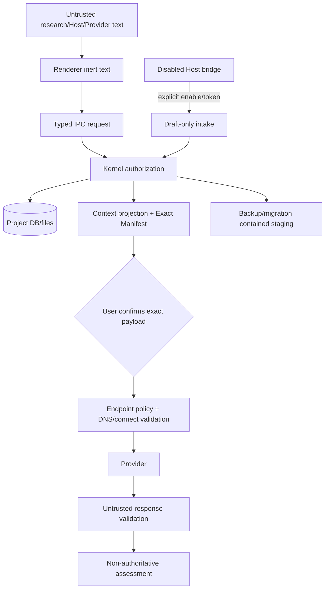

# 本地 App、Provider、Host、数据与恢复统一威胁模型计划

> 本文件给出该领域的完整目标状态和实施合同。它不是 `v0.2.0` 当前事实，也不是完成证明；标注 `existing_verified` 的内容仅表示基线代码中已直接核对。

## 1. 计划结果

完成后，Sestina 的安全边界按真实资产和数据流实现，而不是把“本地”当作自动安全。正式Electron renderer无Node/filesystem/secret/Authority权限；Provider只能接收用户确认且send前重验证的Exact Manifest；Host bridge默认关闭且仅能创建Review draft；legacy loopback/bridge防Host header、Origin/CSRF、DNS rebinding和本机其他进程调用。Provider endpoint在DNS解析和连接时阻止private/metadata/redirect绕过。项目路径、static/import/export、symlink/junction、backup/temp/restore、secret/log/error、Memory forget、prompt injection、update provenance和uninstall副本均有明确控制与fail-closed路径。

## 2. 来源发现与证据边界

### 现有经受攻击的保护

- server强制`127.0.0.1`、loopback Host、32-byte session token for mutations。
- CSP、COOP、no-referrer、nosniff、X-Frame-Options DENY、no-store。
- project select/open使用realpath；backup/restore有inside-root、integrity/hash、temp staging、atomic replace、maintenance lease。
- Provider exact body、redirect error、retry 0、size/timeout、config generation；external HTTPS/loopback exceptions与部分private/metadata checks。
- no Sestina telemetry、project-local state、explicit Manifest、Memory `never_send`。
- MCP/Skill/Pilot Authority限制。

### 计划新增风险

- Electron renderer/main IPC与custom protocol；
- persistent raw Provider/Manifest data；
- Host draft bridge；
- migration staging/managed backup inventory；
- update/installer/signing；
- task-first UI把多个动作集中在一页，需防untrusted text驱动action。

### 证据路径

`apps/research-room/src/server.ts`、`apps/research-room/src/provider-settings.ts`、`apps/research-room/src/openai-compatible-provider.ts`、`packages/storage/src/backup.ts`/`restore.ts`、`packages/core/src/recovery.ts`、Memory/Pilot/MCP/Skill模块及release scripts。

## 3. 当前状态与根因链

```text
“local-only”简化叙事
→ 忽略恶意网页、本机其他进程、DNS rebinding、symlink、Provider endpoint、Host instruction
→ Exact Manifest/loopback虽强，仍可能在新Desktop/bridge/migration路径被旁路
→ UI/文档可能把本地等同无网络或自动安全
```

安全修复不能变成泛化CVE清单；必须围绕研究内容、Authority、exact external payload、project files、secrets、recovery和release provenance建立端到端信任边界。

## 4. 方案空间

| 方案 | 攻击面 | 产品可用性 | 可证伪 | 维护 | 边界一致 |
|---|---|---|---|---|---|
| A. 保持browser loopback，继续加headers/tokens | 中高 | 中 | 强 | 中 | 与Desktop身份弱 |
| B. Electron renderer/main typed IPC；Host bridge独立默认off；legacy loopback保留 | 较低生产UI面 | 高 | 强 | 中高 | 最一致 |
| C. 完全air-gapped，删除Provider/Host/update | 最低网络面 | 降低可选价值 | 强 | 低 | 过度收缩 |
| D. 把所有logic放renderer，依赖OS用户权限 | 高 | 高 | 弱 | 低初始 | 破坏Authority/secret |
| E. 云中转Provider/同步 | 高且扩大信任 | 高表面 | 中 | 极高 | 违反本地/no cloud |

### 完全删除网络的反事实

核心zero-network闭环成立，但Exact Manifest与可选assessment/Host增量消失。更合理的是默认零外发、每次显式、最小capability和准确声明。

## 5. 最终推荐裁决

选择 **B：production Electron typed IPC + 独立显式Host bridge +保留加固legacy loopback**。

- Renderer视为不可信展示层；main/Kernel执行所有权限/路径/Authority检查。
- Provider adapter无工具、文件、Authority；Exact Manifest是唯一research payload gate。
- Host bridge与MCP权限分离，默认off、短期token、draft-only。
- DNS/private地址控制在解析与connect层，不只字符串检查。
- forget/backup/Receipt副本边界诚实，不声称远端删除。
- release/update provenance纳入安全模型。
- 牺牲一些开发便利和通用IPC，换取可测试的最小能力边界。

## 6. 目标领域模型

### 6.1 Assets

| Asset | 影响 |
|---|---|
| Research Brief/Decision/Issue/Evidence/Review/Memory正文 | 隐私、研究完整性 |
| project identity/revision/event/Receipt | Authority与恢复 |
| Exact Manifest/body | 外发隐私与可核对性 |
| Provider secret/config | 账户/费用/数据外发 |
| Host bridge token/MCP config | 本机capability |
| backups/migration staging/temp | 可恢复数据副本 |
| release identity/signature | 供应链与迁移代码信任 |
| official Logo asset | 品牌/制品完整性，非权限资产但hash受release gate |

### 6.2 Threat actors

- 恶意网页/iframe/浏览器extension（legacy preview）；
- 本机其他普通权限进程；
- 被注入的Host/Skill/Agent output；
- 恶意/被攻陷Provider endpoint；
- DNS/redirect/proxy攻击；
- 恶意研究文本/导入文件；
- 本地路径/symlink/junction操作者；
- tampered installer/update/release mirror；
- 误操作用户；
- 损坏磁盘/崩溃/多实例，不是恶意但同样威胁完整性。

### 6.3 Trust boundaries

1. Renderer ↔ preload IPC ↔ main/Kernel。
2. Kernel ↔ project filesystem/SQLite。
3. Kernel ↔ OS secret store。
4. Context projection ↔ Provider network。
5. Host/MCP/Skill ↔ draft/read capability。
6. migration/backup staging ↔ canonical project。
7. build pipeline ↔ signed release。

### 6.4 Capability budget

| Principal | Read | Write non-authoritative | Authority/canonical | Network | Files |
|---|---|---|---|---|---|
| Renderer | view models | request commands | no direct | no direct | no direct |
| Kernel main | project-scoped | Review/Manifest | execute user command | Provider/explicit update | contained project/data roots |
| Provider | exact payload only | assessment response | none | endpoint only | none |
| Host bridge | no project read by default | Review draft | none | loopback | no dereference |
| MCP | allowlisted read | none default | none | local stdio/loopback | viaKernel refs only |
| Skill | visible host context | envelope output | none | no inherent | host-authorized only |
| Migration | full copied project | staging/new schema | no new semantic claims | none | contained staging/backup |

### 6.5 Fail-closed conditions

invalid session/capability、Origin/Host、project lease、path containment、symlink resolution、future schema、corrupt DB、Brief binding、revision/hash/config mismatch、Provider redirect/private address、secret unavailable、migration validation、update signature、raw response size、unknown commit outcome。

### 6.6 Canonical、derived 与安全事实ownership

- canonical：project objects/revision events、persistent Review/Manifest、transition Receipt、Memory治理状态和verified backup catalog；由Kernel/repository拥有。
- authoritative：只有用户确认的canonical effect与明确的privacy/destructive command；安全组件只验证capability，不能替用户决定研究事实。
- non-authoritative：Provider/Host/Skill text、update metadata、imported instructions、diagnostic hints。
- derived：renderer view model、Search/Attention index、redacted log projection、copy inventory summary；可重建且不得被写回为Authority。
- deterministic security proof：session/capability、hash、signature、path/DNS policy、transaction/integrity结果；只证明对应技术条件，不证明研究主张。

## 7. 状态机与 transition

### Security-sensitive transitions

| transition | preconditions | security mutation | failure state |
|---|---|---|---|
| Renderer command | typed channel/schema/session/project | Kernel authorizes actor/revision | reject, no partial write |
| Manifest confirm/send | exact body visible、fresh revision/hash/provider generation | network only after final validate | stale/blocked, zero network |
| Provider/Host attempt cancel | user command、matching attempt/version/capability | abort owned handle；persist cancelled或uncertain事实 | cancellation永不自动重发；未知外发转uncertain |
| Provider DNS/connect | HTTPS or explicit loopback、resolve all addresses、pin selected address/SNI | request | block private/metadata/rebinding/redirect |
| Host bridge enable | user setting、random port/token/capability | listener active visible | closed by default/restart |
| File import/open | user selects、realpath/containment/type/size | read selected bytes | unavailable/blocked link |
| Backup | project lease、allowed root、space | verified file+sidecar/catalog | no success claim |
| Restore/migrate | verified source/staging/project binding | atomic swap | Recovery, original preserved |
| Forget | user destructive confirmation/copy inventory | DB/index/cache cleanup+redaction ledger | privacy recovery, no content Search |
| Update | explicit check、signed metadata/artifact、version policy | stage/install after backup | stay current, no downgrade |
| Uninstall | OS/user action | app components only default | project data remains |

Provider attempt running crash转uncertain；Host submit重复通过idempotency；任何安全失败不自动retry外发。

## 8. 数据流与 Authority 流



研究文本、Provider output、Host instruction都不能直接跨到IPC command、filesystem或Authority。

## 9. API、Schema、Repository 与代码边界

| 当前/目标模块 | 目标控制 | 修改 | 证据/状态 |
|---|---|---|---|
| `apps/desktop/src/main.ts` | BrowserWindow security、single instance、Kernel | `proposed_new` | `10` |
| `apps/desktop/src/preload.ts` | typed allowlist、no generic IPC | `proposed_new` | 计划对象 |
| React renderer | inert render、no secrets/paths | 重构 | 基线client存在 |
| `apps/research-room/src/server.ts` | legacy Host/Origin/session/CSP；Host bridge参考 | 保留加固/legacy | `existing_verified` |
| `apps/desktop/src/host-bridge/*` | draft-only loopback、Origin/token | `proposed_new` | `09/10` |
| `apps/research-room/src/provider-settings.ts` | URL/locality/secret/generation | 扩展DNS/policy | `existing_verified` |
| `apps/research-room/src/openai-compatible-provider.ts` | exact body、no redirect/retry、limits | address pinning/proxy policy/worker isolation | 扩展 | `existing_verified` |
| `packages/storage/src/backup.ts`、`packages/storage/src/restore.ts` | integrity/path/atomic | managed catalog/privacy/migration | 扩展 | `existing_verified` |
| `packages/core/src/recovery.ts` | binding/future schema | revision/event/privacy validation | 扩展 | `existing_verified` |
| `integrations/mcp`/skills | thin/read | capability manifest/claims | 扩展 | `existing_verified`/branch |
| release scripts | hash/identity | tag/signature/provenance/update manifest | 扩展 | `existing_verified` |

`requires_code_verification`：

1. Provider fetch当前是否遵循system proxy、是否能在connect时注入DNS lookup；核对Node fetch/undici实现。若可pin resolved address，复用受控dispatcher；若不可pin，禁用外部custom endpoint或改用具备address policy的transport。不同答案影响network adapter，不改变private/metadata/redirect fail-closed。
2. project static file route是否可映射任意path；核对`apps/research-room/src/server.ts`静态handler。若只服务packaged asset manifest，保留并加hash；若可接收任意path，删除该能力并只从固定asset root读取。不同答案影响legacy server兼容面，不影响Desktop renderer。
3. OS secret stores在Windows/macOS/Linux的fallback行为。若secure store可用，迁移并验证后清理legacy副本；若不可用，禁止静默plaintext，只允许session-only secret或每次重输。不同答案影响持久化UX，不改变secret不得进入project/log/backup。

## 10. UI 与交互

### Privacy & Network center

显示当前runtime mode、network listeners、Provider endpoint/locality、Host bridge状态、last outbound Review/Manifest、no telemetry、manual update。每项提供“what can leave”而非抽象绿色安全分数。

### Manifest

普通摘要+exact body；字段逐项来源/selected Memory/excluded；send按钮旁显示endpoint origin、model、network。Stale/Provider change fail closed。

### Errors/logs

用户错误含actionable code，不显示Authorization、request body、absolute path、raw stack。Technical export先preview/redact，用户显式保存。

### Path/file

file picker显示选定文件/目录、contained project root、symlink blocked原因；不要求用户手写path。Windows junction/mac alias/Linux symlink错误具体。

### Forget/backup/uninstall

副本inventory、可控/不可控、redaction proof降级、managed backup删除选择；卸载默认保留project。不得使用“清理所有数据”模糊按钮。

### Security states

- secret unavailable：Provider disabled，但core可用；不明文fallback。
- endpoint blocked：说明private/metadata/redirect/DNS原因，不能“仍然发送”。
- Host token expired：rotate/disable；manual可用。
- Recovery required：write全锁，readonly diagnostics。
- update signature invalid：不安装，保留当前。
- CSP/renderer error：local crash record，无自动upload。

所有状态在High Contrast/200%/keyboard/screen reader可操作。

## 11. 中文／English 与术语

- `Local`：项目默认保存在本机；不等于Provider永不联网。
- `No telemetry`：Sestina不发送使用/崩溃遥测；不等于用户显式Provider/update/Host无网络。
- `Exact Context Manifest`：真实request payload，不是字段摘要。
- `Secret stored securely`：只有OS secret store成功时使用；否则写“session only/not stored”。
- `Blocked endpoint`：具体private/metadata/DNS/redirect原因。
- `Forget`：当前受控副本已清理；远端/手工副本不可控。
- `Read-only MCP`、`draft-only Host bridge`。
- `Provider assessment`非事实/Authority。

不得写“本地所以绝对安全”“完全离线”“已从所有副本删除”“两个Agent独立”。

## 12. 隐私、安全与权限

### 12.1 恶意网页/loopback

legacy preview/Host bridge：Host只允许127.0.0.1/localhost且规范化port；mutations要求unguessable per-launch token；检查Origin/Fetch Metadata，拒绝cross-site；SameSite不可单独依赖。防DNS rebinding：Host与local address验证、token；不接受0.0.0.0/LAN。

### 12.2 本机其他进程

token不写command line/world-readable file/log；短期rotate；bridge capability最小。承认同用户高权限恶意进程可读取内存/文件，文档不做绝对承诺。

### 12.3 Electron

context isolation/sandbox/no Node、CSP、navigation/new-window禁止、preload narrow API、IPC schema/size/project/session、no remote content/custom protocol path traversal。

### 12.4 Provider endpoint

规范化URL；external仅HTTPS，explicit loopback可HTTP；拒绝userinfo/fragments/unsupported ports按policy；解析A/AAAA全部检查private/link-local/loopback/metadata（除显式loopback）；连接时pin已验证address并保持TLS SNI/hostname校验；redirect error；每attempt fresh resolve，DNS变化stale；proxy默认禁用或显式显示。阻止169.254.169.254、metadata host及IPv6等价。

### 12.5 Prompt injection

研究文本/provider output/host instruction作为数据放进固定schema prompt；Provider无tools。Renderer不把文本解析成commands。Host无法设置Authority/Memory selection/path。公开结构化reason可保存，隐藏CoT拒绝。

### 12.6 Filesystem

project root/data root realpath；创建目标时检查parent realpath、exclusive create、post-open containment；Windows junction/reparse点、case folding、UNC/device paths；static assets只来自packaged manifest；import/export size/type/filename sanitize。

### 12.7 Secrets/logs/errors

OS keychain；redaction library覆盖headers/query/body/path/token；rotating local logs、user-clearable；crash dumps默认禁用敏感memory或本地提示；diagnostic export preview。

### 12.8 Backup/temp/recovery

private permissions、hash/integrity、atomic staging、temp cleanup、crash residue catalog；backup可能含forgotten/oldpayload，inventory/restore policy；future schema/corrupt fail closed。

### 12.9 Release/update

clean tag build、provenance、signature/notarization、hash、manual update、anti-downgrade、signing key separation。

### 12.10 Data export/uninstall

export显式范围/敏感性/recipient；无background share。Uninstall程序/settings/secret/project/backups分离，默认不删project。

## 13. 数据迁移与向后兼容

- migration运行前禁用Provider/Host/update；无网络。
- legacy loopback settings/session tokens不迁移；Desktop生成新session/capability。
- Provider secret安全搬移；失败要求重新输入，不把旧明文写log。
- old exact payload/Memory/Receipt进入copy inventory；forgotten数据触发redaction/restore检查。
- legacy static/absolute path字段不直接信任；migration只保留display/provenance，重新realpath时需用户动作。
- security settings使用安全默认：Host bridge off、update background off、Provider未配置；不继承含糊旧开关。
- old backups标schema/source runtime，restore前验证。
- migration/provenance failure不开放project write。
- threat model版本进入release docs/identity，但不推进project revision。

## 14. 测试与验证

### Threat-driven tests

- malicious webpage：CSRF、form/image/script、Origin null、DNS rebinding、Host variants。
- local process：missing/stolen/expired/replayed token、port scan、capability escalation。
- Electron：XSS→IPC attempts、navigation、file/custom protocol traversal、preload fuzz、Node access。
- Provider：private IPv4/IPv6、metadata hostname、DNS public→private、redirect、proxy、TLS mismatch、response bomb/slowloris、invalid JSON/prompt injection。
- Files：`..`、encoded traversal、symlink/junction/reparse、TOCTOU、UNC/device、static route、export filename。
- secrets/logs：pattern scanning、Authorization/query/body/path redaction、keychain unavailable。
- backup/migration：permissions、temp residue、tamper/hash、restore forgotten data、corrupt/future schema。
- Host/MCP/Skill：untrusted instruction、draft-only/read-only capability。
- update：tampered index/artifact/signature、downgrade、wrong sourceCommit。
- no-network：core/Brief/Memory/migration/recovery with socket denial。

测试使用synthetic private data；通过不等于无漏洞，需按此威胁模型覆盖。

## 15. 完整验收标准

- production renderer无法直接读Node/filesystem/secret/DB或commit Authority。
- Host bridge off时无listener；on时只draft/status，Host/Origin/token/rebinding测试通过。
- legacy preview继续127.0.0.1/session/header保护。
- Provider任何network前Manifest fresh验证；endpoint DNS/connect/redirect/private/metadata/proxy policy通过。
- untrusted text不能触发commands/tools/files/Authority。
- path traversal/symlink/junction/TOCTOU/static route防护通过三平台。
- secret不明文fallback，logs/errors/diagnostics无敏感泄露。
- backup/temp/staging权限、integrity、cleanup、restore privacy完整。
- forget不声称远端删除，旧backup不静默复活内容。
- update/source/signature tamper不安装；no background check/upload。
- uninstall默认保留project；数据副本边界清楚。
- future schema/corrupt/Brief binding/revision chain fail closed。
- 所有核心zero-network路径可完成。

## 16. 明确非目标

- 不承诺抵御同用户管理员/root完全控制主机。
- 不把“本地”当安全证明。
- 不列无关依赖CVE清单。
- 不引入云代理/WAF/账号。
- 不保存hidden CoT用于审计。
- 不允许通用IPC/MCP/Host工具。
- 不后台上传crash/log/update telemetry。
- 不用安全为由删除用户可核对Manifest或Recovery。

## 17. 被拒绝方案与重新考虑条件

- **仅加headers的loopback**：作为legacy保留，不作为最终product UI。
- **完全air-gapped**：只有产品删除Provider/Host/update时重开；当前显式边界足够。
- **renderer全权限**：不重开，违反最小权限。
- **云中转**：违反本地/no cloud，不重开。
- **字符串private-IP检查**：不重开，必须DNS/connect层。
- **forget物理篡改所有Receipt**：只有用户明确选择privacy redaction且记录proof降级时执行，不作为默认。

## 18. 实施风险与失败收缩

- Electron引入新依赖/Chromium漏洞面；保持及时security updates但每次走signed/manual upgrade和migration测试。
- DNS pinning与TLS/SNI实现复杂；未实现时external custom endpoint fail closed，不用文档免责声明替代。
- Linux secret service不可用；session-only或明确配置，不明文。
- redaction规则可能漏字段；结构化logging默认deny正文，allowlist metadata。
- Host bridge/debug flags可能在production误开；build-time/runtime gate与About状态测试。
- security plan一半实施时，保持legacy preview安全声明，不发布Desktop；core zero-network可继续内部测试。
- backup privacy cleanup失败进入Recovery，不恢复正文。

## 19. 对其他计划的依赖

- `02`定义Authority/assessment，`03`定义Manifest，`04`定义attempt uncertain。
- `08`定义Memory/forget副本，`09`定义Host/MCP/Skill capability。
- `10`定义Electron/release/update，`11`定义migration/backup/restore。
- `06`实现安全状态和technical proofUI。
- `13`把每条威胁映射成测试/production evidence。
- `15`约束local/offline/security claims，`16`核对跨文件无冲突。
