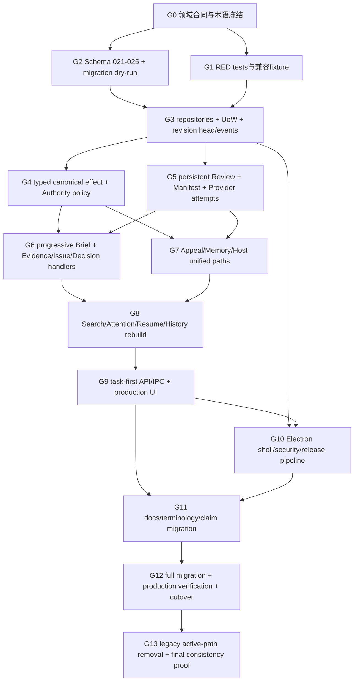

# 完整实施依赖与变更地图

> 本文件把全部领域计划收敛为一条不可拆成半成品发行的实施图。节点表示因果依赖和内部验证门，不是版本、批次、MVP或可独立出货阶段。任何中间状态只允许在开发分支/受控测试中存在，不能对外宣称完整产品。

## 1. 单一实施裁决

实施必须先冻结领域合同和迁移语义，再建立新Schema、repositories、UoW和兼容读取；随后把 Review、Authority、Manifest和Provider整条链切到新Kernel；在真实状态写入稳定后迁移Brief、Appeal、Memory、Host和derived projections；最后切换task-first UI、Electron transport、文档与Release。不能先上线新UI连接旧generic disposition，也不能让新Kernel长期双写旧Receipt/Pilot/Room状态机。

## 2. 总依赖图

所有节点都服务同一最终Release。`G4`和`G5`可并行开发，但只有两者都完成后才能让Review在任何UI中commit。

## 3. 节点合同

### G0 — 领域合同与术语冻结

**进入条件：** 以本计划集和精确`v0.2.0`代码为基线；没有代码修改被当作既成事实。

**工作：** 固定`CanonicalEffect`、Review statuses、Authority policy、revision推进矩阵、Manifest inputs、legacy mapping、UI routes、Electron选择、术语兼容名。生成machine-readable schema drafts和decision IDs，但不更改生产Schema。

**完成条件：** `01`～`12`、`15`和`16`对同一字段/枚举/route无冲突；每个`requires_code_verification`已有精确核对结果并回写合同。

**失败收缩：** 保持仓库不变；冲突回到计划层解决，不先写兼容shim掩盖。

**受影响类别：** `packages/research` types、API DTO设计稿、migration manifest草案、i18n keys、docs claim matrix。

### G1 — RED tests与不可变兼容fixture

**进入条件：** G0完成。

**工作：** 按`13`建立P0/P1/P2 RED tests、`v0.2.0` DB/Release fixtures及SHA、Provider/network/crash/security harness。Fixture与新实现分离，禁止由新runtime反向生成旧数据。

**完成条件：** 每项发现有可解释失败；测试失败不是缺依赖/环境；production visual states可由synthetic project factory建立。

**失败收缩：** 不进入Schema/Kernel修改；修复harness但不改变审查发现的攻击路径。

### G2 — Schema 021–025与copy-on-write migration

**进入条件：** G0合同冻结；G1 migration fixtures可用。

**工作：** 添加project state heads/events、persistent Reviews/attempts/corrections、Context Manifests、transition Receipts、Brief v2 metadata、legacy read-only markers、projection/privacy metadata；实现dry-run、journal、prebackup、temp copy、validation、atomic swap。

**完成条件：** schema idempotent；future/old/corrupt/partial路径fail closed；所有legacy table逐项有mapping；generic accepted类不制造canonical object；无双写。

**失败收缩：** 原DB和prebackup不变；temp副本丢弃或保留diagnostics；runtime不开写。

**精确范围：** `packages/storage/src/migrations/*`、`migration-manifest.json`、migrator、backup/restore、schema check、migration tests。

### G3 — Repository、transaction snapshot、revision truth

**进入条件：** G2 schema可在temp DB创建；G1 repository/property harness可用。

**工作：** 新heads/events、Review、attempt、Manifest、Receipt、correction repositories；扩展`ResearchUnitOfWork`使object mutation、revision event/head、Review terminal和Receipt同事务；实现single read snapshot和context projection service；legacy repositories只读。

**完成条件：** fault injection全或零；revision恰好推进；snapshot无mixed version；derived outbox可重建；legacy write被拒绝。

**失败收缩：** 新API不暴露；旧runtime继续只读测试fixture；不启用dual-write。

**精确范围：** `packages/research/src/ports/repositories.ts`、`packages/research-store/src/repositories/*`、`transactions/research-unit-of-work.ts`、`packages/core/src/*projection*`、`unit-of-work.ts`。

### G4 — typed canonical effect与Authority policy

**进入条件：** G3 transaction/revision可用；G1 P0/P1 RED tests存在。

**工作：** 实现effect parsers/preview/hash/handlers/idempotency/CAS/compensation；把Provider从capability policy移除；Evidence effect保留provenance/support；legacy disposition仅compat read/translate。

**完成条件：** 六种effect和record-only全矩阵通过；non-user永不commit；Provider unavailable不阻塞；resulting object/Receipt/revision一致。

**失败收缩：** Review commit endpoint保持禁用；不能回退到generic accepted临时过渡。

**切换点：** 新Kernel的唯一`commitCanonicalEffect()`成为Authority写入口；旧`ResearchRoomService.commit(disposition)`仅compat adapter并拒绝新写或只接受显式legacy import mode。

### G5 — Persistent Review、Manifest和Provider claims

**进入条件：** G3 repositories/snapshot可用；Provider exact-body基线保护保留。

**工作：** 持久Review lifecycle、attempt uncertain、Manifest v2、send-time revalidation、assessment envelope和四个validity flags；删除固定0.66和semantic-ready projection；in-memory Map只保留AbortController句柄。

**完成条件：** 每阶段crash/restart；不自动重发；exact socket body=Manifest；Provider失败仍能进入G4 effect；stale reason精确。

**失败收缩：** Provider外发保持禁用；zero-network Review/effect可在Kernel测试；不能用旧Map作为fallback truth。

**弃用点：** 当所有Review API/DTO/Receipt兼容reader可解析新flags后，`semantic_ready`停止写入；legacy值只在history adapter显示为“legacy provider result available”。

### G6 — Progressive Brief与canonical object handlers

**进入条件：** G4/G5均完成；Evidence唯一写入口核对完成。

**工作：** Brief section state、typed form DTO、relationship picker query、coverage/limitations、field diff/history/conflict；effect handlers复用Decision/Issue/Evidence/Brief领域函数。

**完成条件：** 用户无需JSON/ID；只question/task时coverage诚实；缺失context进入Manifest；target effect可预览/提交；长文本/locale通过。

**失败收缩：** 保留旧Brief只读编辑器供migration诊断，不允许新UI绕过typed schema写JSON。

### G7 — Appeal、Memory、Host/Pilot/Agent Corrector收口

**进入条件：** G4统一effect、G5Review lifecycle可用。

**可并行工作：**

- Appeal/correction child records + runtime-distinct second opinion；
- Memory internal state到四用户态projection、recall/share/forget；
- Host bridge draft-only、MCP read-only、Skill provenance；
- Agent Corrector companion分支内容审查后合入主树，但保持ephemeral candidate。

**完成条件：** 所有持久化结果只能回G4；Room/Pilot不再active；Memory≠Evidence；Host/Skill不能写Authority；历史数据可读/导出/恢复。

**失败收缩：** 对应入口默认隐藏/关闭；核心手工Review仍完整；不保留第二state machine作为“临时兼容”。

**移除默认入口点：** G7 migration/read-only adapters和G9 route replacement同时准备好后，删除`Open Pilot`、Room new/create、独立Appeal/Memory一级nav；不能提前删除历史访问。

### G8 — Derived projections与恢复一致性

**进入条件：** G6/G7写模型稳定。

**工作：** Today、Project关系、Search、Attention、Resume、History、Receipt detail全部由canonical+revision+Review构建；projection带source revision；migration后重建索引；Recovery验证event/head/Review/Manifest binding。

**完成条件：** commit/compensation/restart/restore后所有表面一致；stale items有action/consequence；1000对象性能通过；projection corruption可重建。

**失败收缩：** projection失败不写canonical；UI进入diagnostic/rebuild或Recovery，不读取旧索引作为truth。

### G9 — task-first transport和production UI

**进入条件：** G4–G8 API稳定；migration兼容reader可提供历史。

**工作：** transport-neutral service、typed IPC/legacy HTTP adapters、target routes、Today/Review Thread/effect preview/Project/Search/Settings/History、Inspector default closed、完整states/a11y/themes/locales/large content。

**完成条件：** packaged-like renderer通过production E2E；旧object routes redirect到target context；old active Room/Pilot routes 404/legacy read-only；UI无自建state machine。

**失败收缩：** 不把新UI接旧commit endpoint；若页面未完成则整条新UI不可对外启用，Kernel仍可测试；避免混合按钮语义。

**信息架构切换点：** 新routes和legacy redirects原子进入同一commit；旧导航注册表不与新导航并存为feature flag公开选择。

### G10 — Electron、security与release provenance

**进入条件：** G3 transport-neutral services可被IPC调用；G9主旅程可嵌入；G2 migration/Recovery成熟。

**工作：** Electron main/preload/renderer、single instance、data dirs/keychain、typed IPC、Host bridge off、installer/sign/notarize/package、manual update/provenance、upgrade prebackup/failure recovery/uninstall separation；legacy loopback只作为dev/history。

**完成条件：** 三平台lifecycle、安全攻击矩阵、source provenance/reproducible core、Logo hash gate通过；production UI无public HTTP。

**失败收缩：** 不发布Desktop；继续准确称现有制品loopback preview。不得因为壳未完成就把未签archive改名Desktop。

### G11 — 文档、术语和声明同步

**进入条件：** target contracts/routes/release identity稳定；不能在G4前宣传新完成事实。

**工作：** 执行`15`的schema/API兼容名、i18n、README/Architecture/Security/Privacy/Getting Started/Recovery/Release/Migration/Agent Corrector文档变更；term/claim lint。

**完成条件：** 文档同时区分existing、target、legacy；无semantic-ready/ledger-only过强主张；Desktop/loopback命名准确；中英文parity。

**失败收缩：** Release gate失败；代码可继续测试但不能发布或标completed。

### G12 — 完整迁移、production verification与cutover rehearsal

**进入条件：** G1–G11各自完成，`13`测试矩阵可运行。

**工作：** 对不可变fixture和三平台packaged build执行migration、主旅程、crash/concurrency/no-network/security/a11y/visual/lifecycle；从clean public tag执行build/provenance；演练upgrade failure/downgrade backup。

**完成条件：** 全部findings/improvements/plans有证据；无混合truth；final ZIP/release manifest可追踪；`16`一致性检查通过。

**失败收缩：** 不切换公开tag/release；保留pre-migration backup和当前稳定制品；缺陷回到所属节点修复并重跑相邻门。

### G13 — legacy active path removal与最终证明

**进入条件：** G12通过。

**工作：** 删除或硬禁用旧generic commit、Map truth、semantic_ready writes、Open Pilot、Room new/create、legacy UI object-first nav、生产UI loopback；保留只读parsers/history/migration。检查dead code、routes、docs和capabilities。

**完成条件：** production bundle中旧active paths不可达；只读compat有显式测试；final consistency log无冲突；Release只包含目标身份。

**失败收缩：** 若某legacy读取仍被迁移/恢复依赖，保留只读模块并从生产nav隐藏；绝不恢复写路径。

## 4. 先于Schema的改变

必须在写migration前完成：

1. typed effect和Review status的枚举/语义裁决；
2. project revision推进矩阵；
3. Manifest projection inputs/排除项；
4. generic disposition、Appeal、Room、Memory、Pilot逐项lossy/lossless mapping；
5. Evidence唯一canonical repository选择；
6. Electron vs loopback裁决；
7. target route和legacy redirect表；
8. Receipt是proof而非result的统一定义。

Schema不能用模糊JSON把这些决定推迟到运行时。

## 5. migration 必须先于 UI 的内容

- Review/attempt/Manifest/effect/Receipt字段和状态；
- project revision head/event；
- Brief v2 section state；
- legacy read-only标记；
- Memory revision/forget copy inventory；
- projection rebuild metadata；
- migration/recovery error codes。

UI可以在Schema前使用static design fixtures做视觉工作，但不得接生产写API或对外宣称可用。

## 6. 双读、双写与兼容裁决

| 对象 | 过渡读取 | 写入 | 最终 |
|---|---|---|---|
| canonical Brief/Decision/Issue/Evidence/Episode | 新repository读取现有表/新字段 | 新UoW唯一写 | canonical |
| new Review/Manifest/transition Receipt | 新表 | 新表唯一写 | canonical workflow/proof |
| old `research_room_receipts` | legacy history reader | 禁写 | read-only |
| old Appeal/Room/Pilot | legacy history reader | 禁写 | read-only/export/restore |
| `review_runs/findings` | internal checker继续读写其自身合同 | 仅checker subsystem | 不与interactive Review混用 |
| Search/Attention | migration后重建 | derived only | 可丢弃重建 |

**不允许双写。** 允许在compat window内“双读”新/legacy history，但每条记录必须有唯一source kind，不能在列表中伪装成同一active对象。

## 7. 可并行与必须顺序

### 可并行

- G4 effect domain与G5 Review persistence，在G3合同上并行；
- G7 Appeal、Memory、Host三个子域，在G4/G5完成后并行；
- G9 visual/accessibility fixture工作可与G8 projection实现并行，但production integration等待G8；
- G10 installer/signing pipeline可早期搭建，但正式打包等待G9/G2；
- G11文档diff草拟可并行，最终事实更新等待实现证据。

### 必须顺序

- migration mapping → Schema；
- Schema → repositories/UoW；
- UoW/revision → effect/Review；
- effect/Review → Appeal/Host/Memory统一；
- canonical writes → derived projections；
- projections/API → UI切换；
- migration/Recovery/UI → Desktop lifecycle；
- production evidence → completed claims/release。

## 8. package／文件类别变更地图

| 类别 | 基线路径 | 目标变化 | 禁止混入 |
|---|---|---|---|
| Domain | `packages/research/src/room/*`, brief/decision/issue/evidence | effect/revision/Review/Manifest/Receipt v2；legacy parsers隔离 | UI文案、Electron代码 |
| Review semantics | `packages/review/src/semantic/*` | assessment envelope/validity flags；去固定confidence | Authority写规则 |
| Core | `packages/core/src/research-room.ts`, appeal/memory/pilot/room | transport-neutral use cases；统一effect/Review | CSS、release scripts |
| Storage | migrations/repositories/UoW | 021–025、new repos、legacy read-only、journal | 文档主张 |
| App server | `apps/research-room/src/server.ts` | legacy adapter/dev harness；不保留production business rules | 新Kernel复制 |
| Desktop | `apps/desktop/*` `proposed_new` | main/preload/renderer host、IPC/lifecycle | Domain transitions |
| UI | client routing/screens/components/styles/i18n | target IA/states/proof hierarchy | migration SQL |
| Integrations | MCP/Skills/Host bridge | read-only/draft-only、Agent Corrector companion | Authority/DB direct writes |
| Security | provider settings/secrets/path guards/IPC | endpoint/network/path/secret/redaction/update gates | semantic accuracy claims |
| Release | scripts/workflows/manifests | exact tag/provenance/reproducible core/sign envelope | product feature code |
| Docs | README/docs/i18n/security/release/migration | claim migration | implementation proof无证据 |
| Tests | unit/integration/e2e/performance/repository | RED-to-production matrix | fixture冒充价值 |

## 9. 提交纪律

后续编码Agent每个提交只服务一个dependency node或一个可追踪子合同，并在message/body引用计划文件、finding/test。不得混入：全仓格式化、无关rename、Logo变更、依赖升级、文档宣传、测试删除、fixture重录、生成文件手工改写。Schema与migration提交必须同时含migration tests；Domain enum修改同时含exhaustive tests和API decoder更新；UI切换不得顺便重写Kernel。

这不是要求每个提交可独立发布。多个提交可以暂时使开发分支不可出货，但每个都必须可回滚、可审计，且最终只形成一个完整产品状态。

## 10. 回滚边界

- G0/G1：文件级回滚，无数据影响。
- G2：只对copy/temp操作；未atomic swap前删除temp，swap后通过prebackup恢复；不做down migration。
- G3–G8：feature未切换前可代码回滚；一旦新schema写入，只能恢复pre-migration backup或前向修复。
- G9：route/UI可整体feature gate回滚到只读diagnostic，但不能回旧generic写。
- G10：installer/update失败恢复previous app binary + preupgrade project backup；新schema仍需compat/future gate。
- G13：删除active legacy path前保留tagged source和只读compat tests；不能用重新启用旧写作为故障修复。

## 11. 混合状态禁止表

| 混合状态 | 为什么危险 | 强制措施 |
|---|---|---|
| 新UI + 旧generic commit | 看似有effect，实际只Receipt | endpoint capability version + E2E gate |
| 新Review + old stateHash | Manifest仍可能漏变化 | Review prepare只接受revision snapshot |
| new effect + old Receipt | proof无result refs/revision | UoW强类型禁止 |
| new Authority policy + semantic-ready button gate | Provider仍控制action | shared policy module + UI derived capability |
| new routes + old Open Pilot/Room create | 两条产品主线 | route registry exhaustive test |
| new schema + old writer | 双truth/数据损坏 | schema too-new fail closed、single writer lease |
| Electron shell + HTTP business rules copy | 第二Kernel | transport-neutral service contract |
| new docs + old release artifact | 虚假完成 | docs/release claim gate |

## 12. 最终闭合证明

完成整套重构必须生成一份可从public tag复现的verification index，包含：

- 17计划→commits→tests→production artifacts映射；
- migration fixture hashes、journals与restore结果；
- exact Manifest socket-body证据；
- one canonical transaction trace（object/revision/Review/Receipt/projections）；
- zero-network、crash/concurrency/security结果；
- packaged UI视觉/a11y矩阵；
- three-platform lifecycle/provenance；
- legacy active route/write absence；
- term/claim lint；
- `16`最终一致性通过。

缺少任何必要证据时，状态仍是`implementation_status: not_started`或实施中的内部状态，不能将计划或局部测试改写为完成事实。

## 13. 明确非目标

- 不提供工时、人员或版本估算。
- 不拆成MVP/后续完善/可独立出货批次。
- 不允许“先改UI以后接真状态”。
- 不允许“先改Kernel以后再补migration/Recovery”。
- 不保留双写作为安全网。
- 不让外部反馈、采用或市场证据成为依赖节点。
- 不在实施过程中改变官方Logo原文件或使用规则。

## 14. 与其他计划的精确关系

G0合同来自`01`～`12`与`15`；G1/G12验证由`13`定义；G2和回滚以`11`为迁移权威；G10安全以`12`为威胁权威、发行以`10`为形态权威；G9以`06`为UI权威；最终冲突和报告由`16-CROSS-PLAN-CONSISTENCY-AND-DECISION-LOG.md`裁决。若实现中出现新代码反证，只能先按`16`的修正流程更新所有受影响计划，不能在单个提交内私自改变Kernel真相。
